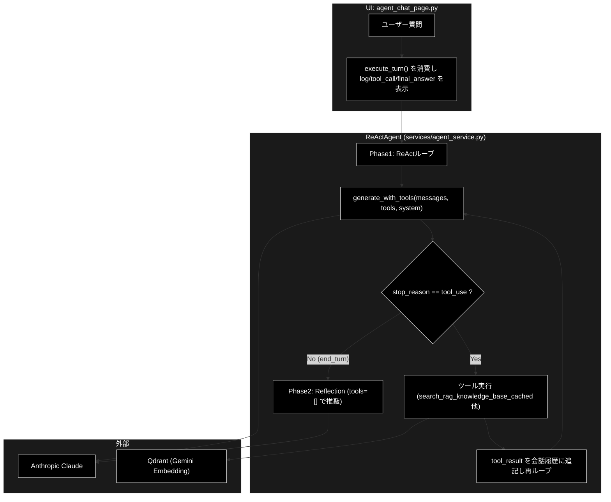
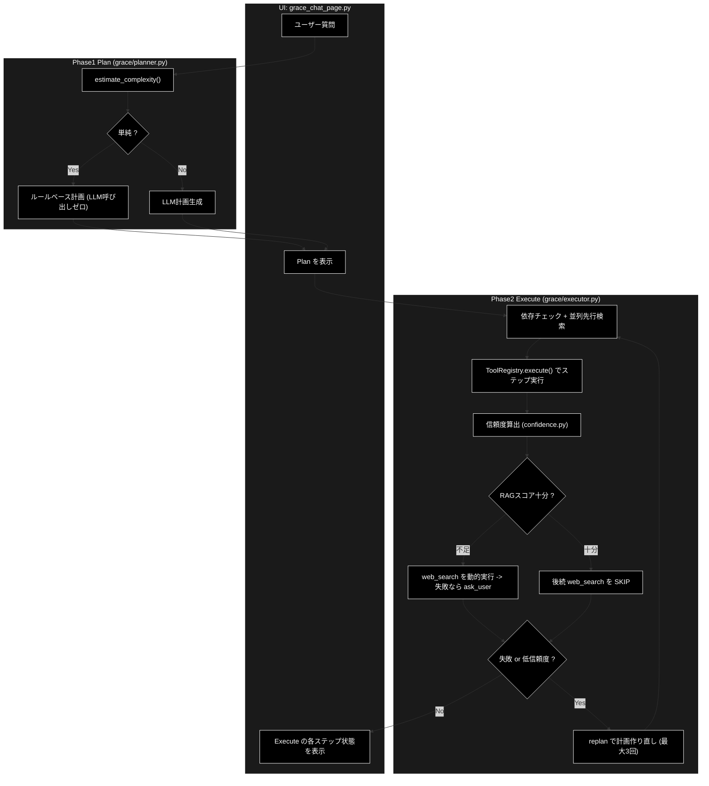

# 自立型Agent(A) と 自律型Agent(B) の比較 — agent_rag.py

**Version 1.0** | 最終更新: 2026-06-20 | 対象: `anthropic_grace_agent_v2`

起動コマンド:

```bash
uv run streamlit run agent_rag.py --server.port 8501
```

左メニュー（`agent_rag.py:148-169` の `st.radio`）には2種のエージェントがある。

- **(1) 自立型Agent(ReAct+Reflection)** … メニュー `agent_chat` → `ui/pages/agent_chat_page.py` → `ReActAgent`（`services/agent_service.py`）＝ **系統A**
- **(2) 自律型Agent(最新：動的Agent)** … メニュー `grace_chat`「[最新]」→ `ui/pages/grace_chat_page.py` → `Planner` + `Executor`（`grace/`）＝ **系統B / GRACE**

共通基盤: LLM=**Anthropic Claude**（既定 `claude-sonnet-4-6`・`create_llm_client("anthropic")`）、Embedding=**Gemini**（`gemini-embedding-001`）、ベクトルDB=Qdrant。

---

## 目次

1. [(A)-(1) 自立型Agent (ReAct + Reflection)](#1-a-1-自立型agent-react--reflection系統a)
2. [(A)-(2) 自律型Agent (最新：動的Agent / GRACE)](#2-a-2-自律型agent-最新動的-agent--grace系統b)
3. [(B) 処理の比較・違い](#3-b-処理の比較違い)
4. [使い分けの指針](#4-使い分けの指針)
5. [変更履歴](#5-変更履歴)

---

## 1. (A)-(1) 自立型Agent (ReAct + Reflection)＝系統A

### 1.1 概要

LLM が「思考→行動→観察」を反復し、**毎ターン自分でツール要否を判断**する LLM 主導型。
最後に Reflection（自己評価）で回答を推敲する 2 段構成。

- 入口: `ui/pages/agent_chat_page.py` → `ReActAgent(selected_collections, model, session_id, use_hybrid_search)`（`agent_service.py:130`）
- ツール定義: `_build_tools()` に **dict スキーマ直書き**（Anthropic Tool Use の `input_schema` 形式、`agent_service.py:191`）
- ツール: `search_rag_knowledge_base`（コレクション自動選択・ハイブリッド検索）、`list_rag_collections`

### 1.2 処理アーキテクチャ



### 1.3 処理ステップ

1. **入力拡張**: MeCab キーワード抽出で重要語を質問へ注入（固有名詞の取りこぼし防止）。
2. **ReActループ**（`agent_service.py:320` `for turn_count in range(1, max_turns+1)`）:
   - `generate_with_tools()` で LLM に投げる。
   - `stop_reason == "tool_use"` ならツールを実行し、`tool_result` を会話履歴へ追記して**もう一周**。
   - そうでなければ（`end_turn`）回答確定で**ループ終了**（`agent_service.py:337`）。
3. **Reflection**（`agent_service.py:_execute_reflection_phase`）: `generate_with_tools(tools=[])` で検索根拠を保持したまま自己評価し `Final Answer:` を確定。
4. UI は `log / tool_call / tool_result / final_text / final_answer` イベントを逐次表示。

### 1.4 動的な点

**「ループを続けるか・どのツールをどのクエリで呼ぶか」を LLM が毎ターン決める**点（経路の動的選択）。
全体構造（ReAct→Reflection）は固定。

---

## 2. (A)-(2) 自律型Agent (最新：動的 Agent / GRACE)＝系統B

### 2.1 概要

先に**実行計画を立て（Plan）**、計画を**1ステップずつ実行（Execute）**しながら、結果に応じて
**経路切替（フォールバック）・スキップ・やり直し（リプラン）・人間介入**を行う計画主導・自律適応型。

- 入口: `ui/pages/grace_chat_page.py` → `create_planner()` + `create_executor()`（`grace/`）
- ツール: `grace/tools.py` の `BaseTool` を `ToolRegistry` に登録（`RAGSearchTool` / `WebSearchTool` / `ReasoningTool` / `AskUserTool`）。さらに `run_legacy_agent` ステップで**系統A(ReActAgent)を内部呼び出し**可能（`executor.py:1053`）。

### 2.2 処理アーキテクチャ



### 2.3 処理ステップ

1. **Phase1 Plan**（`planner.create_plan()` `planner.py:147`）:
   - `estimate_complexity()` で複雑度推定（`planner.py:162`）。
   - 単純 → `_create_rule_based_plan()`（rag_search→reasoning、**LLM 呼び出しゼロ**）。
   - 複雑/明示的Web指示 → `_create_llm_plan()`。失敗時は必ずルールベースへ縮退。
   - 生成物 `ExecutionPlan`（steps / depends_on / fallback / complexity / requires_confirmation）。
2. **Phase2 Execute**（`executor.execute_plan_generator()`）: ステップごとに
   - 依存チェック・**並列先行検索**（`executor.py:290`）。
   - `ToolRegistry.execute()` でツール実行 → **信頼度算出**。
   - **動的フォールバック**（`executor.py:312-358`）: RAGスコア `< rag_sufficient_score(0.7)` または意味的に不適合なら `web_search` を動的実行、Webも失敗なら `ask_user`。十分なら計画上の `web_search` を **SKIP**。
   - **動的介入**（`confidence.decide_action()` `confidence.py:285`）: SILENT/NOTIFY/CONFIRM/ESCALATE を実行時決定（Human-in-the-loop）。
   - **動的リプラン**（`executor.py:408` → `replan.py`）: 失敗・低信頼度で計画を作り直す（`max_replans=3`）。
3. 補助: `RAGSearchTool` の **Dynamic Thresholding**（1位スコア 0.98 以上で下位を切り捨て、`tools.py:200`）。

### 2.4 動的な点

**「どの経路を通り、失敗したらどう立て直すか」をコードのルール（スコア・成功/失敗・信頼度）が動的に決める**点。
計画の生成方式、フォールバック連鎖、ステップSKIP、リプラン、介入レベルすべてが状況適応。

---

## 3. (B) 処理の比較・違い

| 観点 | (1) 自立型 ReAct+Reflection（系統A） | (2) 自律型 動的Agent / GRACE（系統B） |
|---|---|---|
| メニュー | `agent_chat`「🤖 Agent(ReAct+Reflection)」 | `grace_chat`「[最新] 自律型Agent(Plan+Executor)」 |
| 実装 | `services/agent_service.py` `ReActAgent` | `grace/`（`planner.py` / `executor.py` / `confidence.py` / `replan.py` / `tools.py`） |
| 制御方式 | LLM主導（毎ターン判断） | 計画主導（Plan→Execute）＋実行時適応 |
| 事前計画 | なし（その場で判断） | あり（複雑度で rule/LLM を切替） |
| ツール定義 | dict スキーマ直書き（`_build_tools`、`input_schema`） | `BaseTool` クラス＋`ToolRegistry` 登録 |
| 「動的」の正体 | ループ継続/終了・ツール要否（`stop_reason`） | 経路切替・SKIP・リプラン・介入（スコア/成功失敗/信頼度） |
| 判断主体 | **LLM** | **コードのルール**（一部 LLM 補助） |
| フォールバック | なし（LLMが再検索を判断するのみ） | あり（rag→web→ask_user の連鎖、`executor.py:345`） |
| 失敗時のやり直し | なし（max_turns で打ち切り） | あり（リプラン最大3回、`executor.py:408`） |
| Human-in-the-loop | なし | あり（CONFIRM/ESCALATE、`confidence.py:285`） |
| 並列検索 | なし（逐次） | あり（`_prefetch_parallel_searches`） |
| 品質担保 | Reflection（自己評価・推敲） | 多軸信頼度＋リプラン＋介入 |
| 透明性表示 | Thought/ツール呼び出しログ | 計画(Plan)＋実行ログ(Execute)＋複雑度/ステップ |
| レイテンシ/コスト | 中（ターン数依存） | 単純質問は低（rule計画でLLMゼロ）／複雑質問は高（計画+リプラン） |
| 関係 | 基盤。GRACE から `run_legacy_agent` で**呼ばれる側**にもなる | 上位。系統Aを1手段として内包しうる |

### 3.1 ひとことで言うと

- **系統A**: 「LLM にツールを持たせ、いつ止めるかも LLM に任せる」**シンプルな反復型**。
- **系統B**: 「先に計画を立て、結果を見てコードが経路を組み替え・やり直す」**自律適応型**。GRACE は系統Aを内部の一手段として使うこともできる。

---

## 4. 使い分けの指針

- **系統A が向くケース**: 単発のQ&A、検索→回答が素直なタスク、思考過程を見たいデモ。
- **系統B が向くケース**: 複数ステップ・情報源を跨ぐ調査、検索失敗時にWeb/ユーザー確認へ自動で切り替えたい、信頼度に応じた人間介入が欲しい、計画と実行を可視化したい場合。

---

## 5. 変更履歴

| バージョン | 変更内容 |
|---|---|
| 1.0 | 初版作成（系統A/系統Bのアーキテクチャ・処理・比較を記述。Anthropic 表記） |
