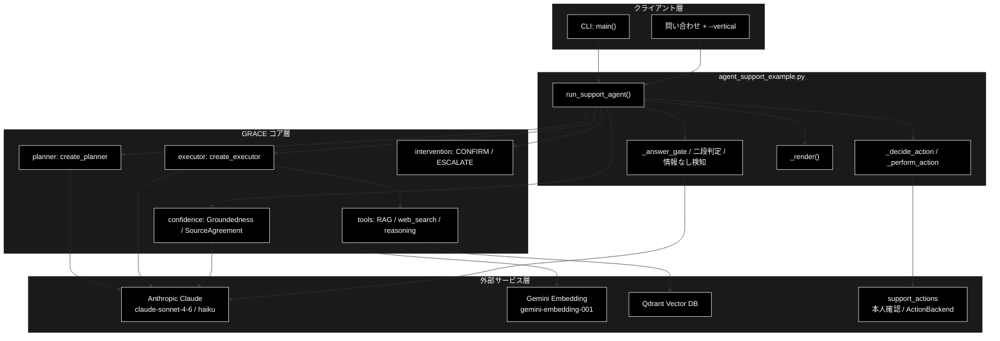
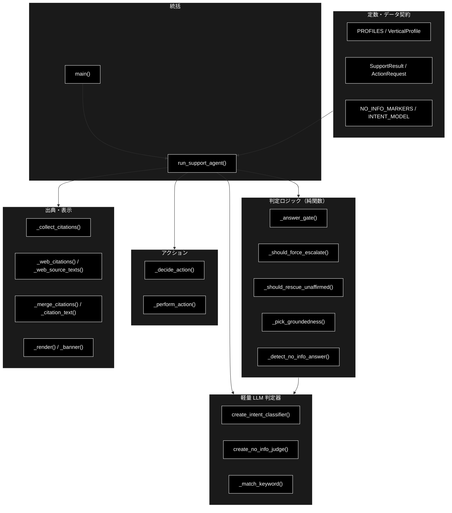
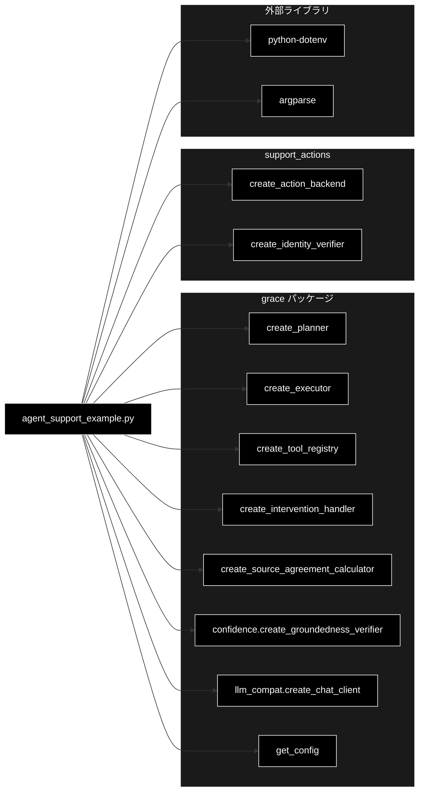

# agent_support_example.py - 日本語ナレッジ駆動サポート・コパイロット（GRACE-Support）ドキュメント

**Version 1.0** | 最終更新: 2026-07-04

> **関連ドキュメント**
> - [`grace/doc/agent_support_example.md`](../grace/doc/agent_support_example.md) — 設計書（回答判定フロー・groundedness ゲート・HITL ポリシー・KPI・ロードマップ）
> - [`grace/doc/agent_support_verticals.md`](../grace/doc/agent_support_verticals.md) — 業界特化（自治体/SaaS/EC）設計
> - [`docs/vertical_spec_review.md`](./vertical_spec_review.md) — 二段判定・情報なし回答検知・Web 重複排除のレビュー
> - [`docs/vertical_test_data.md`](./vertical_test_data.md) — 業界別 Qdrant コレクションのテストデータ

> 本書は **IPO（Input-Process-Output）形式**のモジュール仕様です。設計思想・KPI・ロードマップは上記 `grace/doc/agent_support_example.md`（設計書）を参照してください。

---

## 目次

1. [概要](#概要)
2. [1. アーキテクチャ構成図](#1-アーキテクチャ構成図)
3. [2. モジュール構成図](#2-モジュール構成図)
4. [3. クラス・関数一覧表](#3-クラス関数一覧表)
5. [4. クラス・関数 IPO詳細](#4-クラス関数-ipo詳細)
6. [5. 設定・定数](#5-設定定数)
7. [6. 使用例](#6-使用例)
8. [7. エクスポート](#7-エクスポート)
9. [8. 変更履歴](#8-変更履歴)
10. [付録: 依存関係図](#付録-依存関係図)

---

## 概要

`agent_support_example.py`（**GRACE-Support**）は、日本語 RAG 自律エージェント（GRACE）を土台にした**カスタマーサポート／社内ナレッジ・コパイロット**の応用サンプルである。内部 RAG で回答して**出典を必ず提示**し、根拠が不足すれば **Web フォールバック**で裏取りして内部×Web を**相互検証**する。問い合わせが「対応（アクション）」を要する場合は、**擬似 ActionTool** を **HITL（CONFIRM 承認）** を通してから実行する（既定はドライラン＝実行せずログのみ）。根拠不足なら「わかりません」と誠実に答え、**有人対応へエスカレーション**する。

`--vertical {gov|saas|ec}` で **業界プロファイル（VerticalProfile）** を適用し、検索スコープ・エスカレ語・回答しきい値・アクション対応・本人確認を切り替える。誤検知抑止のため、キーワード一致は候補検出（第 1 段）に留め、一致時のみ軽量 LLM で意図分類（第 2 段）する**二段判定**を採用する。

LLM は **Anthropic Claude**（意図分類・情報なし判定は軽量 `claude-haiku-4-5-20251001`）を用い、`ANTHROPIC_API_KEY` を必須とする。Embedding（RAG 検索側）は **Gemini**（`gemini-embedding-001`）で `GOOGLE_API_KEY` を用いる。

### 主な責務

- 問い合わせの計画立案と内部 RAG 実行を GRACE コア（planner/executor）へ委譲する
- 支持率（groundedness）と出典数で**回答ゲート**を判定し、`answer` / `escalate` を決める
- 根拠不足時に **Web フォールバック**で裏取りし、内部×Web を**相互検証**する
- エスカレ語・アクション意図の**二段判定**（キーワード候補検出＋軽量 LLM 意図分類）で誤検知を抑止する
- 「情報なし回答」を二段判定で検知し、範囲外質問を有人対応へ倒す
- 副作用のあるアクションを**本人確認 → HITL（CONFIRM）→ ドライラン実行**の順で安全に扱う
- 業界プロファイル（`--vertical`）で検索スコープ・しきい値・方針を切り替える

### 各責務対応のモジュール

| # | 責務 | 対応モジュール | 説明 |
|---|------|--------------|------|
| 1 | 計画立案・内部 RAG 実行 | `grace.planner` / `grace.executor` | `create_planner` / `create_executor` を呼び、内部 RAG と動的 Web 検索を統括 |
| 2 | 回答ゲート判定 | `agent_support_example._answer_gate` | 支持率・出典数から `(decision, warning)` を算出 |
| 3 | 根拠評価・相互検証 | `grace.confidence` | `GroundednessVerifier`（支持率）・`SourceAgreementCalculator`（内部×Web 一致度） |
| 4 | 二段判定（エスカレ／アクション） | `agent_support_example.create_intent_classifier` | 軽量 Claude で question / request / incident を分類 |
| 5 | 情報なし回答検知 | `agent_support_example.create_no_info_judge` | 軽量 Claude で answered / no_info を判定 |
| 6 | 本人確認・HITL・アクション実行 | `support_actions` / `grace.intervention` | `create_identity_verifier` / `create_action_backend` / `create_intervention_handler` |
| 7 | 業界プロファイル切替 | `agent_support_example.PROFILES` | `VerticalProfile` で検索スコープ・しきい値・方針を差し替え |

### 主要機能一覧

| 機能 | 説明 |
|------|------|
| `run_support_agent()` | ①Plan→②Execute→③Confidence→④回答ゲート→⑤Web→④'情報なし検知→⑥Action→⑦応答 の統括 |
| `SupportResult` | 回答・出典・判定・信頼度・アクション・KPI メタを保持するデータクラス |
| `ActionRequest` | 副作用のある操作（起票／返信／エスカレ）の要求データクラス |
| `VerticalProfile` | 業界プロファイル（検索スコープ・エスカレ語・アクション対応・しきい値・方針） |
| `create_intent_classifier()` | 意図分類器（question/request/incident）を返すファクトリ |
| `create_no_info_judge()` | 「情報なし回答」判定器（answered/no_info）を返すファクトリ |
| `_answer_gate()` | 支持率・出典数から `(decision, warning)` を決める純関数 |
| `_should_force_escalate()` | エスカレ語の二段判定（候補検出＋意図分類） |
| `_should_rescue_unaffirmed()` | 矛盾なし・出典付きの内部回答を escalate から救済するか判定 |
| `_detect_no_info_answer()` | 「情報なし回答」の二段判定 |
| `_decide_action()` | 問い合わせ意図＋判定から `ActionRequest` を決める（二段判定） |
| `_perform_action()` | 本人確認 → CONFIRM → バックエンド実行の順でアクションを行う |
| `_render()` | 回答ゲートの判定に応じて応答を整形表示する |
| `main()` | argparse（`query`/`-v`/`--vertical`/`--no-web`/`--no-action`/`--dry-run`/`--identity`）の CLI エントリ |

---

## 1. アーキテクチャ構成図

### 1.1 システム全体構成



### 1.2 データフロー

1. **① Plan**: `planner.create_plan(query)` で実行計画を生成する
2. **② Execute**: `executor.execute(plan)` が内部 RAG を実行し、スコア不足なら Web 検索を動的挿入する
3. **③ Confidence**: `GroundednessVerifier.verify()` が内部回答の支持率を評価する
4. **④ 回答ゲート**: `_answer_gate()` が `(decision, warning)` を決め、エスカレ語の二段判定（`_should_force_escalate`）と救済判定（`_should_rescue_unaffirmed`）を適用する
5. **⑤ Web フォールバック**: `decision == "escalate"` かつ強制エスカレでない場合、Web で裏取りし相互検証する（executor が Web 使用済みなら再検証のみ）
6. **④' 情報なし検知**: `_detect_no_info_answer()` で実質回答か判定し、情報なしなら escalate へ倒す
7. **⑥ Action**: `_decide_action()` がアクションを決め、`_perform_action()` が本人確認 → CONFIRM → ドライラン実行する
8. **⑦ 応答**: `_render()` が回答・出典・注意書き・アクション結果・根拠指標を表示し、`SupportResult` を返す

---

## 2. モジュール構成図

### 2.1 内部モジュール構成



### 2.2 外部依存関係

| ライブラリ | 用途 |
|-----------|------|
| `python-dotenv` | `.env` から `ANTHROPIC_API_KEY` / `GOOGLE_API_KEY` を読み込む（未導入でも続行） |
| `argparse`（標準） | CLI 引数解析 |

### 2.3 内部依存モジュール

| モジュール | 用途 |
|-----------|------|
| `grace` | `create_planner` / `create_executor` / `create_tool_registry` / `create_intervention_handler` / `create_source_agreement_calculator` / `get_config` ほか |
| `grace.confidence` | `create_groundedness_verifier`（支持率検証） |
| `grace.llm_compat` | `create_chat_client`（軽量 LLM の意図分類・情報なし判定） |
| `support_actions` | `create_action_backend`（アクション実行）/ `create_identity_verifier`（本人確認） |

---

## 3. クラス・関数一覧表

### 3.1 クラス一覧

#### ActionRequest（dataclass）

| フィールド | 概要 |
|-----------|------|
| `action_type` | `create_ticket` / `send_reply` / `escalate_to_human` |
| `args` | 起票内容・宛先などの引数 dict |
| `requires_confirmation` | 副作用は原則 True（既定 True） |

#### VerticalProfile（dataclass）

| フィールド | 概要 |
|-----------|------|
| `name` | 業界プロファイル名（自治体 / SaaS / EC） |
| `collections` | 検索スコープ（実 Qdrant コレクション名） |
| `escalate_keywords` | 強制エスカレ候補語 |
| `action_map` | 意図キーワード → `action_type` の対応 |
| `require_identity` | アクション前の本人確認を必須化するか |
| `notify_th` / `confirm_th` | 回答しきい値（None なら config 既定） |
| `prompt_addendum` | 業界固有の方針（reasoning へ注入） |

#### SupportResult（dataclass）

| フィールド | 概要 |
|-----------|------|
| `answer` / `citations` | 最終回答と出典（`[社内]` / `[Web]` ラベル付き） |
| `groundedness` / `groundedness_decided` | 支持率と判定できた主張数 |
| `decision` / `warning` | `answer` / `escalate` と未確認注記フラグ |
| `used_web` / `source_agreement` / `contradiction` / `web_reused` | Web 使用・内部×Web 一致度・矛盾・Web 再利用 |
| `action` / `action_result` | 実施（予定）のアクションと結果メッセージ |
| `vertical` / `overall_confidence` / `intent` | 適用プロファイル・較正済み信頼度・意図分類結果 |
| `forced_escalate` / `identity_checked` / `no_info_detected` | KPI 計測用メタ |

### 3.2 関数一覧（カテゴリ別）

#### 統括・CLI

| 関数名 | 概要 |
|-------|------|
| `run_support_agent(query, verbose, use_web, do_action, dry_run, vertical, identity)` | サポートエージェントの全段統括 |
| `main()` | argparse による CLI エントリポイント |

#### 判定ロジック（純関数）

| 関数名 | 概要 |
|-------|------|
| `_answer_gate(support_rate, verified, citation_count, notify_th, confirm_th)` | 回答可否を `(decision, warning)` で返す |
| `_should_force_escalate(query, profile, classify)` | 強制エスカレの二段判定 |
| `_should_rescue_unaffirmed(...)` | 矛盾なし・出典付きの内部回答を救済するか |
| `_pick_groundedness(*results)` | 複数の検証結果から支持率と判定数を選ぶ |
| `_detect_no_info_answer(query, answer, judge, force_judge)` | 「情報なし回答」の二段判定 |
| `_match_keyword(query, keywords)` | キーワード候補の部分一致 |

#### 軽量 LLM 判定器（ファクトリ）

| 関数名 | 概要 |
|-------|------|
| `create_intent_classifier(config)` | 意図分類器（question/request/incident）を返す |
| `create_no_info_judge(config)` | 情報なし判定器（answered/no_info）を返す |

#### アクション

| 関数名 | 概要 |
|-------|------|
| `_decide_action(query, decision, profile, classify)` | アクションを決める（二段判定） |
| `_perform_action(action, handler, backend, identity_verifier, identity)` | 本人確認 → CONFIRM → 実行 |

#### 出典・表示

| 関数名 | 概要 |
|-------|------|
| `_collect_citations(step_results)` | 各ステップの sources を出典リスト化 |
| `_citation_text(citation)` | 出典表示文字列からラベルを外す |
| `_merge_citations(internal, web)` | 内部と Web の出典を重複なく結合 |
| `_web_citations(web_output)` | Web 検索結果から出典表示文字列を作る |
| `_web_source_texts(web_output)` | Web 検索結果の本文を検証用に抽出 |
| `_render(result)` | 応答を整形表示 |
| `_banner(title)` | セクション見出しを表示 |

---

## 4. クラス・関数 IPO詳細

### 4.1 ActionRequest クラス

副作用のある操作（v3・擬似）の要求を表すデータクラス。

**概要**: チケット起票・返信・エスカレーションなどの副作用操作を、実行前に確認可能な形で保持する。

```python
@dataclass
class ActionRequest:
    action_type: ActionType
    args: dict = field(default_factory=dict)
    requires_confirmation: bool = True
```

| パラメータ | 型 | デフォルト | 説明 |
|------------|------|-----------|------|
| `action_type` | ActionType | - | `create_ticket` / `send_reply` / `escalate_to_human` |
| `args` | dict | `{}` | 起票内容・宛先・クエリなどの引数 |
| `requires_confirmation` | bool | True | 副作用は原則 True（CONFIRM 必須） |

| 項目 | 内容 |
|------|------|
| **Input** | `action_type: ActionType`, `args: dict = {}`, `requires_confirmation: bool = True` |
| **Process** | フィールドを保持するだけの薄いデータ契約 |
| **Output** | `ActionRequest` インスタンス |

**戻り値例**:
```python
ActionRequest(
    action_type="create_ticket",
    args={"query": "返品したい", "matched": "返品"},
    requires_confirmation=True,
)
```

```python
# 使用例
action = ActionRequest("escalate_to_human", {"query": "訴訟について相談したい"})
print(action.action_type)  # escalate_to_human
```

### 4.2 VerticalProfile クラス

業界プロファイル（差し替えの共通枠）。設計は `agent_support_verticals.md` を参照。

**概要**: 検索スコープ・エスカレ語・アクション対応・本人確認・しきい値・方針を業界単位で束ねる。

```python
@dataclass
class VerticalProfile:
    name: str
    collections: List[str] = field(default_factory=list)
    escalate_keywords: List[str] = field(default_factory=list)
    action_map: Dict[str, ActionType] = field(default_factory=dict)
    require_identity: bool = False
    notify_th: Optional[float] = None
    confirm_th: Optional[float] = None
    prompt_addendum: str = ""
```

| パラメータ | 型 | デフォルト | 説明 |
|------------|------|-----------|------|
| `name` | str | - | プロファイル表示名 |
| `collections` | List[str] | `[]` | 検索スコープ（実 Qdrant コレクション名） |
| `escalate_keywords` | List[str] | `[]` | 強制エスカレ候補語 |
| `action_map` | Dict[str, ActionType] | `{}` | 意図キーワード → action_type |
| `require_identity` | bool | False | アクション前の本人確認を必須化 |
| `notify_th` | Optional[float] | None | 回答（自信あり）しきい値。None なら config 既定 |
| `confirm_th` | Optional[float] | None | 注意付き回答しきい値。None なら config 既定 |
| `prompt_addendum` | str | `""` | reasoning へ注入する業界方針 |

| 項目 | 内容 |
|------|------|
| **Input** | 上記 8 フィールド |
| **Process** | プロファイル値を保持。`run_support_agent` が `config.qdrant.allowed_collections` と `config.llm.prompt_addendum` へ配線する |
| **Output** | `VerticalProfile` インスタンス |

**戻り値例**:
```python
VerticalProfile(
    name="自治体",
    collections=["gov_faq_anthropic", "gov_laws_anthropic", "wikipedia_ja"],
    escalate_keywords=["法的", "訴訟", "減免", "個別", "例外", "不服"],
    action_map={"申請": "send_reply", "手続": "send_reply", "様式": "send_reply"},
    require_identity=False,
    notify_th=0.8, confirm_th=0.5,
    prompt_addendum="条例・公式案内に基づき、断定を避け、該当ページ・担当課を明示。個人情報は尋ねない。",
)
```

```python
# 使用例
profile = PROFILES["gov"]
print(profile.name, profile.notify_th)  # 自治体 0.8
```

### 4.3 SupportResult クラス

サポート回答の結果。回答・出典・判定・信頼度・アクション・KPI メタを保持する。

**概要**: `run_support_agent()` の戻り値であり、`_render()` の表示元。全段の判定結果を 1 つに集約する。

```python
@dataclass
class SupportResult:
    answer: Optional[str]
    citations: List[str] = field(default_factory=list)
    groundedness: float = 0.0
    groundedness_decided: int = 0
    decision: Decision = "escalate"
    warning: bool = False
    used_web: bool = False
    source_agreement: Optional[float] = None
    contradiction: bool = False
    action: Optional[ActionRequest] = None
    action_result: Optional[str] = None
    vertical: Optional[str] = None
    overall_confidence: float = 0.0
    intent: Optional[Intent] = None
    forced_escalate: bool = False
    identity_checked: bool = False
    no_info_detected: bool = False
    web_reused: bool = False
```

| 項目 | 内容 |
|------|------|
| **Input** | `answer` 以外は既定値を持つ（`decision` の既定は安全側の `escalate`） |
| **Process** | 各段の結果を保持。`_render()` が decision に応じて整形表示する |
| **Output** | `SupportResult` インスタンス |

**戻り値例**:
```python
SupportResult(
    answer="住民票の写しは市区町村の窓口・コンビニ交付・郵送で取得できます…",
    citations=["[社内] gov_faq_anthropic/juminhyo", "[Web] 総務省（https://...）"],
    groundedness=0.85, groundedness_decided=4,
    decision="answer", warning=False,
    used_web=False, vertical="gov", overall_confidence=0.78,
)
```

```python
# 使用例
result = run_support_agent("住民票の写しの取り方は？", vertical="gov")
if result and result.decision == "answer":
    print(result.answer)
```

### 4.4 統括・CLI 関数

#### `run_support_agent`

**概要**: 計画 → 実行 → 根拠評価 → 回答ゲート → （不足時）Web＋相互検証 → 情報なし検知 → （必要なら）アクション → 応答表示までを統括し、`SupportResult` を返す。

```python
def run_support_agent(
    query: str = DEFAULT_QUERY,
    verbose: bool = False,
    use_web: bool = True,
    do_action: bool = True,
    dry_run: bool = True,
    vertical: Optional[str] = None,
    identity: Optional[Dict[str, str]] = None,
) -> Optional[SupportResult]
```

| パラメータ | 型 | デフォルト | 説明 |
|------------|------|-----------|------|
| `query` | str | `DEFAULT_QUERY` | 問い合わせ内容 |
| `verbose` | bool | False | 支持率の内訳など詳細を表示 |
| `use_web` | bool | True | Web フォールバックを使うか |
| `do_action` | bool | True | アクション（v3）を実行するか |
| `dry_run` | bool | True | アクションをドライラン（ログのみ）にするか |
| `vertical` | Optional[str] | None | 業界プロファイルキー（gov/saas/ec） |
| `identity` | Optional[Dict[str, str]] | None | 本人確認の識別子 |

| 項目 | 内容 |
|------|------|
| **Input** | `query`, `verbose`, `use_web`, `do_action`, `dry_run`, `vertical`, `identity` |
| **Process** | 1. `ANTHROPIC_API_KEY` ガード<br>2. config／planner／executor／verifier／handler と軽量 LLM 判定器を用意<br>3. プロファイルを検索スコープ・方針へ配線<br>4. ①Plan→②Execute→③Confidence<br>5. ④回答ゲート＋エスカレ二段判定＋救済判定<br>6. ⑤Web フォールバック（相互検証／再利用）<br>7. ④'情報なし回答検知<br>8. ⑥アクション（本人確認→CONFIRM→実行）<br>9. ⑦`_render()` で表示 |
| **Output** | `Optional[SupportResult]`: 全段の結果。API キー未設定時は `None` |

**戻り値例**:
```python
SupportResult(answer="…", citations=["[社内] …"], decision="answer",
              groundedness=0.85, vertical="gov", overall_confidence=0.78)
```

```python
# 使用例
result = run_support_agent(
    "住民票の写しの取り方は？", vertical="gov", verbose=True,
)
# コンソールに ①〜⑦ の走行ログと応答が出力され、SupportResult が返る
```

#### `main`

**概要**: argparse で CLI 引数を解析し、`run_support_agent` を例外保護付きで実行する。

```python
def main() -> None
```

| 項目 | 内容 |
|------|------|
| **Input** | コマンドライン引数（`query`, `-v`, `--vertical`, `--no-web`, `--no-action`, `--dry-run/--no-dry-run`, `--identity`） |
| **Process** | 1. `--identity KEY=VALUE` を dict へ整形<br>2. `run_support_agent()` を呼ぶ<br>3. 例外時は Qdrant 起動・API キーのヒントを表示し `exit(1)` |
| **Output** | なし（標準出力へ応答を表示） |

```python
# 使用例（コマンドライン）
# python agent_support_example.py --vertical gov "住民票の写しの取り方は？"
```

### 4.5 判定ロジック（純関数）

#### `_answer_gate`

**概要**: 支持率・検証可否・出典数から回答可否を判定する純関数。

```python
def _answer_gate(
    support_rate: float,
    verified: bool,
    citation_count: int,
    notify_th: float,
    confirm_th: float,
) -> tuple[Decision, bool]
```

| パラメータ | 型 | デフォルト | 説明 |
|------------|------|-----------|------|
| `support_rate` | float | - | 支持率（0.0–1.0） |
| `verified` | bool | - | 検証が成立したか |
| `citation_count` | int | - | 出典数 |
| `notify_th` | float | - | 自信あり（answer）しきい値 |
| `confirm_th` | float | - | 注意付き（answer+warning）しきい値 |

| 項目 | 内容 |
|------|------|
| **Input** | `support_rate`, `verified`, `citation_count`, `notify_th`, `confirm_th` |
| **Process** | 1. 未検証／出典 0 → `("escalate", False)`<br>2. 支持率 ≥ notify → `("answer", False)`<br>3. 支持率 ≥ confirm → `("answer", True)`<br>4. それ未満 → `("escalate", False)` |
| **Output** | `tuple[Decision, bool]`: `(decision, warning)` |

**戻り値例**:
```python
("answer", False)   # 高信頼
("answer", True)    # 中信頼（未確認注記）
("escalate", False) # 低信頼／未検証／出典0
```

```python
# 使用例
decision, warning = _answer_gate(0.85, True, 2, notify_th=0.8, confirm_th=0.5)
print(decision, warning)  # answer False
```

#### `_should_force_escalate`

**概要**: エスカレ語の二段判定（候補検出＋意図分類）で強制エスカレの要否を決める。

```python
def _should_force_escalate(
    query: str,
    profile: Optional[VerticalProfile],
    classify: Optional[Callable[[str], Optional[Intent]]] = None,
) -> tuple[bool, Optional[str], Optional[Intent]]
```

| パラメータ | 型 | デフォルト | 説明 |
|------------|------|-----------|------|
| `query` | str | - | 問い合わせ本文 |
| `profile` | Optional[VerticalProfile] | - | 業界プロファイル（None ならエスカレ無し） |
| `classify` | Optional[Callable] | None | 意図分類器 |

| 項目 | 内容 |
|------|------|
| **Input** | `query`, `profile`, `classify` |
| **Process** | 1. `escalate_keywords` の候補検出（第 1 段）<br>2. 一致時のみ意図分類（第 2 段）<br>3. `question`（FAQ）なら誤検知とみなし非エスカレ、`request`/`incident` はエスカレ<br>4. 分類器無し・失敗（None）なら安全側でエスカレ |
| **Output** | `tuple[bool, Optional[str], Optional[Intent]]`: `(forced, matched_keyword, intent)` |

**戻り値例**:
```python
(True, "減免", "request")    # エスカレ語 × 依頼 → 強制エスカレ
(False, "課金", "question")  # エスカレ語 × FAQ質問 → 誤検知抑止
(False, None, None)          # 候補不一致
```

```python
# 使用例
forced, kw, intent = _should_force_escalate("減免を個別に判断してほしい", PROFILES["gov"], classify)
print(forced, kw, intent)  # True 減免 request
```

#### `_should_rescue_unaffirmed`

**概要**: 出典付き・非「情報なし」・矛盾なしの内部回答を、支持率が低いだけの理由で escalate に落とさず救済するか判定する。

```python
def _should_rescue_unaffirmed(
    decision: Decision,
    forced_escalate: bool,
    has_contradiction: bool,
    citation_count: int,
    answer: str,
    query: str,
    no_info_judge: Optional[Callable[[str, str], Optional[bool]]] = None,
) -> bool
```

| 項目 | 内容 |
|------|------|
| **Input** | `decision`, `forced_escalate`, `has_contradiction`, `citation_count`, `answer`, `query`, `no_info_judge` |
| **Process** | 1. escalate かつ非強制エスカレでなければ救済しない<br>2. 矛盾あり／出典 0／回答空なら救済しない<br>3. `_detect_no_info_answer` が「情報なし」でない（実質回答）なら救済する |
| **Output** | `bool`: 救済して answer を維持するなら True |

**戻り値例**:
```python
True   # 矛盾なし・出典付き・実質回答 → answer（未確認注記）で維持
False  # 矛盾あり／情報なし／強制エスカレ → 従来どおり escalate
```

```python
# 使用例
rescue = _should_rescue_unaffirmed(
    "escalate", False, False, 2, "返品は30日以内に…", "返品規定は？", no_info_judge,
)
print(rescue)  # True
```

#### `_pick_groundedness`

**概要**: 複数の `GroundednessResult` から `(支持率, 判定できた主張数)` を選ぶ純関数。

```python
def _pick_groundedness(*results) -> tuple[float, int]
```

| 項目 | 内容 |
|------|------|
| **Input** | `*results`: 1 個以上の GroundednessResult |
| **Process** | 支持率が最大の結果を採用（同率なら decided が多い方）。`(support_rate, supported+contradicted)` を返す |
| **Output** | `tuple[float, int]`: `(支持率, 判定できた主張数)` |

**戻り値例**:
```python
(0.83, 6)  # 内部 gres と Web gres_web のうち支持率が高い方
```

```python
# 使用例
g_rate, g_decided = _pick_groundedness(gres, gres_web)
```

#### `_detect_no_info_answer`

**概要**: 「情報なし回答」を二段判定（定型句の候補検出＋軽量 LLM の実質回答判定）で検知する。

```python
def _detect_no_info_answer(
    query: str,
    answer: str,
    judge: Optional[Callable[[str, str], Optional[bool]]] = None,
    force_judge: bool = False,
) -> tuple[bool, Optional[str]]
```

| パラメータ | 型 | デフォルト | 説明 |
|------------|------|-----------|------|
| `query` | str | - | 問い合わせ本文 |
| `answer` | str | - | 回答本文 |
| `judge` | Optional[Callable] | None | 情報なし判定器（第 2 段） |
| `force_judge` | bool | False | 候補句が無くても第 2 段を必ず実施（Web のみ出典時） |

| 項目 | 内容 |
|------|------|
| **Input** | `query`, `answer`, `judge`, `force_judge` |
| **Process** | 1. `NO_INFO_MARKERS` の候補検出（第 1 段）<br>2. 候補不一致かつ `force_judge` でなければ False<br>3. 判定器で実質回答か判定（第 2 段）<br>4. answered → False、no_info／判定失敗 → True（安全側 escalate） |
| **Output** | `tuple[bool, Optional[str]]`: `(no_info, matched_marker)` |

**戻り値例**:
```python
(True, "見つかりません")  # 情報なし → escalate へ
(False, "見当たりません") # 定型句はあるが実質回答 → 維持
(False, None)             # 候補不一致
```

```python
# 使用例
no_info, marker = _detect_no_info_answer(
    "入荷予定日は？", "商品ページでご確認ください", no_info_judge, force_judge=True,
)
print(no_info)  # True
```

#### `_match_keyword`

**概要**: キーワード候補の部分一致（二段判定の第 1 段）。最初に一致した語を返す。

```python
def _match_keyword(query: str, keywords) -> Optional[str]
```

| 項目 | 内容 |
|------|------|
| **Input** | `query: str`, `keywords`: 反復可能なキーワード列 |
| **Process** | 先頭から順に部分一致を確認し、最初の一致語を返す |
| **Output** | `Optional[str]`: 一致語（無ければ None） |

**戻り値例**:
```python
"返品"  # query に「返品」を含む
None    # いずれも不一致
```

```python
# 使用例
print(_match_keyword("返品したい", ("返品", "交換")))  # 返品
```

### 4.6 軽量 LLM 判定器（ファクトリ）

#### `create_intent_classifier`

**概要**: 問い合わせ意図を question / request / incident に分類する軽量 LLM 分類器（二段判定の第 2 段）を返す。

```python
def create_intent_classifier(config) -> Callable[[str], Optional[Intent]]
```

| 項目 | 内容 |
|------|------|
| **Input** | `config`: GRACE 設定（`create_chat_client` に渡す） |
| **Process** | 1. `create_chat_client(config)` でクライアント生成<br>2. 返す `classify(query)` が軽量モデル（`INTENT_MODEL`）で分類<br>3. 出力から incident/request/question を検出。失敗時は None（呼び出し側が安全側へ） |
| **Output** | `Callable[[str], Optional[Intent]]`: 意図分類関数 |

**戻り値例**:
```python
"question"  # 「課金プランの違いを教えて」
"request"   # 「返品したい」
"incident"  # 「サービスが落ちています」
None        # 分類失敗（キーワード判定を優先）
```

```python
# 使用例
classify = create_intent_classifier(config)
print(classify("返品したい"))  # request
```

#### `create_no_info_judge`

**概要**: 回答が質問に実質的に答えているか（answered / no_info）を判定する軽量 LLM 判定器（④' ゲートの第 2 段）を返す。

```python
def create_no_info_judge(config) -> Callable[[str, str], Optional[bool]]
```

| 項目 | 内容 |
|------|------|
| **Input** | `config`: GRACE 設定 |
| **Process** | 1. `create_chat_client(config)` でクライアント生成<br>2. 返す `judge(query, answer)` が軽量モデルで判定<br>3. no_info → True、answered → False、失敗 → None（安全側 escalate） |
| **Output** | `Callable[[str, str], Optional[bool]]`: 情報なし判定関数 |

**戻り値例**:
```python
False  # answered（実質回答）
True   # no_info（確認方法の案内のみ 等）
None   # 判定失敗
```

```python
# 使用例
judge = create_no_info_judge(config)
print(judge("送料は？", "一般的な料金の目安表は…"))  # False
```

### 4.7 アクション関数

#### `_decide_action`

**概要**: 問い合わせ内容と回答判定から、必要なアクションを二段判定で決める。

```python
def _decide_action(
    query: str,
    decision: Decision,
    profile: Optional[VerticalProfile] = None,
    classify: Optional[Callable[[str], Optional[Intent]]] = None,
) -> Optional[ActionRequest]
```

| 項目 | 内容 |
|------|------|
| **Input** | `query`, `decision`, `profile`, `classify` |
| **Process** | 1. escalate → 常に `escalate_to_human`<br>2. プロファイル有: `action_map` 候補検出／無: 既定マッピング<br>3. 意図が `question`（FAQ）なら起票せず回答のみ（None）<br>4. それ以外は `ActionRequest` を返す |
| **Output** | `Optional[ActionRequest]`: 必要なアクション（不要なら None） |

**戻り値例**:
```python
ActionRequest("escalate_to_human", {"query": "…"})           # escalate 時
ActionRequest("create_ticket", {"query": "返品したい", "matched": "返品"})  # EC 返品
None                                                          # FAQ 質問／該当なし
```

```python
# 使用例
action = _decide_action("返品したい", "answer", PROFILES["ec"], classify)
print(action.action_type)  # create_ticket
```

#### `_perform_action`

**概要**: 本人確認 → HITL（CONFIRM 承認）→ バックエンド実行の順でアクションを行う。

```python
def _perform_action(
    action: ActionRequest,
    handler,
    backend,
    identity_verifier=None,
    identity: Optional[Dict[str, str]] = None,
) -> str
```

| 項目 | 内容 |
|------|------|
| **Input** | `action`, `handler`（intervention）, `backend`（実行）, `identity_verifier`, `identity` |
| **Process** | 1. `identity_verifier` 指定時は本人確認。未確認なら実行せず有人へ<br>2. `ActionDecision(CONFIRM)` を `handler.handle()`。非承認ならキャンセル<br>3. `backend.execute(action_type, args)` で実行し結果メッセージを返す |
| **Output** | `str`: アクション結果メッセージ |

**戻り値例**:
```python
"[dry-run] create_ticket を記録しました（実行はしていません）"
"本人確認が完了しないため 'create_ticket' は実行せず、有人対応へ引き継ぎます"
"アクション 'send_reply' はキャンセルされました"
```

```python
# 使用例
msg = _perform_action(action, handler, backend, identity_verifier=None, identity=None)
print(msg)
```

### 4.8 出典・表示関数

#### `_collect_citations`

**概要**: 各ステップの sources を重複排除し、`[社内]` / `[Web]` ラベル付きの出典リストにする。

```python
def _collect_citations(step_results) -> List[str]
```

| 項目 | 内容 |
|------|------|
| **Input** | `step_results`: executor の各ステップ結果 |
| **Process** | 各 `sr.sources` を走査し、URL は `[Web]`、それ以外は `[社内]` を付与して重複排除 |
| **Output** | `List[str]`: 出典表示文字列リスト |

**戻り値例**:
```python
["[社内] gov_faq_anthropic/juminhyo", "[Web] https://www.soumu.go.jp/..."]
```

```python
# 使用例
citations = _collect_citations(result.step_results)
```

#### `_citation_text`

**概要**: 出典表示文字列（`[社内] xxx` / `[Web] xxx`）からラベルを外して中身を返す。

```python
def _citation_text(citation: str) -> str
```

| 項目 | 内容 |
|------|------|
| **Input** | `citation: str` |
| **Process** | `"] "` で分割し、後半（中身）を返す。区切りが無ければそのまま返す |
| **Output** | `str`: ラベルを外した出典本体 |

**戻り値例**:
```python
"gov_faq_anthropic/juminhyo"  # "[社内] gov_faq_anthropic/juminhyo" から
```

```python
# 使用例
print(_citation_text("[Web] https://example.com"))  # https://example.com
```

#### `_merge_citations`

**概要**: 内部出典と ⑤ の Web 出典を、URL の包含で重複排除して結合する。

```python
def _merge_citations(internal: List[str], web: List[str]) -> List[str]
```

| 項目 | 内容 |
|------|------|
| **Input** | `internal`, `web`: それぞれ出典表示文字列リスト |
| **Process** | 内部出典本体のいずれかを含む Web 出典はスキップし、残りを追加 |
| **Output** | `List[str]`: 重複排除済みの結合出典リスト |

**戻り値例**:
```python
["[社内] a", "[Web] https://x", "[Web] タイトル（https://y）"]
```

```python
# 使用例
merged = _merge_citations(internal_citations, web_citations)
```

#### `_web_citations`

**概要**: Web 検索結果（rag_search 互換 dict）から出典表示文字列を作る。

```python
def _web_citations(web_output: list) -> List[str]
```

| 項目 | 内容 |
|------|------|
| **Input** | `web_output`: Web 検索結果（payload に title/source を含む dict のリスト） |
| **Process** | 各エントリの title と URL を取り出し `[Web] タイトル（URL）` 形式に整形 |
| **Output** | `List[str]`: Web 出典表示文字列リスト |

**戻り値例**:
```python
["[Web] 総務省 住民票（https://www.soumu.go.jp/...）", "[Web] (無題)"]
```

```python
# 使用例
cites = _web_citations(web_output)
```

#### `_web_source_texts`

**概要**: Web 検索結果の本文（answer スニペット）を groundedness 検証用に抽出する。

```python
def _web_source_texts(web_output: list) -> List[str]
```

| 項目 | 内容 |
|------|------|
| **Input** | `web_output`: Web 検索結果のリスト |
| **Process** | 各 payload の `answer` を取り出し、空でないものだけ収集 |
| **Output** | `List[str]`: 検証用本文リスト |

**戻り値例**:
```python
["住民票の写しはコンビニ交付でも取得できます…", "郵送請求には本人確認書類が必要…"]
```

```python
# 使用例
texts = _web_source_texts(web_output)
gres_web = verifier.verify(query, web_answer, texts)
```

#### `_render`

**概要**: 回答ゲートの判定に応じて応答（回答・注意書き・出典・アクション・根拠指標）を整形表示する。

```python
def _render(result: SupportResult) -> None
```

| 項目 | 内容 |
|------|------|
| **Input** | `result: SupportResult` |
| **Process** | 1. answer なら回答本文＋（必要なら）未確認/矛盾の注意＋出典一覧<br>2. escalate なら定型のエスカレ文言<br>3. アクション結果を表示<br>4. `[根拠]` 行に支持率・全体信頼度・decision・web・一致度・vertical・intent 等を出力 |
| **Output** | なし（標準出力へ表示） |

```python
# 使用例
_render(support)
# ============================================================
# 応答
# ============================================================
# （回答本文）
# 【出典】
#   [1] [社内] gov_faq_anthropic/juminhyo
# [根拠] 支持率(groundedness)=0.85 / 全体信頼度=0.78 / decision=answer / ...
```

#### `_banner`

**概要**: セクション見出し（`===` 罫線で挟んだタイトル）を表示する。

```python
def _banner(title: str) -> None
```

| 項目 | 内容 |
|------|------|
| **Input** | `title: str` |
| **Process** | `=` × 60 の罫線でタイトルを囲んで表示 |
| **Output** | なし（標準出力へ表示） |

```python
# 使用例
_banner("① Plan（planner）")
```

---

## 5. 設定・定数

### 5.1 型エイリアス

```python
Decision = Literal["answer", "escalate"]
ActionType = Literal["create_ticket", "send_reply", "escalate_to_human"]
Intent = Literal["question", "request", "incident"]
```

| 型 | 説明 |
|----|------|
| `Decision` | 回答ゲートの判定（回答 / エスカレ） |
| `ActionType` | アクション種別 |
| `Intent` | 意図分類（FAQ質問 / 実行依頼 / 障害報告） |

### 5.2 定数

| 定数 | 値 | 説明 |
|------|-----|------|
| `DEFAULT_QUERY` | `"パスワードを忘れました"` | query 省略時の既定質問 |
| `INTENT_MODEL` | `"claude-haiku-4-5-20251001"` | 意図分類・情報なし判定に使う軽量 Claude |
| `_AUTO_PROCEED` | `InterventionResponse(action=PROCEED)` | 非対話 CLI で CONFIRM/ESCALATE を自動承認（実行はドライラン） |
| `NO_INFO_MARKERS` | 見当たりません／見つかりません／確認できません 等 | 「情報なし回答」候補検出の定型句 |

### 5.3 PROFILES（業界プロファイル）

`--vertical` で選択する組み込みプロファイル。`collections` は実 Qdrant コレクション名（命名規約 `*_anthropic`）。

```python
PROFILES: Dict[str, VerticalProfile] = {
    "gov":  VerticalProfile(name="自治体", collections=["gov_faq_anthropic", "gov_laws_anthropic", "wikipedia_ja"],
                            escalate_keywords=["法的", "訴訟", "減免", "個別", "例外", "不服"],
                            action_map={"申請": "send_reply", "手続": "send_reply", "様式": "send_reply"},
                            require_identity=False, notify_th=0.8, confirm_th=0.5, prompt_addendum="…"),
    "saas": VerticalProfile(name="SaaS", collections=["saas_docs_anthropic", "saas_api_anthropic"],
                            escalate_keywords=["障害", "ダウン", "落ち", "課金", "請求", "情報漏", "セキュリティ"],
                            action_map={"エラー": "create_ticket", "不具合": "create_ticket", "バグ": "create_ticket"},
                            require_identity=False, prompt_addendum="…"),
    "ec":   VerticalProfile(name="EC", collections=["ec_policy_anthropic", "ec_faq_anthropic"],
                            escalate_keywords=["決済", "返金", "破損", "クレーム", "不良品"],
                            action_map={"返品": "create_ticket", "交換": "create_ticket",
                                        "キャンセル": "create_ticket", "解約": "create_ticket"},
                            require_identity=True, prompt_addendum="…"),
}
```

| キー | name | 本人確認 | しきい値（notify/confirm） | 特徴 |
|------|------|---------|--------------------------|------|
| `gov` | 自治体 | 不要 | 0.8 / 0.5（厳しめ） | 正確性最優先。条例・公式案内ベース |
| `saas` | SaaS | 不要 | config 既定 | 障害・課金はエスカレ。不具合は起票 |
| `ec` | EC | **必須** | config 既定 | 注文操作は本人確認必須。返品/交換は起票 |

---

## 6. 使用例

### 6.1 基本的なワークフロー（CLI）

```bash
# FAQ 即答（自治体プロファイル）
python agent_support_example.py --vertical gov "住民票の写しの取り方は？"

# EC：本人確認 → CONFIRM → ドライラン
python agent_support_example.py --vertical ec "返品したい"

# SaaS：障害報告 → escalate（詳細ログ）
python agent_support_example.py --vertical saas -v "サービスが落ちています"

# 擬似実行（ドライラン解除）
python agent_support_example.py --no-dry-run --vertical ec --identity order_id=1001 "解約したい"
```

### 6.2 応用ワークフロー（プログラムから）

```python
from agent_support_example import run_support_agent

# 業界プロファイルを適用して呼び出し、SupportResult を受け取る
result = run_support_agent(
    query="住民票の写しの取り方は？",
    vertical="gov",
    verbose=True,
    use_web=True,     # 根拠不足なら Web で裏取り
    do_action=True,   # アクション判定を有効化
    dry_run=True,     # 実行せずログのみ（安全）
)

if result is None:
    print("ANTHROPIC_API_KEY 未設定")
elif result.decision == "answer":
    print(result.answer)
    for c in result.citations:
        print(" -", c)
else:
    print("有人対応へエスカレーション")
```

---

## 7. エクスポート

`agent_support_example.py` は **CLI エントリスクリプト**であり、`__all__` は定義していない。外部から利用する主なシンボルは以下。

```python
# 統括・データ契約
run_support_agent   # サポートエージェント統括
SupportResult       # 結果データクラス
ActionRequest       # アクション要求データクラス
VerticalProfile     # 業界プロファイル
PROFILES            # 組み込みプロファイル辞書

# ファクトリ
create_intent_classifier   # 意図分類器
create_no_info_judge       # 情報なし判定器

# エントリポイント
main                # argparse CLI
```

> 判定ロジック（`_answer_gate` 等）や表示（`_render` 等）はアンダースコア始まりの内部関数であり、テスト・拡張時のみ参照する想定。

---

## 8. 変更履歴

| バージョン | 変更内容 |
|-----------|---------|
| 1.0 | 初版作成。`agent_support_example.py`（v1〜v3・業界特化・二段判定・情報なし検知・Web 重複排除）の IPO 形式ドキュメントを整備。クラス（SupportResult/ActionRequest/VerticalProfile）・統括（run_support_agent/main）・判定純関数・軽量 LLM 判定器・アクション・出典表示の各要素を実コードに整合。設計思想は `grace/doc/agent_support_example.md` を参照 |

---

## 付録: 依存関係図


