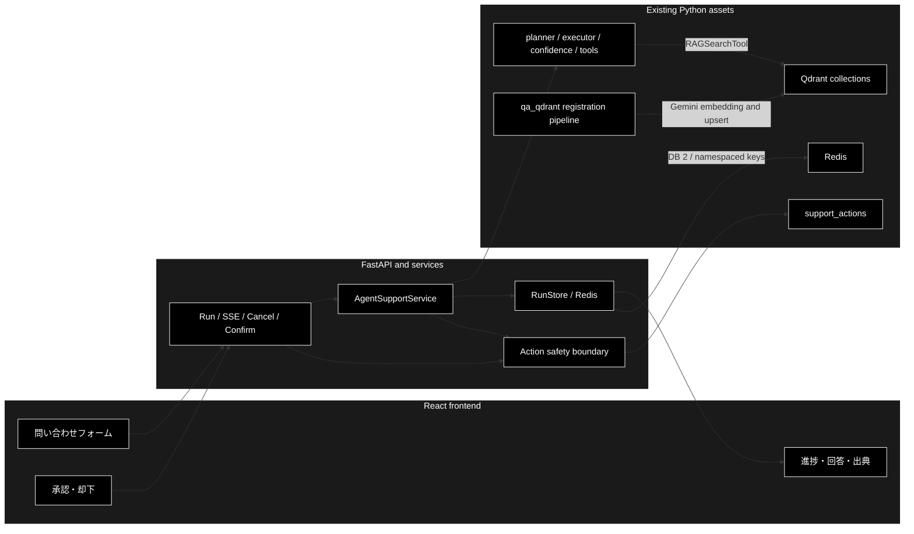
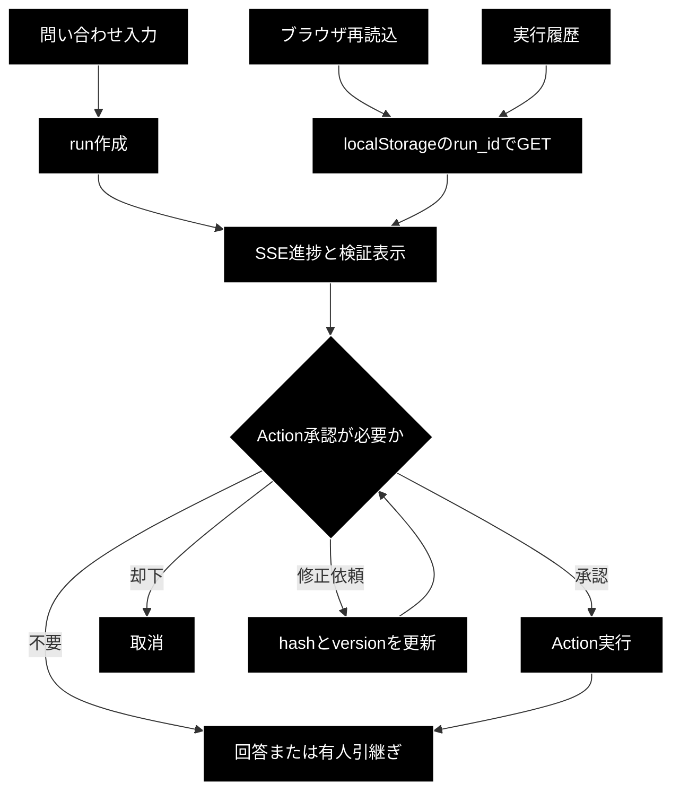

# GRACE Support React アーキテクチャ

**Version 1.1** | 最終更新: 2026-07-17

## 概要

`agent_support_example.py` のGRACE処理をPython側に維持し、FastAPIを介してReact + TypeScript画面から実行する。ブラウザはLLM、Qdrant、ActionBackend、APIキーへ直接アクセスしない。



## 実装構成

| 領域 | ファイル | 責務 |
|---|---|---|
| Domain | `services/agent_support_schemas.py` | run、event、結果、Action、承認の共有schema |
| Orchestration | `services/agent_support_service.py` | CLI処理の実行、構造化イベント発行、Action提案 |
| State | `services/agent_support_run_store.py` | run状態、順序付きevent、pending confirmationのスレッドセーフ保存 |
| Action | `services/agent_support_action_service.py` | 本人確認、承認hash/version/期限、冪等実行 |
| API | `api/app.py`、`api/routes/agent_support.py` | run、state、SSE、cancel、confirmation、health/readiness |
| UI | `frontend/src/App.tsx` | 入力、進捗、根拠、出典、HITL、エラー表示 |

## API

| Method | Path | 用途 |
|---|---|---|
| POST | `/api/agent-support/runs` | run開始 |
| GET | `/api/agent-support/runs/{run_id}` | 最新状態取得・再読込復元 |
| GET | `/api/agent-support/runs/{run_id}/events` | SSE進捗。`Last-Event-ID`対応 |
| POST | `/api/agent-support/runs/{run_id}/cancel` | 未完了runの取消 |
| POST | `/api/agent-support/runs/{run_id}/confirmations` | approve／reject／modify |
| GET | `/health`、`/ready` | processと設定状態の確認。秘密値は返さない |

## Action安全境界

1. Action候補を `pending_confirmation` として保存する。
2. Action本文のSHA-256 hash、version、期限、action_idを発行する。
3. ECの実Actionは本人確認成功を必須にする。
4. 承認内容が一致したときだけActionBackendを一度実行する。
5. 重複承認は保存済み結果を返し、却下・期限切れ・古いversionでは実行しない。

開発時はインメモリStoreを使用できる。`AGENT_SUPPORT_STORE=redis` では、`docker-compose/docker-compose.yml` に既にあるRedisへrun、event、pending confirmationを保存し、プロセス再起動後も復元する。既定URLは `redis://localhost:6379/2`、キーnamespaceは `grace:agent_support:v1` とし、Celeryのbroker DB・キーと分離する。SQLiteやPostgreSQLは本構成へ追加しない。QdrantはRun状態の保存先ではなく、`qa_qdrant/` が登録しGRACEが検索するナレッジ用ベクトルDBである。

## React画面仕様

| 画面領域 | 入力・表示 | 状態変化 |
|---|---|---|
| 問い合わせ | query、vertical、Web、Action、dry-run、EC本人情報 | run作成後にrun_idをlocalStorageへ保存 |
| 実行ステータス | 7段階timeline、cancel、実行履歴 | SSEイベントとGET runで更新 |
| Plan／Execute | complexity、steps、依存、成功条件、step結果 | `plan_completed`／`executor_state`から構築 |
| 検証 | Groundedness、判定主張数、Web一致度、矛盾、no-info | SupportResultから表示 |
| HITL | Action種別・引数、承認、却下、修正依頼 | modify時は新hash/versionで再承認待ち |
| 回答 | 回答／有人引継ぎ、警告、出典URL | completed／escalatedで確定 |
| 履歴 | query、vertical、state | 選択runを結果領域へ復元 |



SSE切断時はGET runで最新状態を取得する。ブラウザ再読込時は保存したrun_idを復元し、pending confirmationを含む同じ画面状態を再構成する。「新しい問い合わせ」で保存run_idを消去する。

## 実データ経路

1. `qa_qdrant/make_qa.py` または `qa_qdrant/make_qa_register_qdrant.py` がAnthropicでQ/Aを生成する。
2. `qa_qdrant/register_to_qdrant.py` がGemini `gemini-embedding-001`でベクトル化し、Qdrantへupsertする。
3. `agent_support_example.py` が業界profileの`allowed_collections`をrun単位configへ設定する。
4. `grace.tools.RAGSearchTool` がQdrantの3072次元・非空collectionを列挙し、許可collectionだけを検索する。
5. ReactはこのQdrantへ直接接続せず、FastAPIが返す回答・出典・イベントのみを扱う。

## 起動

```bash
# Qdrant + Redis
docker-compose -f docker-compose/docker-compose.yml up -d

# terminal 1
export AGENT_SUPPORT_STORE=redis
uv run uvicorn api.app:app --reload --port 8000

# terminal 2
cd frontend
npm ci
npm run dev
```

ブラウザは `http://localhost:5173` を開く。実RAGにはQdrant、`ANTHROPIC_API_KEY`、`GOOGLE_API_KEY`が必要である。Actionは既定でdry-runとし、実Webhookは明示設定時のみ利用する。

## Streamlit・CLIの移行方針

- `agent_support_example.py` のCLIは評価、障害切り分け、Reactとの回帰比較に使用するため維持する。
- `agent_rag.py` と `ui/` は既存利用者向けに当面維持し、React安定前には削除しない。
- Reactを新規サポート業務の標準画面とし、新しいHITL・履歴機能はReact／FastAPI側へ実装する。
- Streamlit廃止の判断は、実Qdrant／LLM代表ケース、再接続、障害試験が完了し、React運用実績が得られた後に別タスクで行う。
- 廃止時もCLIの評価入口とGRACEコアは残し、UI固有コードだけを削除対象とする。

## 検証

```bash
uv run pytest tests/test_agent_support_vertical.py tests/test_support_actions.py \
  tests/services/test_agent_support_run_store.py \
  tests/services/test_agent_support_action_service.py \
  tests/services/test_agent_support_service.py tests/api/test_agent_support_api.py

cd frontend
npm run lint
npm run typecheck
npm run test
npm run build
npm run types:check
```

実APIキーやQdrantを利用できない環境では、`uv run python scripts/capture_agent_support_baseline.py` でanswer、no-info、Action承認待ち、escalateのフォールバック基準を `eval/vertical/baselines/agent_support_mock.json` へ記録する。実環境が利用可能になった後は、この基準と実Qdrant／LLM／Web結果を比較する。

## 変更履歴

| Version | 日付 | 内容 |
|---|---|---|
| 1.1 | 2026-07-17 | React画面領域、HITL修正、再読込復元、履歴選択、旧UI・CLI方針を追加 |
| 1.0 | 2026-07-17 | React、FastAPI、SSE、RunStore、HITL安全境界の実装仕様を作成 |
