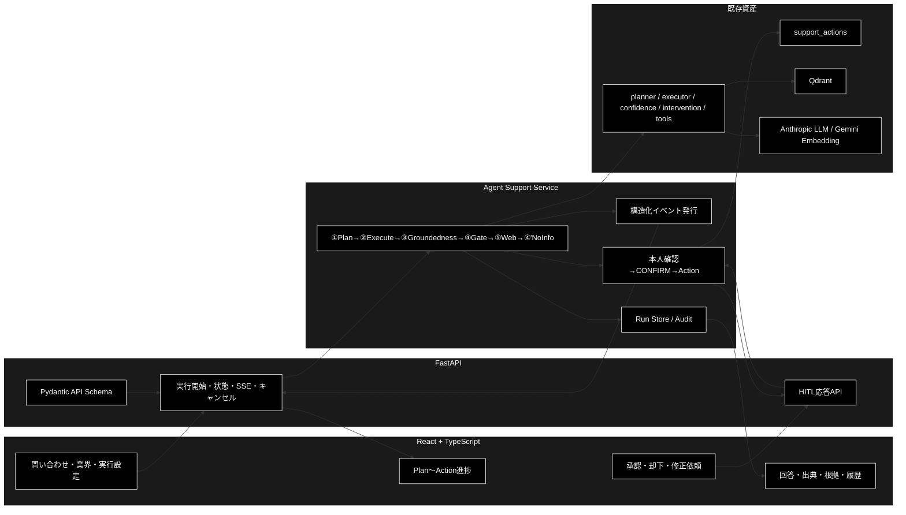

# agent_support_example.py React 移行 TODO

**Version 1.0** | 最終更新: 2026-07-16

## 目次

1. [目的](#1-目的)
2. [調査済みの現状](#2-調査済みの現状)
3. [移行方針](#3-移行方針)
4. [目標アーキテクチャ](#4-目標アーキテクチャ)
5. [処理・状態・画面の対応](#5-処理状態画面の対応)
6. [ディレクトリ・ファイル構成案](#6-ディレクトリファイル構成案)
7. [詳細 TODO](#7-詳細-todo)
8. [MVP と実装順序](#8-mvp-と実装順序)
9. [テスト・動作確認計画](#9-テスト動作確認計画)
10. [完了条件](#10-完了条件)
11. [未確定事項と既定判断](#11-未確定事項と既定判断)
12. [調査対象](#12-調査対象)

---

## 1. 目的

CLI の `agent_support_example.py` が実装する GRACE-Support を、既存の Python／GRACE 資産を再利用し、React + TypeScript の GUI から実行できるようにする。

移行後も、次の業務フローと安全策を維持する。

1. Plan
2. Execute（`executor.execute`／進捗表示時は `execute_plan_generator`）
3. Groundedness
4. 回答ゲート／強制エスカレーション
5. 情報なし回答検知（現行コード上の ④'）
6. Web フォールバック／相互検証（現行コード上の ⑤）
7. Action（本人確認 → HITL CONFIRM → ActionBackend）
8. 最終回答と出典の表示

> 注: 依頼文では「④' 情報なし検知 → ⑤ Web相互検証」の順だが、実コードは原則として「⑤ Webフォールバック → ④' 最終回答の情報なし検知」の順である。内部回答救済の判定中にも情報なし検知を利用する。移行では実コードの安全上の順序を維持する。

---

## 2. 調査済みの現状

### 2.1 再利用できる資産

| 資産 | 現行の責務 | React 移行時の扱い |
|---|---|---|
| `agent_support_example.py` | ①〜⑦の統括、業界プロファイル、判定、CLI表示 | 業務処理をサービスへ抽出し、CLIは薄いアダプターとして維持 |
| `grace/planner.py` | 通常はルールベース2ステップ、複雑／明示Web時はLLM計画、曖昧質問は `ask_user` | そのまま再利用 |
| `grace/executor.py` | Plan-Execute／ReAct振分、動的Web、介入、リプラン、キャンセル | `execute_plan_generator()` をAPI進捗イベント源として再利用 |
| `grace/tools.py` | RAG、Web検索、Reasoning、AskUser、ツール登録 | そのまま再利用 |
| `grace/confidence.py` | Groundedness、ソース一致度、Confidence | そのまま再利用 |
| `grace/intervention.py` | SILENT／NOTIFY／CONFIRM／ESCALATE、介入履歴 | HITL要求・応答型を再利用し、Web APIで承認を受ける |
| `support_actions.py` | dry-run／pseudo／webhook、CSV本人確認 | そのまま再利用。実行前ゲートはバックエンドで強制 |
| `grace/schemas.py` | `ExecutionPlan`、`StepResult`、`ExecutionResult` | API schema の基礎として再利用 |
| `ui/pages/grace_chat_page.py` | Streamlit上のPlan・Execute・履歴表示 | 画面項目と進捗表現を参考にする。Reactへコード移植はしない |
| `tests/test_agent_support_vertical.py` | 回答ゲート、二段判定、情報なし検知、出典の回帰テスト | サービス抽出後も維持し、新しい公開APIへ追加テスト |
| `tests/test_support_actions.py` | ActionBackend、本人確認、CONFIRM統合 | HITL APIと冪等性テストを追加 |

### 2.2 現行実装で移行時に解消する点

| ID | 現状 | 移行上の課題 |
|---|---|---|
| C-01 | `run_support_agent()` 内に生成、判定、Action、`print()` が混在 | APIレスポンスと進捗イベントへ分離できない |
| C-02 | CLIのInterventionは `_AUTO_PROCEED` | 実際の人間承認になっていない |
| C-03 | StreamlitのGRACE画面も介入時に「自動続行」 | Reactでは承認待ち状態を永続化し、承認までActionを禁止する必要がある |
| C-04 | `SupportResult`／`ActionRequest`／`VerticalProfile` がCLIファイル内のdataclass | API向け直列化・サービス再利用のため独立schemaが必要 |
| C-05 | `config.qdrant.allowed_collections` と `config.llm.prompt_addendum` を実行時に変更 | 同時実行時に共有configが混線しないよう、実行単位のconfig複製が必要 |
| C-06 | ブロッキング `executor.execute()` は中間イベントを捨てる | GUI進捗にはジェネレーターまたはコールバックが必要 |
| C-07 | 実行・承認状態の永続化がない | ページ再読込、再接続、監査、二重Action防止に不足 |
| C-08 | Python Streamlit UIのみで `package.json` が存在しない | React + TypeScript基盤を新規追加する必要がある |
| C-09 | FastAPI等は依存済みだが本機能のAPI層がない | 既存Pythonプロセス内に専用APIを追加する必要がある |
| C-10 | `SupportResult.action_result` は文字列中心 | UI表示・監査用にsuccess/backend/messageを構造化する必要がある |

---

## 3. 移行方針

1. GRACEコア、判定ロジック、ActionBackendはPython側に残す。
2. `agent_support_example.py` から表示を除いたオーケストレーションを `services/agent_support_service.py` へ抽出する。
3. CLIは新サービスを呼び、現行と同じ表示・引数・終了動作を維持する。
4. FastAPIは実行開始、状態取得、SSE進捗、キャンセル、HITL応答を提供する。
5. ReactはAPIの状態を描画するだけとし、LLMやActionBackendを直接呼ばない。
6. MVPの状態保存はインターフェースを分離したインメモリ実装とする。再起動耐性が必要ならSQLite実装をP1で追加する。
7. 進捗配信は一方向イベントが中心であるためSSEを第一候補とする。HITL応答は通常のPOST APIを利用する。
8. Actionは `pending_confirmation` 状態で停止し、承認トークンとAction内容のハッシュが一致した場合のみ一度だけ実行する。
9. CLI／Streamlitは移行完了まで削除しない。

---

## 4. 目標アーキテクチャ



### 4.1 実行状態案

`queued → planning → executing → verifying → gating → web_verifying → no_info_check → pending_confirmation → action_executing → completed`

終端・例外状態は `escalated`、`cancelled`、`failed` とする。Actionが無い場合は `pending_confirmation` と `action_executing` を通らない。

---

## 5. 処理・状態・画面の対応

| 処理 | 主要入力 | 主要出力 | APIイベント例 | React表示 |
|---|---|---|---|---|
| ① Plan | query、vertical | `ExecutionPlan` | `plan_started` / `plan_completed` | ステップ、複雑度、要確認、成功基準 |
| ② Execute | `ExecutionPlan` | `ExecutionResult`、`StepResult` | `step_started` / `step_completed` / `tool_event` | ステップ状態、信頼度、検索種別、実行時間 |
| ③ Groundedness | query、answer、sources | `GroundednessResult` | `groundedness_completed` | 支持率、判定可能主張数、矛盾、出典数 |
| ④ Gate | 支持率、verified、出典、profile | decision、warning、forced | `gate_completed` | answer／escalate、注意、強制理由 |
| ⑤ Web | query、内部回答 | Web結果、一致度 | `web_started` / `web_completed` | Web使用、再利用、URL、一致度、矛盾 |
| ④' NoInfo | query、最終回答 | no_info、marker | `no_info_completed` | 検知理由、有人引継ぎ |
| ⑥ Action候補 | query、decision、intent | `ActionRequest` | `action_proposed` | 種別、引数、影響、dry-run |
| 本人確認 | identity | `IdentityResult` | `identity_completed` | 方法、確認済み／未確認、理由 |
| HITL | Action内容 | `InterventionResponse` | `confirmation_required` / `confirmation_resolved` | 承認、却下、修正依頼 |
| Action実行 | 承認済Action | `ActionOutcome` | `action_started` / `action_completed` | backend、成功、メッセージ |
| 最終応答 | `SupportResult` | 回答・出典・KPI | `run_completed` | 回答、出典、警告、メタ情報 |

---

## 6. ディレクトリ・ファイル構成案

既存規約の調査後に最終確定する。現時点の推奨構成は次のとおり。

```text
grace_agent_v2_react_openai/
├── agent_support_example.py                  # 既存CLIを薄いアダプター化
├── support_actions.py                        # 既存ActionBackendを再利用
├── services/
│   ├── agent_support_service.py              # 表示非依存のオーケストレーション
│   ├── agent_support_run_store.py            # 実行状態・イベント・監査の保存
│   └── agent_support_action_service.py        # 本人確認・HITL・冪等Action実行
├── api/
│   ├── __init__.py
│   ├── app.py                                # FastAPIアプリ
│   ├── dependencies.py                       # Service／Store注入
│   ├── schemas/
│   │   └── agent_support.py                  # Request／Response／Event schema
│   └── routes/
│       └── agent_support.py                  # run／events／cancel／confirm
├── frontend/
│   ├── package.json
│   ├── vite.config.ts
│   ├── tsconfig.json
│   ├── src/
│   │   ├── app/
│   │   ├── api/agentSupportClient.ts
│   │   ├── types/agentSupport.ts
│   │   ├── pages/AgentSupportPage.tsx
│   │   ├── components/agent-support/
│   │   │   ├── SupportQueryForm.tsx
│   │   │   ├── WorkflowTimeline.tsx
│   │   │   ├── PlanPanel.tsx
│   │   │   ├── ExecutePanel.tsx
│   │   │   ├── GroundednessPanel.tsx
│   │   │   ├── GatePanel.tsx
│   │   │   ├── WebVerificationPanel.tsx
│   │   │   ├── EscalationPanel.tsx
│   │   │   ├── ActionConfirmationDialog.tsx
│   │   │   ├── FinalAnswerPanel.tsx
│   │   │   └── CitationList.tsx
│   │   └── test/
│   └── e2e/
├── tests/
│   ├── services/test_agent_support_service.py
│   ├── services/test_agent_support_action_service.py
│   └── api/test_agent_support_api.py
└── docs/
    ├── agent_support_react_migration_todo.md
    └── agent_support_react_architecture.md
```

---

## 7. 詳細 TODO

状態は `TODO`／`DOING`／`BLOCKED`／`DONE` を使用する。

### Phase 0: ベースラインと契約固定

| ID | 優先度 | 状態 | TODO | 対象／再利用資産 | 完了条件・検証 |
|---|---|---|---|---|---|
| P0-01 | P0 | DONE | CLI本体と呼び出し経路を調査する | `agent_support_example.py`、GRACEコア | ①〜⑦、分岐、CLI引数、データ型を本書へ反映 |
| P0-02 | P0 | DONE | 既存UIと進捗実装を調査する | `ui/pages/grace_chat_page.py`、`grace_components.py` | Streamlit、session state、generator利用、HITL自動続行を特定 |
| P0-03 | P0 | DONE | Action・本人確認・介入を調査する | `support_actions.py`、`grace/intervention.py` | dry-run／pseudo／webhook／CSV照合／CONFIRMを整理 |
| P0-04 | P0 | DONE | React／API基盤の有無を調査する | `pyproject.toml`、`requirements.txt`、リポジトリ全体 | FastAPI依存あり、React基盤なしを確認 |
| P0-05 | P0 | TODO | 現行の純関数・Actionテストを実行する | `tests/test_agent_support_vertical.py`、`tests/test_support_actions.py` | APIキー・Qdrant不要の対象テストが全件成功 |
| P0-06 | P0 | TODO | CLI代表ケースのベースラインを定義する | `eval/vertical/cases/*.jsonl`、`eval/vertical/run.py` | gov／saas／ecでanswer、forced escalate、no-info、action各1件以上を固定 |
| P0-07 | P1 | TODO | 実API利用可能時のCLIベースラインを保存する | Qdrant、Anthropic、Gemini、Web検索 | SupportResultと実行時間をJSON記録。利用不能時はモック基準を明記 |

### Phase 1: サービス分離とデータ契約

| ID | 優先度 | 状態 | TODO | 対象／再利用資産 | 完了条件・検証 |
|---|---|---|---|---|---|
| P1-01 | P0 | TODO | `ActionRequest`、`SupportResult`、`VerticalProfile`を独立schemaへ移す | 現行dataclass、`grace/schemas.py`のPydantic作法 | CLI・API双方からimportでき、既存テストが成功 |
| P1-02 | P0 | TODO | 実行状態enumと構造化イベントschemaを定義する | `ExecutionState`、`StepResult` | 全処理段階と終端状態を表現しJSON化できる |
| P1-03 | P0 | TODO | `run_support_agent()`を表示非依存サービスへ抽出する | 現行①〜⑥ロジック | `print()`なしで最終結果を返し、イベントsinkを注入できる |
| P1-04 | P0 | TODO | CLI表示をイベント／結果のconsumerとして再実装する | `_banner()`、`_render()` | 既存CLI引数と主要表示が維持される |
| P1-05 | P0 | TODO | `execute_plan_generator()`をサービス進捗へ接続する | Executor generator | step開始・完了、tool event、pauseを構造化イベント化 |
| P1-06 | P0 | TODO | 実行ごとに独立したconfigを生成する | `get_config()`、VerticalProfile | 同時実行でallowed collections／prompt addendumが混線しないテストが成功 |
| P1-07 | P0 | TODO | 標準出力依存をログ／event sinkへ置換する | intent、no-info、Web、Action表示 | テスト時にstdout解析なしで状態を検証できる |
| P1-08 | P1 | TODO | Action結果を構造化する | `ActionOutcome` | success、backend、message、action idをSupportResultへ保持 |
| P1-09 | P1 | TODO | CLI互換回帰テストを追加する | `run_support_agent()`公開契約 | 既存呼び出し側 `eval/vertical/run.py` が変更なしまたは薄い修正で動く |

### Phase 2: 実行状態・HITL・Action安全境界

| ID | 優先度 | 状態 | TODO | 対象／再利用資産 | 完了条件・検証 |
|---|---|---|---|---|---|
| P2-01 | P0 | TODO | `AgentSupportRunStore`インターフェースを定義する | run、events、pending action、audit | create/get/update/append_event/cancel/resolve_confirmationを提供 |
| P2-02 | P0 | TODO | スレッドセーフなインメモリStoreを実装する | Python標準同期機構 | 並行runの状態とイベントが混線しない |
| P2-03 | P0 | TODO | Action提案時に `pending_confirmation` で停止する | `_decide_action()`、InterventionRequest | 承認前にbackend.executeが一度も呼ばれない |
| P2-04 | P0 | TODO | 承認／却下／修正依頼のサービスAPIを実装する | InterventionResponse | 3応答を区別し、却下時はActionを実行しない |
| P2-05 | P0 | TODO | Action内容ハッシュと承認バージョンを導入する | ActionRequest | 承認後にAction内容が変われば古い承認を拒否 |
| P2-06 | P0 | TODO | Actionの冪等性を実装する | action id、RunStore | 同じ承認POSTを再送してもbackend.executeは1回だけ |
| P2-07 | P0 | TODO | 本人確認結果をAction前に保存する | IdentityVerifier | EC未確認時は確認画面へ進まず有人引継ぎ |
| P2-08 | P1 | TODO | 監査イベントを定義・保存する | InterventionHandler.historyを参考 | 提案、本人確認、承認者、日時、結果、失敗を追跡可能 |
| P2-09 | P1 | TODO | SQLite Storeを追加する | RunStore interface | プロセス再起動後もrun／承認状態を復元できる |
| P2-10 | P1 | TODO | pending confirmationの期限切れを実装する | timeout_seconds | 期限切れ承認を拒否しAction未実行 |

### Phase 3: FastAPI

| ID | 優先度 | 状態 | TODO | 対象／再利用資産 | 完了条件・検証 |
|---|---|---|---|---|---|
| P3-01 | P0 | TODO | FastAPIアプリと依存注入を追加する | 既存FastAPI／Uvicorn依存 | health endpointとテストclientが起動 |
| P3-02 | P0 | TODO | `POST /api/agent-support/runs` を実装する | AgentSupportService | query、vertical、use_web、do_action、dry_run、identityを検証しrun_idを返す |
| P3-03 | P0 | TODO | `GET /api/agent-support/runs/{run_id}` を実装する | RunStore | 最新状態、Plan、各評価、最終結果、pending actionを返す |
| P3-04 | P0 | TODO | `GET /api/agent-support/runs/{run_id}/events` SSEを実装する | 構造化イベント | 順序付きevent id、heartbeat、再接続のLast-Event-IDに対応 |
| P3-05 | P0 | TODO | `POST /runs/{run_id}/confirmations` を実装する | HITL service | approve／reject／modifyを受け、権限・version・冪等性を検証 |
| P3-06 | P0 | TODO | `POST /runs/{run_id}/cancel` を実装する | `Executor.cancel()`、run state | 未完了runをcancelledにし、Actionを開始しない |
| P3-07 | P0 | TODO | APIエラー契約を統一する | Pydantic、FastAPI exception handler | validation、not found、conflict、expired、internalをUIが識別可能 |
| P3-08 | P0 | TODO | CORSと秘密情報境界を設定する | FastAPI middleware | 許可originのみ。APIキー・webhook token・identity台帳パスを返さない |
| P3-09 | P1 | TODO | run一覧／履歴APIを追加する | RunStore | 日時、vertical、statusで取得できる |
| P3-10 | P1 | TODO | readiness endpointを追加する | Qdrant、環境変数 | 未設定サービスと起動可否を秘密を漏らさず返す |
| P3-11 | P1 | TODO | OpenAPI schemaからTypeScript型生成を導入する | FastAPI OpenAPI | Python／TSの型ずれをCIで検出 |

### Phase 4: React + TypeScript画面

| ID | 優先度 | 状態 | TODO | 対象／再利用資産 | 完了条件・検証 |
|---|---|---|---|---|---|
| P4-01 | P0 | TODO | Vite + React + TypeScript基盤を追加する | 新規 `frontend/` | dev、test、typecheck、buildの各scriptが成功 |
| P4-02 | P0 | TODO | API clientとSSE clientを実装する | FastAPI契約 | run開始、状態取得、再接続、HITL、cancelを型安全に呼べる |
| P4-03 | P0 | TODO | 問い合わせフォームを作る | CLI引数を画面項目へ対応 | query、gov/saas/ec、Web、Action、dry-run、identityを入力可能 |
| P4-04 | P0 | TODO | ワークフロータイムラインを作る | 状態・イベントschema | ①Plan〜⑥Actionの現在／完了／失敗／skipを表示 |
| P4-05 | P0 | TODO | Planパネルを作る | 既存Streamlit Plan表示 | complexity、steps、depends_on、fallback、success criteriaを表示 |
| P4-06 | P0 | TODO | Execute進捗パネルを作る | StepResult、tool events | step status、confidence、sources、時間を段階表示 |
| P4-07 | P0 | TODO | Groundedness／回答ゲートパネルを作る | SupportResult | 支持率、decided、矛盾、warning、forced escalate、no-infoを表示 |
| P4-08 | P0 | TODO | Web相互検証と出典一覧を作る | citations、agreement、web_reused | 社内／Webを区別し、Web URLを安全な外部リンクで表示 |
| P4-09 | P0 | TODO | HITL確認ダイアログを作る | pending Action、confirmation API | Action種別、引数、影響、backend予定、承認／却下／修正を表示 |
| P4-10 | P0 | TODO | 最終回答／エスカレーション画面を作る | SupportResult | answerとcitations、または有人引継ぎ理由を明確に表示 |
| P4-11 | P0 | TODO | cancel、retry、APIエラー表示を実装する | API error contract | ユーザーが状態を誤認せず再試行可能 |
| P4-12 | P1 | TODO | 再読込／SSE再接続時の状態復元を実装する | run_id、GET run | pending confirmationを含め同じ画面へ復元 |
| P4-13 | P1 | TODO | 実行履歴画面を作る | run list API | 過去runを選び、結果と監査概要を表示 |
| P4-14 | P1 | TODO | アクセシビリティとレスポンシブ対応を行う | WCAG基本項目 | キーボード操作、focus、label、狭幅表示をテスト |

### Phase 5: テスト・デバッグ・動作確認

| ID | 優先度 | 状態 | TODO | 対象／再利用資産 | 完了条件・検証 |
|---|---|---|---|---|---|
| P5-01 | P0 | TODO | サービス単体テストを追加する | 全主要分岐をstub化 | answer、warning、forced、Web、no-info、actionをAPIキーなしで検証 |
| P5-02 | P0 | TODO | config分離・並行実行テストを追加する | gov／saas／ec同時run | collectionとprompt_addendumがrun間で混線しない |
| P5-03 | P0 | TODO | HITL安全テストを追加する | fake backend | 未承認0回、承認1回、重複承認1回、却下0回を検証 |
| P5-04 | P0 | TODO | FastAPI統合テストを追加する | TestClient／ASGI transport | run→events→confirm→completeとcancelを検証 |
| P5-05 | P0 | TODO | React component testを追加する | Vitest／Testing Library候補 | 各イベントで正しいパネル・ボタン・警告が表示される |
| P5-06 | P0 | TODO | E2Eテストを追加する | Playwright候補、mock API | answer、escalate、HITL approve／rejectをブラウザで検証 |
| P5-07 | P0 | TODO | CLI回帰テストを実行する | 既存pytest／eval | 移行前の純関数・Action・vertical指標を破壊していない |
| P5-08 | P0 | TODO | Python品質チェックを実行・修正する | ruff、pytest | 対象差分のruffと関連pytestが成功 |
| P5-09 | P0 | TODO | Frontend品質チェックを実行・修正する | lint、typecheck、test、build | 全コマンド成功 |
| P5-10 | P1 | TODO | 実Qdrant／LLM／Webによる代表ケースを確認する | Phase 0 baseline | CLIとReactのdecision、action、出典が許容範囲で一致 |
| P5-11 | P1 | TODO | 障害系を確認する | APIキーなし、Qdrant停止、Web失敗、Webhook失敗 | failed／escalatedが適切に表示され秘密を漏らさない |
| P5-12 | P1 | TODO | 長時間・再接続・キャンセルを確認する | SSE、RunStore | 切断後復元、cancel後Action禁止、イベント欠落なし |

### Phase 6: 文書・運用

| ID | 優先度 | 状態 | TODO | 対象／再利用資産 | 完了条件・検証 |
|---|---|---|---|---|---|
| P6-01 | P1 | TODO | 実装後アーキテクチャ文書を作る | 本TODO、実装コード | API、状態遷移、HITL境界、実ファイルを記載 |
| P6-02 | P1 | TODO | React画面仕様を作る | 実装コンポーネント | レイアウト、状態、操作、エラー、画面遷移を記載 |
| P6-03 | P1 | TODO | 開発・起動手順を更新する | README／setup docs | backend、frontend、Qdrantを再現可能な手順で起動 |
| P6-04 | P1 | TODO | 環境変数一覧を更新する | `.env`項目 | 秘密／非秘密、必須／任意、dry-runを明記 |
| P6-05 | P1 | TODO | CIへbackend／frontendチェックを追加する | GitHub Actions | pytest、ruff、typecheck、test、buildをPRで実行 |
| P6-06 | P2 | TODO | Streamlit画面とCLIの将来方針を決める | `agent_rag.py`、`ui/` | React安定後の維持／廃止条件を文書化。現時点では削除しない |

---

## 8. MVP と実装順序

### 8.1 MVP範囲

MVPはP0優先度を対象とし、次を含む。

- 既存ロジックのサービス分離とCLI互換
- 単一プロセスのインメモリRunStore
- FastAPIのrun／state／SSE／cancel／confirmation
- React入力、進捗、回答、出典、エスカレーション、実HITL
- dry-run Action
- mock中心のbackend／frontend／E2Eテスト
- React production build

P1のSQLite、履歴、実外部サービス検証、監査強化、CIはMVP直後に実施する。

### 8.2 クリティカルパス

`P0-05 → P1-01 → P1-02 → P1-03 → P1-05 → P2-01 → P2-03 → P2-04 → P3-02 → P3-04 → P3-05 → P4-02 → P4-03〜P4-11 → P5-01〜P5-09`

### 8.3 並行実行可能なまとまり

- P1サービス契約確定後: API実装とReact静的コンポーネント
- P3 OpenAPI確定後: API統合テストとReact API client
- UI実装中: mockによるE2E fixture作成
- MVP完成後: SQLite、履歴、文書、CI

---

## 9. テスト・動作確認計画

### 9.1 API不要の必須回帰

```bash
uv run pytest tests/test_agent_support_vertical.py tests/test_support_actions.py
uv run pytest tests/grace/test_planner.py tests/grace/test_executor.py \
  tests/grace/test_groundedness.py tests/grace/test_intervention.py
```

### 9.2 実装後のBackend

```bash
uv run pytest tests/services/test_agent_support_service.py \
  tests/services/test_agent_support_action_service.py \
  tests/api/test_agent_support_api.py
uv run ruff check agent_support_example.py support_actions.py services api tests
```

### 9.3 実装後のFrontend

実際に採用した `package.json` scriptsを正とする。最低限、次を用意する。

```bash
npm run lint
npm run typecheck
npm run test
npm run build
npm run test:e2e
```

### 9.4 代表シナリオ

| シナリオ | 期待結果 |
|---|---|
| gov「住民票の写しの取り方は？」 | 出典付きanswer、Actionなし |
| saas「課金プランの違いを教えて」 | FAQ質問として強制エスカレを抑止 |
| saas「サービスが落ちています」 | incident、forced escalate、有人Action候補 |
| ec「返品したい」dry-run | 本人確認→HITL待ち→承認後にdry-runを1回実行 |
| ec「返品したい」却下 | Action実行0回、cancelled/rejected表示 |
| 範囲外・情報なし質問 | ④'でno-info検知しescalate |
| 内部根拠不足 | Web検索、出典、一致度／矛盾を表示 |
| SSE切断・再接続 | Last-Event-ID以降を復元し重複表示しない |

---

## 10. 完了条件

- Reactからqueryと業界プロファイルを指定してrunを開始できる。
- Plan、各Execute step、Groundedness、回答ゲート、Web、情報なし、Actionを順次確認できる。
- 現行CLIと同じ判定ロジック・しきい値・業界プロファイルを使用する。
- 内部／Web出典を区別して表示できる。
- 強制エスカレーションと情報なしエスカレーションを区別できる。
- Actionは本人確認と明示承認を通過するまで実行されない。
- 重複承認、期限切れ承認、変更後の古い承認でActionを実行できない。
- APIキー、Webhook token、本人確認台帳の内容／パスをブラウザへ返さない。
- CLIと既存テストを破壊しない。
- Backend関連pytest／ruff、Frontend lint／typecheck／test／build、主要E2Eが成功する。
- 外部依存で未実行の検証は、理由と残存リスクが明示される。

---

## 11. 未確定事項と既定判断

ユーザー確認で作業を止めないため、MVPでは次の既定判断を採用する。実コードや既存規約に反することが判明した場合はそちらを優先する。

| 項目 | MVP既定 | 後で変更が必要になる条件 |
|---|---|---|
| React基盤 | React + TypeScript + Vite | 既存の別frontend規約が追加された場合 |
| API | FastAPI | リポジトリに別APIエントリが確立している場合 |
| 進捗 | SSE + POST HITL | 双方向の高頻度通信が必要な場合はWebSocket |
| 状態保存 | interface + インメモリ | 再起動耐性・複数workerはSQLite/PostgreSQLへ |
| 認証 | MVPでは単一利用者／ローカル前提 | 共有環境へ出す前に認証・承認者IDを必須化 |
| Action | dry-runを既定 | 実Webhookは明示設定時のみ |
| UI言語 | 日本語 | 多言語要件が提示された場合 |
| 既存UI | CLI／Streamlitを維持 | Reactの回帰検証完了後に別途廃止判断 |

本番公開、実Webhook送信、認証方式、複数承認者、個人情報保存期間はMVP外とし、実行前に要件確定が必要である。

---

## 12. 調査対象

本TODO作成時に、少なくとも以下の実コード・仕様・テストを確認した。

- `agent_support_example.py` 全体
- `support_actions.py` 全体
- `grace/planner.py` の計画生成とfactory
- `grace/executor.py` のgenerator／blocking／ReAct振分／pause／cancel／resume
- `grace/schemas.py` のPlan／Step／ExecutionResult
- `grace/confidence.py` のGroundednessとsource agreement factory
- `grace/intervention.py` のrequest／response／handler／factory
- `grace/tools.py` のToolResult／RAG／Web／Reasoning／ToolRegistry
- `ui/pages/grace_chat_page.py`
- `ui/pages/agent_chat_page.py`
- `ui/components/grace_components.py`
- `agent_rag.py`
- `grace/doc/agent_support_example.md`
- `grace/doc/agent_support_example_flow.md`
- `grace/doc/agent_support_verticals.md`
- `docs/agent_support_example.md`
- `docs/migration_and_update.md`
- `tests/test_agent_support_vertical.py`
- `tests/test_support_actions.py`
- `tests/grace/test_planner.py`
- `tests/grace/test_executor.py`
- `tests/grace/test_groundedness.py`
- `tests/grace/test_intervention.py`
- `pyproject.toml`、`requirements.txt`、`uv.lock`

---

## 変更履歴

| Version | 日付 | 内容 |
|---|---|---|
| 1.0 | 2026-07-16 | CLI、GRACEコア、Streamlit UI、Action／HITL、テスト、依存構成を調査し、React + FastAPI移行の構成、P0〜P6 TODO、MVP、テスト、完了条件を作成 |
