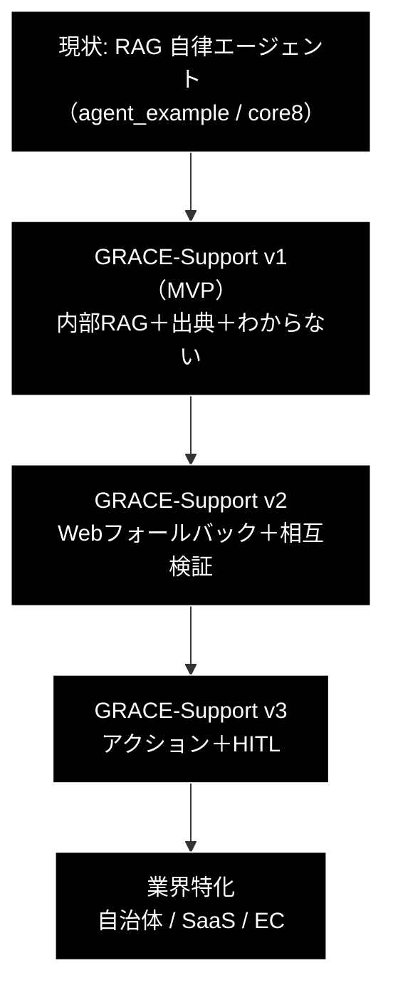

# migration_and_update — 自律型エージェントの発展計画（需要分析と GRACE-Support 提案）

**Version 1.0** | 最終更新: 2026-06-28

本書は、現在の日本語 RAG 自律エージェント（GRACE）を**次にどの応用へ発展させるか**を、市場需要の観点から整理し、採用方針（**GRACE-Support**）と今後のロードマップを記録する上位計画資料（migration & update material）である。

> **関連ドキュメント**
> - [`grace/doc/agent_support_example.md`](../grace/doc/agent_support_example.md) — GRACE-Support の詳細設計書（本書の下位・仕様）
> - [`grace/doc/grace_core_flow.md`](../grace/doc/grace_core_flow.md) — 5 段階設計・8 コアモジュール・プロンプト/API 発行部
> - [`grace/doc/grace_core.md`](../grace/doc/grace_core.md) — コアモジュール群の横断アーキテクチャ

---

## 1. 現状（出発点）

- **RAG の作成**と、**登録 RAG データを検索する自律型エージェント**（GRACE: Plan→Execute→Confidence→Intervention→Replan ＋ tools/memory）を構築済み。
- 保有資産＝**日本語 RAG ＋ 出典検証（groundedness）＋ HITL ＋ 計画/再計画**。
- サンプル：`agent_example.py`（最小）、`agent_example_core8.py`（8 モジュール明示）。

---

## 2. 需要の観点（何が「需要」を生むか）

需要は基本的に次から生まれる。

1. **反復・大量**（同種処理が多い）
2. **人件費が高い／有資格者が足りない**
3. **24 時間 × 365 日**の稼働要求
4. **書類・規制対応が重い**
5. **ROI が測れる**（削減時間・問い合わせ件数）

### 需要が大きい分野（サマリ）

| # | 分野 | 需要の源泉 | 既存資産との接続 |
|---|------|-----------|----------------|
| 1 | カスタマーサポート自動化 | 大量・反復・24/365・高離職 | ★最高（日本語 RAG が回答エンジン） |
| 2 | 社内ナレッジ・コパイロット | 文書が探せない痛み | ★最高（RAG＋出典検証） |
| 3 | 文書処理・IDP（請求書/契約） | 手入力コスト大 | 高（構造化出力＋HITL） |
| 4 | 営業・マーケ支援（調査/生成） | 高単価人材の作業 | 中（Web 調査） |
| 5 | データ分析コパイロット | 非エンジニアの数値要求 | 高（CodeExecuteTool） |
| 6 | 音声エージェント（電話） | コールセンター人手不足 | 中（頭脳は流用） |

### 日本で特に伸びる観点

| 観点 | 背景 | 狙い |
|------|------|------|
| 人手不足の穴埋め | 少子高齢化 | サポート/予約/書類処理の自動化 |
| 書類・PDF 中心 | ハンコ・紙文化 | IDP＋RAG |
| 日本語対応の質 | 海外製は敬語・出典が弱い | **日本語 RAG の精度**で差別化 |
| 中小企業の DX | 大手は飽和 | 安価な業務まるごと支援 |
| 行政・自治体 | 問い合わせ大量 | 住民 FAQ＋一次トリアージ |

> **示唆**：「読む（RAG）」だけはコモディティ化しつつある。需要と単価が伸びるのは **「読む＋行動する＋人間に渡す」**（＝ intervention/replan が効く領域）。

---

## 3. 採用方針：GRACE-Support（統合サポート・コパイロット）

需要が大きく（分野 1・2）、学習価値が高く（Web 調査・groundedness・行動＋HITL）、既存資産を最小追加で流用できる 1 本へ統合する。

**一言**：「社内ナレッジで答え、足りなければ Web で裏取りし、出典を必ず示し、“わからない/行動が要る”ときは人間に渡す、日本語サポート AI」。

### スコープ（3 段）

| 版 | 機能 | 学ぶ要素 | 追加実装 |
|----|------|---------|---------|
| **v1 (MVP)** | 内部 RAG→出典つき回答／根拠不足なら「わかりません」 | 誠実さの制度化（groundedness ゲート） | 回答ポリシーのみ |
| **v2** | 内部不足時に Web フォールバック＋相互検証 | ディープリサーチ・引用管理 | WebSearchTool 起動条件 |
| **v3** | アクション（起票/返信/エスカレ）＋HITL | 副作用＋安全弁 | ActionTool＋CONFIRM |

### GRACE モジュール対応

詳細仕様は [`grace/doc/agent_support_example.md`](../grace/doc/agent_support_example.md) を参照。

---

## 4. 全体ロードマップ

- **設計先行（現在）**：`grace/doc/agent_support_example.md`（本書の下位・完了）。
- **次フェーズ（将来）**：GRACE-Support 完成後、**業界特化**（自治体／SaaS／EC など）へ展開。業界ごとに、対象コレクション・想定質問・アクション・エスカレ基準・KPI を差し替える。

### 業界特化の観点（将来メモ）

| 業界 | 対象ナレッジ | 代表アクション | 特有の注意 |
|------|-------------|--------------|-----------|
| 自治体 | 条例・手続き・FAQ | 窓口案内・申請様式提示 | 正確性・出典必須、断定回避 |
| SaaS | 製品ドキュメント・API | チケット起票・障害エスカレ | バージョン差・再現手順 |
| EC | 商品・返品規定・注文 | 返品受付・配送状況照会 | 個人情報・注文権限の確認 |

---

## 5. 評価指標（需要に直結）

自己解決率（deflection）／出典付与率／**根拠なし回答率（0 目標）**／エスカレーション適合率／平均応答時間。

---

## 6. 変更履歴

| バージョン | 変更内容 |
|-----------|---------|
| 1.0 | 初版作成。需要分析（分野サマリ・日本観点）、採用方針 GRACE-Support（v1〜v3）、GRACE モジュール対応図、全体ロードマップ（→業界特化: 自治体/SaaS/EC）、KPI を記録 |
