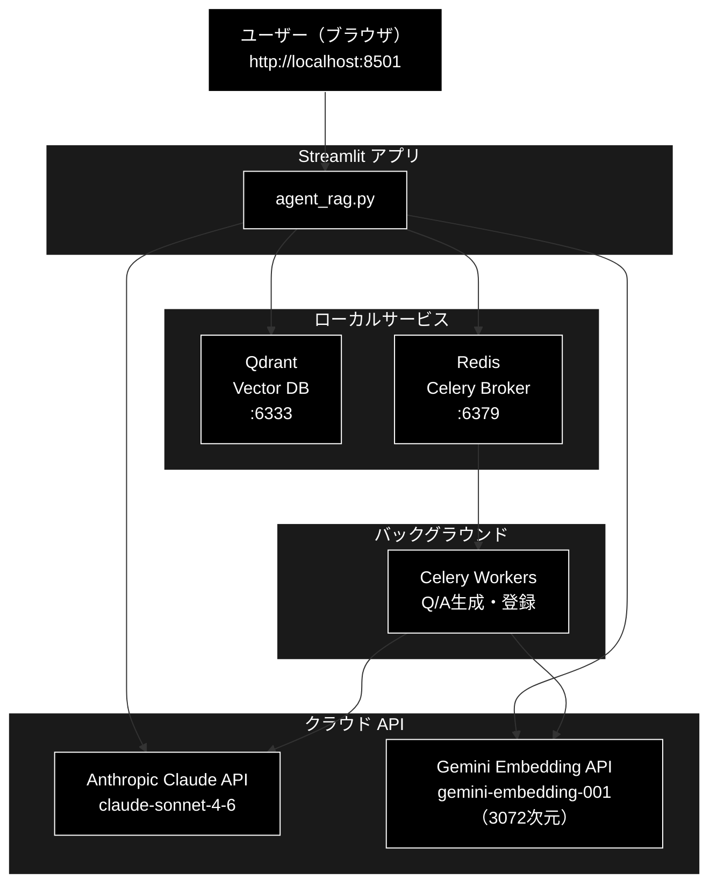

# セットアップ・インストール手順書

**プロジェクト**: anthropic_grace_agent（GRACE Agent + RAG システム）  
**LLM**: Anthropic Claude API（`claude-sonnet-4-6`）  
**Embedding**: Gemini Embedding API（`gemini-embedding-001`）  
**バージョン**: 1.2  
**作成日**: 2026-05-26  
**最終更新**: 2026-06-17

---

## 目次

1. [システム構成・概要](#1-システム構成概要)
2. [動作環境・前提条件](#2-動作環境前提条件)
3. [必要ソフトウェアのインストール](#3-必要ソフトウェアのインストール)
   - [3.1 Homebrew（macOS）](#31-homebrewmacos)
   - [3.2 Python 3.11 以上](#32-python-311-以上)
   - [3.3 uv（パッケージマネージャー）](#33-uvパッケージマネージャー)
   - [3.4 Docker Desktop](#34-docker-desktop)
   - [3.5 MeCab（オプション）](#35-mecabオプション)
4. [プロジェクトのセットアップ](#4-プロジェクトのセットアップ)
   - [4.1 リポジトリのクローン](#41-リポジトリのクローン)
   - [4.2 Python 依存パッケージのインストール](#42-python-依存パッケージのインストール)
   - [4.3 環境変数の設定（.env）](#43-環境変数の設定env)
5. [インフラサービスの起動](#5-インフラサービスの起動)
   - [5.1 Docker サービス（Qdrant + Redis）](#51-docker-サービスqdrant--redis)
   - [5.2 Celery ワーカーの起動](#52-celery-ワーカーの起動)
6. [初回データ登録](#6-初回データ登録)
7. [アプリケーションの起動・停止](#7-アプリケーションの起動停止)
8. [ポート一覧](#8-ポート一覧)
9. [動作確認チェックリスト](#9-動作確認チェックリスト)
10. [トラブルシューティング](#10-トラブルシューティング)
11. [主要ファイル構成](#11-主要ファイル構成)
12. [参考ドキュメント](#12-参考ドキュメント)

---

## 1. システム構成・概要

### アーキテクチャ図



### コンポーネント概要

| コンポーネント | 役割 | 実行場所 |
|--------------|------|---------|
| Streamlit | Web UI（agent_rag.py） | Python プロセス |
| Anthropic Claude API | LLM（チャンク分割・Q&A生成・Agent応答） | クラウド（Anthropic） |
| Gemini Embedding API | Embedding（3072次元） | クラウド（Google） |
| Qdrant | ベクトル DB（RAG 検索） | Docker コンテナ |
| Redis | Celery タスクブローカー・結果保存 | Docker コンテナ |
| Celery | Q/A 生成などのバックグラウンドタスク | Python プロセス |

---

## 2. 動作環境・前提条件

### 対応 OS

| OS | 対応状況 |
|----|---------|
| macOS（Apple Silicon M1/M2/M3） | ✅ 推奨 |
| macOS（Intel） | ✅ 動作可 |
| Linux（Ubuntu 22.04+） | ✅ 動作可 |
| Windows（WSL2） | ⚠️ 未確認 |

### ハードウェア要件

| リソース | 最小 | 推奨 |
|---------|------|------|
| CPU | 4 コア | 8 コア以上 |
| RAM | 8 GB | 16 GB 以上 |
| ディスク空き | 5 GB | 10 GB 以上 |

> LLM（Anthropic Claude）・Embedding（Gemini）はクラウド API のため、ローカルへの大容量モデルダウンロードは不要です。

### 必須ソフトウェア一覧

| ソフトウェア | バージョン | 用途 |
|------------|----------|------|
| Python | **3.11 以上**（3.13 を推奨） | アプリ実行環境 |
| uv | 最新版 | パッケージ管理 |
| Docker Desktop | 最新版 | Qdrant / Redis |
| Git | 2.x 以上 | リポジトリ操作 |

### 必須 API キー

| API | 用途 | 取得先 |
|-----|------|--------|
| `ANTHROPIC_API_KEY` | LLM（Anthropic Claude） | https://console.anthropic.com/ |
| `GOOGLE_API_KEY` | Embedding（Gemini） | https://aistudio.google.com/ |
| `GEMINI_API_KEY` | Embedding（代替設定名） | https://aistudio.google.com/ |
| `COHERE_API_KEY` | Rerank（オプション） | https://dashboard.cohere.com/ |
| `SERPAPI_KEY` | Web 検索（オプション・`web_search` backend=serpapi 時） | https://serpapi.com/ |
| `GOOGLE_CSE_API_KEY` / `GOOGLE_CSE_ENGINE_ID` | Web 検索（オプション・backend=google_cse 時） | https://programmablesearchengine.google.com/ |

> LLM 用に `ANTHROPIC_API_KEY`、Embedding 用に `GOOGLE_API_KEY`（または `GEMINI_API_KEY`）を設定してください。`GOOGLE_API_KEY` と `GEMINI_API_KEY` は同じキーを設定して構いません。
>
> Web 検索ツール（`grace/tools.py`）を利用する場合のみ、選択した backend に応じて `SERPAPI_KEY` または `GOOGLE_CSE_API_KEY` / `GOOGLE_CSE_ENGINE_ID` を設定します。未設定でも RAG 検索・LLM 応答は動作します。

---

## 3. 必要ソフトウェアのインストール

### 3.1 Homebrew（macOS）

macOS の場合、パッケージ管理に Homebrew を使います。

```bash
/bin/bash -c "$(curl -fsSL https://raw.githubusercontent.com/Homebrew/install/HEAD/install.sh)"
```

インストール確認:
```bash
brew --version   # → Homebrew 4.x.x
```

> Linux の場合は `apt` / `dnf` など OS 標準のパッケージマネージャーを使用してください。

---

### 3.2 Python 3.11 以上

本プロジェクトは **Python 3.11 以上**（`pyproject.toml` の `requires-python = ">=3.11"`）が必要です。動作確認は 3.13 系で行っており、3.13 の利用を推奨します。

#### macOS（Homebrew）

```bash
brew install python@3.13
python3.13 --version   # → Python 3.13.x
```

#### pyenv を使う場合（macOS / Linux）

```bash
brew install pyenv            # macOS
# または: curl https://pyenv.run | bash   # Linux

pyenv install 3.13.3
pyenv local 3.13.3
python --version   # → Python 3.13.3
```

#### Linux（Ubuntu）

```bash
sudo apt update
sudo apt install -y python3.13 python3.13-venv python3.13-dev
```

---

### 3.3 uv（パッケージマネージャー）

`pip` の代わりに **`uv`** を使います。依存解決が高速で、`uv.lock` による完全再現が可能です。

```bash
# 公式インストーラー（macOS / Linux）
curl -LsSf https://astral.sh/uv/install.sh | sh

# または Homebrew（macOS）
brew install uv
```

インストール後、シェルを再起動（または `source ~/.zshrc`）してから確認:

```bash
uv --version   # → uv 0.x.x
```

---

### 3.4 Docker Desktop

Qdrant と Redis を Docker コンテナで起動します。

#### macOS

[Docker Desktop for Mac](https://www.docker.com/products/docker-desktop/) からダウンロードしインストール。  
**Apple Silicon（M1/M2/M3）の場合は ARM 版**を選択すること。

Docker Desktop 起動後、**Settings → Resources** で推奨値を設定:

| リソース | 推奨値 |
|---------|--------|
| CPUs | 4 以上 |
| Memory | 8 GB 以上 |
| Swap | 1 GB |

#### Linux

```bash
# Ubuntu の場合
curl -fsSL https://get.docker.com | sh
sudo usermod -aG docker $USER
newgrp docker
```

インストール確認:
```bash
docker --version          # → Docker version 27.x.x
docker compose version    # → Docker Compose version v2.x.x
```

---

### 3.5 MeCab（オプション）

日本語形態素解析（キーワード抽出）に使用。なくてもアプリは動作します。

```bash
# macOS
brew install mecab mecab-ipadic

# Linux（Ubuntu）
sudo apt install -y mecab libmecab-dev mecab-ipadic-utf8
```

Python バインディングは `uv sync` で自動インストールされます（`mecab-python3`）。

---

## 4. プロジェクトのセットアップ

### 4.1 リポジトリのクローン

```bash
git clone https://github.com/nakashima2toshio/anthropic_grace_agent.git
cd anthropic_grace_agent
```

---

### 4.2 Python 依存パッケージのインストール

```bash
# 本番依存のみ（推奨）
uv sync

# 開発用依存（ruff, pytest）も含める
uv sync --all-groups
```

> `uv sync` は `pyproject.toml` と `uv.lock` を読み込み、Python 仮想環境（`.venv/`）を自動作成してパッケージをインストールします。

インストール確認:
```bash
uv run python -c "import streamlit, qdrant_client, anthropic; from google import genai; print('OK')"
# → OK
```

主要パッケージバージョン（`requirements.txt` 準拠。`uv.lock` でバージョン固定）:

| パッケージ | バージョン | 用途 |
|----------|----------|------|
| anthropic | >=0.40.0 | Anthropic Claude API クライアント（LLM） |
| google-genai | 1.52.0 | Gemini API クライアント（Embedding。`from google import genai`） |
| streamlit | 1.52.1 | Web UI |
| qdrant-client | 1.16.1 | ベクトル DB クライアント |
| celery | 5.5.3 | タスクキュー |
| redis | 7.1.0 | Celery ブローカー |
| pydantic | 2.12.5 | データバリデーション |
| tiktoken | 0.12.0 | トークン数カウント |

> Embedding クライアントは新パッケージ **`google-genai`**（`from google import genai`）を使用します。旧 `google-generativeai` には依存していません。

---

### 4.3 環境変数の設定（`.env`）

プロジェクトルートに `.env` ファイルを作成します。

```bash
touch .env
```

`.env` の設定例:

```dotenv
# ============================================================
# LLM（必須）: Anthropic Claude API
# ============================================================
ANTHROPIC_API_KEY=your-anthropic-api-key-here

# ============================================================
# Embedding（必須）: Google Gemini API
# ============================================================
GOOGLE_API_KEY=your-google-api-key-here
GEMINI_API_KEY=your-google-api-key-here

# ============================================================
# Rerank（オプション）: Cohere
# ============================================================
# COHERE_API_KEY=your-cohere-api-key-here

# ============================================================
# Web 検索（オプション）: grace/tools.py の web_search backend に応じて設定
# ============================================================
# SERPAPI_KEY=your-serpapi-key-here          # backend=serpapi の場合
# GOOGLE_CSE_API_KEY=your-cse-api-key-here   # backend=google_cse の場合
# GOOGLE_CSE_ENGINE_ID=your-cse-engine-id

# ============================================================
# Qdrant（Docker で起動する場合はデフォルトで動作）
# ============================================================
# QDRANT_HOST=localhost
# QDRANT_PORT=6333

# ============================================================
# Redis / Celery（Docker で起動する場合はデフォルトで動作）
# ============================================================
# CELERY_BROKER_URL=redis://localhost:6379/0
# CELERY_RESULT_BACKEND=redis://localhost:6379/0
```

> **LLM 用の `ANTHROPIC_API_KEY` と、Embedding 用の `GOOGLE_API_KEY`（または `GEMINI_API_KEY`）は必須です。Embedding キーは両方設定することを推奨します。**

---

## 5. インフラサービスの起動

### 5.1 Docker サービス（Qdrant + Redis）

#### 起動

```bash
docker compose -f docker-compose/docker-compose.yml up -d
```

#### 状態確認

```bash
docker compose -f docker-compose/docker-compose.yml ps
```

期待される出力:
```
NAME      IMAGE                  STATUS
qdrant    qdrant/qdrant:latest   Up (healthy)
redis     redis:7-alpine         Up (healthy)
```

#### ヘルスチェック

```bash
# Qdrant
curl http://localhost:6333/health
# → {"title":"qdrant - vector search engine","version":"..."}

# Redis
docker compose -f docker-compose/docker-compose.yml exec redis redis-cli ping
# → PONG
```

#### ログ確認

```bash
docker compose -f docker-compose/docker-compose.yml logs -f qdrant
docker compose -f docker-compose/docker-compose.yml logs -f redis
```

#### 停止

```bash
# データを保持したまま停止
docker compose -f docker-compose/docker-compose.yml down

# データも削除してリセット
docker compose -f docker-compose/docker-compose.yml down -v
```

---

### 5.2 Celery ワーカーの起動

Q/A 自動生成などのバックグラウンドタスクを処理します。

```bash
# 実行権限付与（初回のみ）
chmod +x start_celery.sh

# 起動（M2 MacBook Air 推奨設定）
./start_celery.sh start -c 8 --flower

# 状態確認
./start_celery.sh status

# 再起動
./start_celery.sh restart -c 8 --flower

# 停止
./start_celery.sh stop
```

#### Flower タスクモニター

```
http://localhost:5555
```

#### 推奨パラメータ（M2 MacBook Air 8 コア）

| パラメータ | 推奨値 | 説明 |
|----------|--------|------|
| `-c`（concurrency） | 8 | CPU コア数に合わせる |
| `--flower` | 有効 | タスク状況のリアルタイム監視 |

---

## 6. 初回データ登録

Qdrant にベクトルデータを登録します（初回または再構築時）。

### 6.1 Q/A 生成 + Qdrant 登録（統合 CLI）

チャンク済み CSV から Q/A を生成し、Embedding（Gemini）化して Qdrant に登録します。

```bash
uv run python qa_qdrant/make_qa_register_qdrant.py \
    --input-file output_chunked/cc_news_5per_chunks.csv \
    --collection cc_news_5per \
    --recreate
```

### 6.2 Celery 経由で並列 Q/A 生成 + 登録

```bash
# Celery ワーカーを先に起動してから実行
uv run python qa_qdrant/make_qa_register_qdrant.py \
    --input-file output_chunked/cc_news_5per_chunks.csv \
    --collection cc_news_5per \
    --use-celery \
    --recreate
```

### 6.3 登録データの確認

```bash
# Qdrant コレクション一覧
curl http://localhost:6333/collections | python3 -m json.tool
```

---

## 7. アプリケーションの起動・停止

### 7.1 全サービスの一括起動手順

```bash
# ── ターミナル 1: Docker (Qdrant + Redis) ────────────
docker compose -f docker-compose/docker-compose.yml up -d

# ── ターミナル 2: Celery ワーカー ────────────────────
./start_celery.sh start -c 8 --flower

# ── ターミナル 3: Streamlit アプリ ───────────────────
uv run streamlit run agent_rag.py --server.port 8501
```

ブラウザでアクセス:
```
http://localhost:8501
```

### 7.2 起動後のアクセス先一覧

| サービス | URL | 備考 |
|---------|-----|------|
| Streamlit Web UI | http://localhost:8501 | メインアプリ |
| Qdrant REST API | http://localhost:6333 | DB 管理 |
| Flower（Celery 監視） | http://localhost:5555 | タスクモニター |

### 7.3 全サービスの停止

```bash
# Streamlit: Ctrl+C

# Celery 停止
./start_celery.sh stop

# Docker 停止
docker compose -f docker-compose/docker-compose.yml down
```

---

## 8. ポート一覧

| サービス | ポート | プロトコル | 用途 |
|---------|--------|----------|------|
| Streamlit | **8501** | HTTP | Web UI |
| Qdrant | **6333** | HTTP | ベクトル DB REST API |
| Redis | **6379** | TCP | Celery ブローカー・結果保存 |
| Flower | **5555** | HTTP | Celery タスクモニタリング |

> Anthropic Claude API・Gemini Embedding API はクラウド経由のため、ローカルポートは不要です。

---

## 9. 動作確認チェックリスト

セットアップ完了後、以下をすべて確認してください。

### ソフトウェア

```
[ ] python3 --version  →  Python 3.11 以上（3.13 推奨）
[ ] uv --version       →  uv 0.x.x
[ ] docker --version   →  Docker version 27.x.x
```

### API キー

```
[ ] .env に ANTHROPIC_API_KEY が設定されている（LLM）
[ ] .env に GOOGLE_API_KEY が設定されている（Embedding）
[ ] .env に GEMINI_API_KEY が設定されている（Embedding 代替名）
[ ] uv run python -c "import anthropic; anthropic.Anthropic(api_key='test')" がエラーなく動作
[ ] uv run python -c "from google import genai; genai.Client(api_key='test')" がエラーなく動作
```

### サービス起動

```
[ ] docker compose ps で qdrant が Up (healthy)
[ ] docker compose ps で redis が Up (healthy)
[ ] curl http://localhost:6333/health が正常応答
[ ] ./start_celery.sh status でワーカーが起動中
```

### アプリ起動

```
[ ] uv run streamlit run agent_rag.py が正常起動
[ ] http://localhost:8501 にブラウザでアクセス可能
[ ] 左ペインのメニューが表示される
[ ] Agent(ReAct+Reflection) でエラーなく動作する
[ ] 自律型 Agent(Plan+Executor) でエラーなく動作する
```

---

## 10. トラブルシューティング

### `ANTHROPIC_API_KEY が設定されていない` エラー

```bash
# .env を確認（LLM キー）
grep -E "ANTHROPIC_API_KEY" .env

# または環境変数として設定
export ANTHROPIC_API_KEY=your-key-here
```

### `GOOGLE_API_KEY が設定されていない` エラー（Embedding）

```bash
# .env を確認（Embedding キー）
grep -E "GOOGLE_API_KEY|GEMINI_API_KEY" .env

# または環境変数として設定
export GOOGLE_API_KEY=your-key-here
export GEMINI_API_KEY=your-key-here
```

### Qdrant に接続できない

```bash
# コンテナ状態確認
docker compose -f docker-compose/docker-compose.yml ps

# unhealthy の場合は再起動
docker compose -f docker-compose/docker-compose.yml restart qdrant

# ログで原因確認
docker compose -f docker-compose/docker-compose.yml logs qdrant
```

### Celery ワーカーが起動しない

```bash
# Redis が起動しているか確認
docker compose -f docker-compose/docker-compose.yml exec redis redis-cli ping
# → PONG でなければ Docker を再起動

# Celery ログ確認
tail -50 logs/celery_qa_worker.log
```

### `ModuleNotFoundError` が出る

```bash
# uv run 経由で実行する（自動で venv を解決）
uv run python agent_rag.py

# PYTHONPATH を明示する場合
export PYTHONPATH="$(pwd):$(pwd)/helper"
```

### `uv sync` が Python バージョンエラーで失敗する

```bash
# Python 3.13 を明示指定（最小要件は 3.11）
uv sync --python 3.13

# .python-version ファイルで固定
echo "3.13" > .python-version
uv sync
```

### Anthropic Claude API レート制限エラー

```bash
# エラー例: RateLimitError: 429 Too Many Requests
# 対処: Celery 並列数を下げる
./start_celery.sh restart -c 2 --flower
```

### Streamlit で「Q/A が生成されない」

Celery ワーカーが起動していない可能性があります:
```bash
./start_celery.sh status
# 起動していなければ
./start_celery.sh start -c 8 --flower
```

---

## 11. 主要ファイル構成

```
anthropic_grace_agent/
├── agent_rag.py              # Streamlit メインアプリ
├── agent_main.py             # エージェント共通ロジック
├── config.py                 # アプリ設定（モデル・DB・Celery など）
├── config.yml                # YAML 形式設定ファイル
├── pyproject.toml            # プロジェクト定義（uv 管理）
├── uv.lock                   # 依存ロックファイル（変更禁止）
├── .env                      # 環境変数（要作成・git 管理外）
│
├── docker-compose/
│   └── docker-compose.yml    # Qdrant + Redis コンテナ定義
│
├── start_celery.sh           # Celery ワーカー起動スクリプト
│
├── helper/
│   ├── helper_llm.py         # Anthropic Claude LLM クライアント
│   └── helper_embedding.py   # Gemini Embedding クライアント
│
├── grace/                    # GRACE Agent（Plan+Executor）
│   ├── confidence.py         # 信頼度スコア計算
│   ├── executor.py           # タスク実行エンジン
│   └── planner.py            # タスク計画生成
│
├── services/
│   └── agent_service.py      # Agent サービス層
│
├── qa_generation/
│   └── smart_qa_generator.py # Q/A 自動生成
│
├── qa_qdrant/
│   └── make_qa_register_qdrant.py  # Q/A 生成 + Qdrant 登録
│
├── chunking/                 # テキストチャンキング
├── output_chunked/           # チャンク済みデータ（CSV）
├── qa_output/                # 生成済み Q/A データ
├── logs/                     # Celery ログ
│
└── docs/
    ├── llm_api_comparison_v2.md                       # LLM API 比較表（v2）
    ├── grace_agent_performance_comparison_spec.md     # GRACE 性能比較スペック
    ├── agent_rag.md                                   # agent_rag.py IPO 仕様
    ├── uv_install.md                                  # pip → uv 移行手順
    ├── setup_and_install.md                           # 本ファイル
    └── archive/                                       # 旧移行計画・API 移行メモ
```

---

## 12. 参考ドキュメント

| ドキュメント | 内容 |
|------------|------|
| `docs/llm_api_comparison_v2.md` | Gemini / Anthropic / OpenAI API 比較表（v2） |
| `docs/grace_agent_performance_comparison_spec.md` | GRACE エージェント性能比較スペック |
| `docs/agent_rag.md` | `agent_rag.py` の IPO 仕様 |
| `docs/uv_install.md` | pip → uv 移行手順 |
| `readme_make_env.md` | Mac 向け環境構築手順 |
| `readme_rag.md` | RAG システム概要 |
| `readme_autonomous_agent.md` | GRACE 自律エージェント概要 |
| `readme_react_reflection.md` | ReAct + Reflection エージェント概要 |
| `CLAUDE.md` | Claude Code 向けプロジェクトガイド |

---

*最終更新: 2026-06-17*
