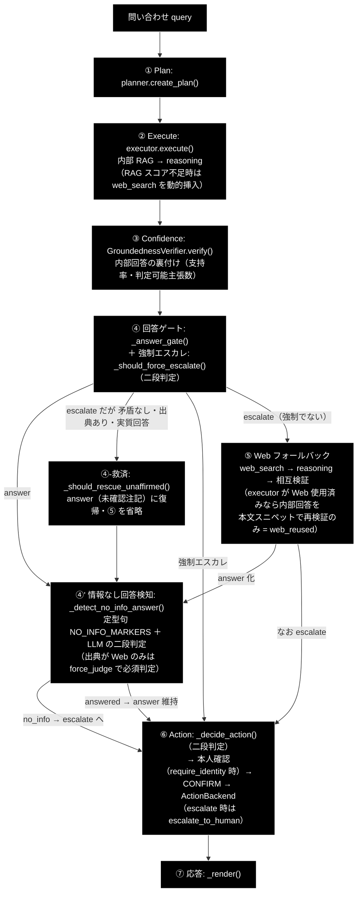
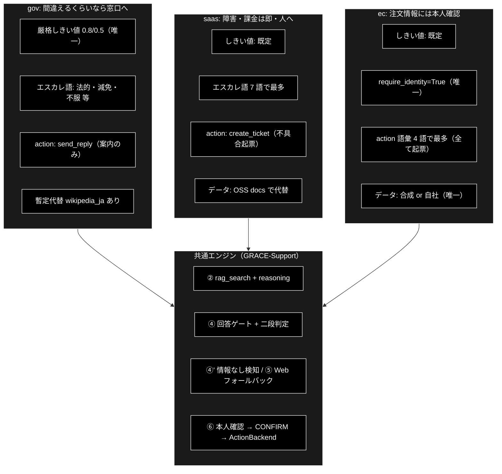

# 業界特化 3 業界比較（gov / SaaS / EC）ドキュメント

**Version 1.2** | 最終更新: 2026-07-11

GRACE-Support の業界特化 3 プロファイルを**横並びで対比**する資料。各業界の詳細は
[`docs/vertical_gov.md`](./vertical_gov.md) / [`docs/vertical_saas.md`](./vertical_saas.md) /
[`docs/vertical_ec.md`](./vertical_ec.md)、共通アーキテクチャ（7 つの機構・6 軸）は
[`grace/doc/agent_support_verticals.md`](../grace/doc/agent_support_verticals.md) を参照。

---

## 目次

1. [一言での対比 — 3 業界の「性格」](#1-一言での対比--3-業界の性格)
2. [7 つの機構の横並び比較](#2-7-つの機構の横並び比較)
3. [6 軸での対比](#3-6-軸での対比)
4. [二段判定の対比 — 何と何を区別する業界か](#4-二段判定の対比--何と何を区別する業界か)
5. [検索スコープ設計の対比](#5-検索スコープ設計の対比)
6. [prompt_addendum（語り口）の対比](#6-prompt_addendum語り口の対比)
7. [データ戦略の対比（TODO(b) の結論）](#7-データ戦略の対比todob-の結論)
8. [KPI の対比 — 何を最重視し、いまどこまで来たか](#8-kpi-の対比--何を最重視しいまどこまで来たか)
9. [パイプライン全体フロー（①〜⑦と 3 つのゲート）＋コード読解マップ](#9-パイプライン全体フロー①〜⑦と-3-つのゲートコード読解マップ)
10. [全体対比図](#10-全体対比図)
11. [変更履歴](#11-変更履歴)

---

## 1. 一言での対比 — 3 業界の「性格」

| | gov（自治体） | SaaS | EC |
|---|---|---|---|
| **性格（一言）** | 間違えるくらいなら窓口へ | 技術 FAQ は自動で捌き、障害・課金は即・人へ | 手続きは自動化するが、注文情報には本人確認 |
| **最も恐れる失敗** | 誤案内（根拠のない行政回答） | 障害・課金トラブルの取りこぼし | 本人確認なしの注文操作／誤起票 |
| **自動化の重心** | 制度・手続きの**案内**まで | 技術 FAQ の**回答**と不具合の**起票** | FAQ 回答と注文操作の**起票（本人確認つき）** |
| **3 業界で唯一の特徴** | しきい値を既定より**厳格化**（0.8/0.5） | エスカレ語彙が**最多**（7 語） | **require_identity=True**（本人確認必須） |

## 2. 7 つの機構の横並び比較

| # | 機構 | gov | saas | ec |
|---|---|---|---|---|
| 1 | 検索スコープ（`collections`） | `gov_faq` / `gov_laws` ＋ **`wikipedia_ja`（暫定代替）** | `saas_docs` / `saas_api`（代替なし） | `ec_policy` / `ec_faq`（代替なし） |
| 2 | 回答の厳しさ（`notify_th`/`confirm_th`） | **0.8 / 0.5（厳格化）** | 既定 0.7 / 0.4 | 既定 0.7 / 0.4 |
| 3 | 強制エスカレ語（`escalate_keywords`） | 法的・訴訟・減免・個別・例外・不服（**6 語**） | 障害・ダウン・落ち・課金・請求・情報漏・セキュリティ（**7 語・最多**） | 決済・返金・破損・クレーム・不良品（**5 語**） |
| 4 | アクション語彙（`action_map`） | 申請・手続・様式 → **send_reply**（案内返信） | エラー・不具合・バグ → **create_ticket** | 返品・交換・キャンセル・解約 → **create_ticket**（**4 語・最多**） |
| 5 | 本人確認（`require_identity`） | False（個人情報を尋ねない方針） | False | **True（唯一）** |
| 6 | 業務方針（`prompt_addendum`） | 断定回避・該当ページ/担当課明示・個人情報を尋ねない | バージョン明示・再現手順・公式 URL | 照会/変更は本人確認必須・規定の版に基づく |
| 7 | 評価基準（KPI 重点） | false_escalate=0・ungrounded=0 | escalate_recall=1.0・誤検知=0 | **identity_check_rate=1.0**・誤起票=0 |

※ コレクション名は `*_anthropic` を省略表記。

## 3. 6 軸での対比

| 軸 | gov | saas | ec |
|---|---|---|---|
| ① 何を知識源とし | 行政 FAQ・法令＋百科事典（制度一般） | 製品ドキュメント・API 仕様のみ | 自社規定・注文 FAQ のみ |
| ② どこまで自信があれば答え | **3 業界で最も高い確信を要求** | 標準 | 標準 |
| ③ 何を人間に渡し | 法的判断・個別事情 | 障害・課金・セキュリティ | 金銭（決済・返金）・損害・苦情 |
| ④ 何を実行し | 案内返信のみ（**申請処理自体は人間**） | 不具合の起票 | 注文操作の起票（**本人確認つき**） |
| ⑤ どう語り | 断定せず担当課へ誘導 | バージョンと再現手順を添える | 規定の版に基づき本人確認前提を崩さない |
| ⑥ 何で測るか | 誤案内ゼロ | 障害の即エスカレ・誤起票ゼロ | 本人確認遵守 100% |

## 4. 二段判定の対比 — 何と何を区別する業界か

判定ルール自体（第 1 段キーワード候補検出 → 第 2 段 haiku 意図分類、question=誤検知抑止・
request/incident=発動・分類失敗=安全側）は 3 業界共通。**業界ごとに違うのは「何と何が衝突するか」**である。

**判定ルール（3 文書共通の正）** — `_should_force_escalate()` / `_decide_action()`。
`docs/vertical_gov.md` / `vertical_saas.md` / `vertical_ec.md` の §4 はこの表を参照する
（変更時はここだけを更新する）:

| 第 1 段（キーワード候補） | 第 2 段（意図分類） | 結果 |
|---|---|---|
| 不一致 | （呼ばれない） | 通常フロー |
| 一致 | `question` | **誤検知抑止** — 強制エスカレしない／起票しない（回答のみ） |
| 一致 | `request` / `incident` | 強制エスカレ（`escalate_keywords`）／起票（`action_map`） |
| 一致 | `None`（分類失敗） | **安全側** — 従来どおり強制エスカレ／起票 |

| | gov | saas | ec |
|---|---|---|---|
| **衝突の性質** | 制度名にエスカレ語が含まれる（減免制度・不服審査**制度**） | FAQ 語彙とエスカレ語が同じ（課金・障害は FAQ の主題そのもの） | FAQ 語彙とアクション語が同じ（返品・解約は FAQ の主題そのもの） |
| **抑止する誤動作** | 誤・強制エスカレ | 誤・強制エスカレ | 誤・強制エスカレ＋**誤起票** |
| **典型の分かれ方** | 「減免を**個別に判断してほしい**」→ escalate<br>「減免**制度の概要を教えて**」→ answer | 「課金が**二重になっています**」→ escalate<br>「課金**プランの違いを教えて**」→ answer | 「返品**したい**」→ 起票<br>「返品**規定を教えて**」→ answer のみ |

同じキーワードでも**意図（question / request / incident）で結果が分かれる**ことが 3 業界共通の核であり、
その「同じキーワード」が gov では制度名、saas では技術トピック、ec では手続き名になる。

## 5. 検索スコープ設計の対比

仕組み（`allowed_collections`・部分一致・未登録自動無視・全滅時は制限なしの安全側）は共通。
設計判断が業界で異なる。

| | gov | saas | ec |
|---|---|---|---|
| **暫定代替** | **あり**（`wikipedia_ja`） | なし | なし |
| **理由** | 制度・一般知識は百科事典でも正しく答えられる | 製品仕様は百科事典では正しくならない | 返品規定・送料は「自社の規定」であり一般知識で答えてはいけない |
| **未登録時の挙動** | wikipedia_ja で一部 in-scope に回答可 | 社内根拠ゼロ → Web/escalate に倒れることを許容 | 同左（④' の force_judge が escalate に倒す・安全側） |

## 6. prompt_addendum（語り口）の対比

| | gov | saas | ec |
|---|---|---|---|
| **方針文** | 条例・公式案内に基づき、断定を避け、該当ページ・担当課を明示。個人情報は尋ねない。 | 製品バージョンを明示し、再現手順と公式ドキュメント URL を添える。 | 注文情報の照会・変更は本人確認必須。返品・交換は規定の版に基づいて回答。 |
| **狙いの中心** | 責任の所在（断定しない・窓口へ誘導） | 再現性（版・手順・一次情報） | 整合性（本人確認前提・規定の版） |
| **他機構との連動** | `require_identity=False`（個人情報を尋ねない）と一体 | create_ticket の起票内容がそのまま検証に使える | `require_identity=True` と一体（文面でも前提を崩さない） |

## 7. データ戦略の対比（TODO(b) の結論）

| | gov | saas | ec |
|---|---|---|---|
| **公開実データ** | **あり**: e-Gov 法令 API（政府標準利用規約 2.0） | 準ずる: OSS 公式ドキュメント（Apache/MIT） | **なし**（amazon_reviews_multi は配布終了） |
| **第一候補** | e-Gov 法令（`fetch_real_knowledge egov`）＋公式 FAQ からの疑似 FAQ 合成 | OSS docs（`fetch_real_knowledge oss-docs`・既定 FastAPI 日本語版） | **合成 or 自社データ**（規約・FAQ CSV を直接登録） |
| **理由** | 法令は一次情報が公開されている | 製品 FAQ は各社固有だが、技術ドキュメントの「器」は OSS で代替可 | 返品規定は各社固有＝合成が最も実態に合う |
| **登録先** | `gov_laws_anthropic` / `gov_faq_anthropic` | `saas_docs_anthropic` / `saas_api_anthropic` | `ec_policy_anthropic` / `ec_faq_anthropic` |

## 8. KPI の対比 — 何を最重視し、いまどこまで来たか

メトリクス定義（10 指標・`eval/vertical/metrics.py`）とカテゴリ（5 種）は共通。重視点と直近結果が異なる。

| | gov | saas | ec |
|---|---|---|---|
| **ケース数** | 7 | 8 | 9（最多） |
| **業界固有のケース設計** | 将来予測質問（税制改正）を out-of-scope に配置 | 障害・課金の incident を 2 件配置 | `expect_identity_check` ケースを 2 件配置（**唯一**） |
| **最重視の指標** | false_escalate_rate=0・ungrounded_answer_rate=0 | escalate_recall=1.0・forced_escalate_misfire_rate=0 | identity_check_rate=1.0・action_accuracy |
| **前回計測（2026-07-03）** | **7/7（1.000）**・escalate_recall 0.500→1.000 | **7/8（0.875）** | **9/9（全指標 1.000）**・escalate_recall 0.667→1.000 |
| **直近計測（2026-07-11・#11〜#14 実装後）** | **7/7（1.000）**（vertical_gov4） | **8/8（1.000）**・「500 エラー報告」が answer＋create_ticket で通過（**#12 効果確認**） | **9/9（1.000）**・identity_check_rate 1.000 維持 |
| **残課題** | なし | なし（#12 効果確認済み。ungrounded 0.000＝#11 是正も確認） | なし |
| **mean_latency（2026-07-11）** | 42.9 秒/ケース | 42.4 秒/ケース | 38.6 秒/ケース |

実行コマンドは共通で `--vertical` だけが変わる:

```bash
uv run python -m eval.vertical.run --vertical gov   --report logs/vertical_gov.json
uv run python -m eval.vertical.run --vertical saas  --report logs/vertical_saas.json
uv run python -m eval.vertical.run --vertical ec    --report logs/vertical_ec.json
```

## 9. パイプライン全体フロー（①〜⑦と 3 つのゲート）＋コード読解マップ

### 9.1 パイプライン全体フロー

`run_support_agent()`（`agent_support_example.py`）の実行順を、プロファイルに依らない共通フローとして示す。
④（回答ゲート）・**④-救済**・**④'（情報なし回答検知）** の 3 つのゲートと、
⑤ の **Web 再利用最適化（web_reused）** の適用順序が読みどころ。
④' は ⑤ の**後**に、decision=answer の回答すべて（内部回答・Web 回答とも）へ適用される。



### 9.2 コード読解マップ（プロファイル項目 → 効く関数）

`VerticalProfile` の各フィールドが `agent_support_example.py` のどの関数で効くかの対応。
コードを読むときはこの表から該当関数へ入るとよい。

| プロファイル項目（機構） | 配線（`run_support_agent()` 内） | 効く場所（実装） |
|---|---|---|
| `collections` | `config.qdrant.allowed_collections` へ設定 | `grace/tools.py::RAGSearchTool._apply_allowed_collections()` — 明示指定・フォールバック連鎖を含む全検索候補へ許可リストを適用（②） |
| `notify_th` / `confirm_th` | ゲートしきい値を上書き | `_answer_gate()`（④）。`confirm_th` は ⑤ の相互検証の矛盾判定（内部×Web 一致度 < confirm_th）にも使用 |
| `escalate_keywords` | — | `_should_force_escalate()`（④）— 第 1 段 `_match_keyword()` ＋ 第 2 段 `create_intent_classifier()`（意図分類はメモ化） |
| `action_map` | — | `_decide_action()`（⑥）— 同じ二段判定を使用（メモ化した意図分類を共有） |
| `require_identity` | — | `_perform_action()` ＋ `support_actions.create_identity_verifier()`（⑥・CONFIRM の**前**に照合。未確認なら実行せず有人へ） |
| `prompt_addendum` | `config.llm.prompt_addendum` へ設定 | `grace/tools.py::ReasoningTool._build_prompt()` — 「###【業務方針（遵守）】」として注入（② と ⑤ の両方の reasoning に有効） |

## 10. 全体対比図

共通エンジン（GRACE-Support パイプライン）は 1 つで、業界ごとに差し替わるのはプロファイルの 6 項目だけ、
という構造を対比で示す。



## 11. 変更履歴

| バージョン | 変更内容 |
|-----------|---------|
| 1.0 | 初版。業界別ドキュメント 3 本（vertical_gov / vertical_saas / vertical_ec 各 v1.0）を元に、性格・7 機構・6 軸・二段判定の衝突語彙・検索スコープ設計・prompt_addendum・データ戦略・KPI（重視指標と直近計測）の 8 観点で横並び比較表を作成。全体対比図（共通エンジン×プロファイル差し替え）を追加 |
| 1.1 | **P1 改善（docs/vertical_docs_todo.md）**: §9 を新設し、①〜⑦パイプライン全体フロー図（④-救済・④' 情報なし検知・⑤ Web 再利用 = 3 つのゲートの適用順序）とコード読解マップ（プロファイル項目 → 効く関数）を追加（P1-1/P1-2）。§4 に二段判定の判定ルール表を「3 文書共通の正」として集約（P1-4。gov/saas/ec 各書は本表を参照） |
| 1.2 | **3 業界すべての再計測結果を反映（2026-07-11）**: §8 に直近計測行を追加 — gov **7/7** / saas **8/8** / ec **9/9**（decision_accuracy すべて 1.000）。saas は #12（web_search リトライ＋fallback_backend）の効果確認により前回唯一の不一致「500 エラー報告」を解消。mean_latency（gov 42.9s / saas 42.4s / ec 38.6s）と残課題欄を更新 |
