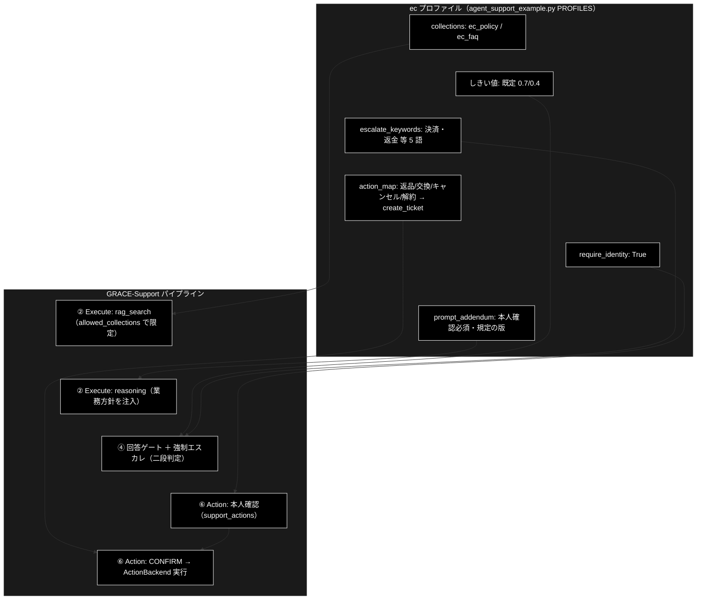

# 業界特化・EC ドキュメント

**Version 1.2** | 最終更新: 2026-07-10

GRACE-Support の業界特化（`--vertical ec`）のうち、**EC プロファイルの特化部分**を説明する。
共通アーキテクチャ（7 つの機構・6 軸の定義）は [`grace/doc/agent_support_verticals.md`](../grace/doc/agent_support_verticals.md)、
テストデータの考え方は [`docs/vertical_test_data.md`](./vertical_test_data.md) を参照。

---

## 目次

1. [概要 — EC はどこが「特化」か](#1-概要--ec-はどこが特化か)
2. [プロファイル定義（実コード）](#2-プロファイル定義実コード)
3. [検索スコープ: collections 実検索限定（allowed_collections）](#3-検索スコープ-collections-実検索限定allowed_collections)
4. [二段判定（キーワード誤検知抑止）](#4-二段判定キーワード誤検知抑止)
5. [prompt_addendum の reasoning 注入](#5-prompt_addendum-の-reasoning-注入)
6. [実コレクション命名の確定＋データ検証 TODO(b)](#6-実コレクション命名の確定データ検証-todob)
7. [KPI 評価ハーネス（eval/vertical/・5 カテゴリ）](#7-kpi-評価ハーネスevalvertical5-カテゴリ)
8. [変更履歴](#8-変更履歴)

---

## 1. 概要 — EC はどこが「特化」か

EC プロファイルの性格は「**手続きは自動化するが、注文情報には本人確認**」。3 業界で唯一
`require_identity=True` を持ち、アクション語彙が最多（4 語すべて create_ticket）。返品・解約と
いった「アクション語を含む FAQ 質問」（返金ポリシー・解約手続きの説明）が多いため、
keyword-trap の誤検知抑止が最も効く業界でもある。7 つの機構への割り当ては次のとおり。

| # | 機構 | ec の設定 | 意図 |
|---|---|---|---|
| 1 | 検索スコープ（`collections`） | `ec_policy_anthropic` / `ec_faq_anthropic` | 根拠を自社規定・注文 FAQ に限定（他社ポリシーで答えない） |
| 2 | 回答の厳しさ（`notify_th`/`confirm_th`） | 既定（0.7 / 0.4） | 定型 FAQ は標準の厳しさで自動化を優先 |
| 3 | 強制エスカレ語（`escalate_keywords`） | 決済・返金・破損・クレーム・不良品 | 金銭・損害・苦情は機械に答えさせない |
| 4 | アクション語彙（`action_map`） | 返品・交換・キャンセル・解約 → **create_ticket** | 注文操作の依頼はチケット化 |
| 5 | 本人確認（`require_identity`） | **True**（3 業界で唯一） | 注文情報の操作は本人確認必須 |
| 6 | 業務方針（`prompt_addendum`） | 照会・変更は本人確認必須・返品交換は規定の版に基づく | 規定準拠と本人確認の徹底 |
| 7 | 評価基準（KPI） | 9 ケース（最多）。**identity_check_rate = 100%** を必須。直近 **9/9** | §7 参照 |

6 軸で言えば「①自社規定のみを知識源とし、②標準の確信度で答え、③金銭・損害を人間に渡し、
④注文操作を本人確認つきで起票し、⑤規定の版に基づいて語り、⑥本人確認遵守 100% で測る」。

適用ポイントの全体像:



> パイプライン全体（①〜⑦と ④-救済／④' 情報なし検知／⑤ Web 再利用の 3 ゲート）と、
> プロファイル項目 → 効く関数の対応（コード読解マップ）は
> [`docs/vertical_comparison.md` §9](./vertical_comparison.md) を参照。

## 2. プロファイル定義（実コード）

`agent_support_example.py` の `PROFILES["ec"]`（`VerticalProfile`）:

```python
"ec": VerticalProfile(
    name="EC",
    collections=["ec_policy_anthropic", "ec_faq_anthropic"],
    escalate_keywords=["決済", "返金", "破損", "クレーム", "不良品"],
    action_map={"返品": "create_ticket", "交換": "create_ticket",
                "キャンセル": "create_ticket", "解約": "create_ticket"},
    require_identity=True,           # 注文情報の操作は本人確認必須
    prompt_addendum="注文情報の照会・変更は本人確認必須。返品・交換は規定の版に基づいて回答。",
),
```

しきい値は未指定＝config 既定（0.7 / 0.4）。実行例:

```bash
python agent_support_example.py --vertical ec "返品規定を教えて"          # FAQ → answer（起票しない）
python agent_support_example.py --vertical ec "返品したい"                # 本人確認 → CONFIRM → 起票（ドライラン）
python agent_support_example.py --vertical ec --no-dry-run \
  --identity order_id=1001 --identity email=taro@example.com "返品したい"  # 台帳照合つき実行
```

**本人確認フロー（ec 固有・#14 実装済み）**: `require_identity=True` により ⑥ Action の先頭
（CONFIRM より前）で `support_actions.py` の照合が走る。dry-run はデモ照合（常に確認済み扱い）、
`--no-dry-run` では `SUPPORT_IDENTITY_FILE` の顧客台帳 CSV と `order_id`/`email` を照合し、
未確認ならバックエンドに到達させず有人対応へ引き継ぐ（安全側）。実行バックエンドは
`SUPPORT_ACTION_WEBHOOK_URL` 設定時に Webhook 連携（JSON POST）となる。

## 3. 検索スコープ: collections 実検索限定（allowed_collections）

`--vertical ec` 指定時、`config.qdrant.allowed_collections = ["ec_policy_anthropic", "ec_faq_anthropic"]`
が設定され、`RAGSearchTool` が明示指定・フォールバック連鎖を含む全検索候補へ許可リストを適用する
（`grace/tools.py::_apply_allowed_collections`。部分一致・未登録は自動無視・全滅時は制限を適用しない安全側フォールバック）。

ec 固有の設計: **返品規定・送料は「自社の規定」であり、一般知識で答えてはいけない**。スコープ限定は
「Web や他コレクションの他社ポリシーを根拠に自社規定を答えてしまう」誤りを構造的に防ぐ。逆に
専用コレクション未登録の段階では in-scope 質問も社内根拠ゼロとなり、④'（情報なし検知・出典 Web のみの
force_judge）が escalate に倒すことがある（安全側の揺れ。登録後に解消 — §7 の計測履歴で実証済み）。

## 4. 二段判定（キーワード誤検知抑止）

ec は**アクション語（返品・解約）とエスカレ語（返金）が FAQ 質問に最も頻出する**業界である。
「返品したい」（依頼）と「返品規定を教えて」（質問）を区別できなければ、FAQ に答えるたびに
誤起票が発生する。二段判定がこれを抑止する。

- **第 1 段（候補検出）**: `_match_keyword(query, ...)` — 部分一致。不一致なら LLM は呼ばれない
- **第 2 段（意図分類）**: 軽量モデル（`claude-haiku-4-5-20251001`）で `question` / `request` / `incident` に
  1 語分類（メモ化・エスカレ判定と action_map 判定で共有）

**判定ルール**（`_should_force_escalate` / `_decide_action`）は 3 業界共通 — 正は
[`docs/vertical_comparison.md` §4](./vertical_comparison.md) の表を参照
（一致×question=誤検知抑止／一致×request・incident=発動／分類失敗=安全側）。

ec の具体例:

| 問い合わせ | 第 1 段 | 意図 | 結果 |
|---|---|---|---|
| 「**決済**が失敗しました」 | 決済 | incident | 強制エスカレ（Web もスキップ） |
| 「届いた商品が**破損**していました」 | 破損 | incident | 強制エスカレ |
| 「**返金**ポリシーを教えて」 | 返金 | question | 誤検知抑止 → answer |
| 「**返品**したい」 | （action_map: 返品） | request | 本人確認 → create_ticket 起票 |
| 「**返品**規定を教えて」 | （action_map: 返品） | question | 起票しない → answer のみ |
| 「**解約**手続きの流れを教えて」 | （action_map: 解約） | question | 起票しない → answer のみ |

## 5. prompt_addendum の reasoning 注入

`PROFILES["ec"].prompt_addendum` は `config.llm.prompt_addendum` を経由して
`grace/tools.py::ReasoningTool._build_prompt()`（「業務方針」注入口）のシステム指示直後に
**「### 【業務方針（遵守）】」**として注入される（executor 経由・⑤ Web フォールバック経由の両方に有効）。

ec の方針文とその狙い:

| 方針 | 狙い |
|---|---|
| 注文情報の照会・変更は本人確認必須 | 回答文面でも本人確認前提を崩さない（⑥ の `require_identity=True` と一体） |
| 返品・交換は規定の版に基づいて回答 | 「いつの規定か」を明示し、旧版・他社ポリシーの混入を防ぐ |

## 6. 実コレクション命名の確定＋データ検証 TODO(b)

**命名（確定・プロファイル設定済み）**: `ec_policy_anthropic`（利用規約・返品/配送規定）/
`ec_faq_anthropic`（注文 FAQ）。命名規約は `*_anthropic`。

**データ検証 TODO(b) の結論**（2026-07-02 検証・✅ 完了）:

| 候補 | 検証結果 | 扱い |
|---|---|---|
| `amazon_reviews_multi`（日本語サブセット） | **配布終了を確認**（HF 上で defunct） | 使用不可 |
| 合成（規約・FAQ の自作） | 返品規定は各社固有＝合成が最も実態に合う | **第一候補（繰り上げ）** |
| 楽天データ（楽天技術研究所） | 申請制・無料 | 代替 |

EC は 3 業界で唯一「公開実データなし＝合成 or 自社データ」が確定している。実運用では自社の
利用規約・返品規定・注文 FAQ を `text`（または `question,answer`）カラムの CSV にして同一手順で登録する。

**投入手順（実装済み・実行はユーザー環境）**:

```bash
# 合成データ（各 10 件: 返品規定・送料・配送・支払い 等）
uv run python -m eval.vertical.register_test_collections --vertical ec --recreate

# 自社データ（Q&A ペア CSV はそのまま登録できる）
uv run python qa_qdrant/register_to_qdrant.py \
  --input-file qa_output/ec_policy.csv --collection ec_policy_anthropic --recreate
```

## 7. KPI 評価ハーネス（eval/vertical/・5 カテゴリ）

**テストケース**: [`eval/vertical/cases/ec.jsonl`](../eval/vertical/cases/ec.jsonl) — 9 ケース（3 業界最多）・5 カテゴリ。

| カテゴリ | 件数 | 代表質問 | 期待 |
|---|---|---|---|
| in-scope | 2 | 返品規定を教えて／送料はいくらかかりますか？ | answer（出典つき・起票しない） |
| out-of-scope | 1 | この商品の入荷予定日はいつですか？ | escalate（④' の「案内のみ= no_info」基準） |
| action | 2 | 返品したい／注文をキャンセルしたい | answer ＋ create_ticket ＋ **本人確認**（`expect_identity_check: true`） |
| escalate-keyword | 2 | 決済が失敗しました／届いた商品が破損していました | escalate（incident × 決済・破損） |
| keyword-trap | 2 | 返金ポリシーを教えて／解約手続きの流れを教えて | answer（誤検知・誤起票しない） |

**メトリクス**（定義: `eval/vertical/metrics.py`）: decision_accuracy / false_escalate_rate /
forced_escalate_misfire_rate / escalate_recall / citation_rate / ungrounded_answer_rate /
groundedness_neutral_rate / action_accuracy / **identity_check_rate** / mean_latency_ms。
ec で特に重視するのは **identity_check_rate = 1.0**（本人確認遵守 100%。3 業界で ec のみ
`expect_identity_check` ケースを持つ）と **action_accuracy**（FAQ 質問への誤起票ゼロ）。

**実行**:

```bash
uv run python -m eval.vertical.run --vertical ec --report logs/vertical_ec.json
uv run python -m eval.vertical.run --vertical ec --limit 3     # スモーク
```

**直近計測**（2026-07-03・vertical_ec6。詳細: [`agent_support_verticals.md` §9.1](../grace/doc/agent_support_verticals.md)）:
**9/9（全指標 1.000）**。escalate_recall 0.667 → **1.000**（「入荷予定日」を ④' 判定基準の精密化＝
「事柄そのもの vs 確認方法の案内」で escalate）・identity_check_rate 1.000・keyword-trap 2/2
誤検知なし・mean_latency 38.0 秒/ケース。

## 8. 変更履歴

| バージョン | 変更内容 |
|-----------|---------|
| 1.0 | 初版。ec プロファイルの特化部分（7 機構の割り当て・二段判定の判定ルールと ec 実例＝返品/返金/解約 trap・自社規定へのスコープ限定の意図・prompt_addendum と本人確認フロー（require_identity=True・support_actions 連携）・TODO(b) 結論＝合成第一候補と投入手順・KPI 9 ケースと直近計測 9/9）を整理 |
| 1.1 | §1 適用ポイント図のノード配置を縦並びに変更（`direction TB`＋不可視リンク `~~~` でサブグラフ内を縦一列化。横並びでノード内の文字が小さく読みにくかったため） |
| 1.2 | **P1 改善（docs/vertical_docs_todo.md）**: §1 に comparison §9（①〜⑦フロー図＋コード読解マップ）への参照を追加（P1-1/P1-2）。§4 の判定ルール表を comparison §4 の「共通の正」への参照に置換（P1-4・重複解消）。§5 の行番号アンカー（tools.py:525-528）を関数名参照に変更（drift 対策） |
