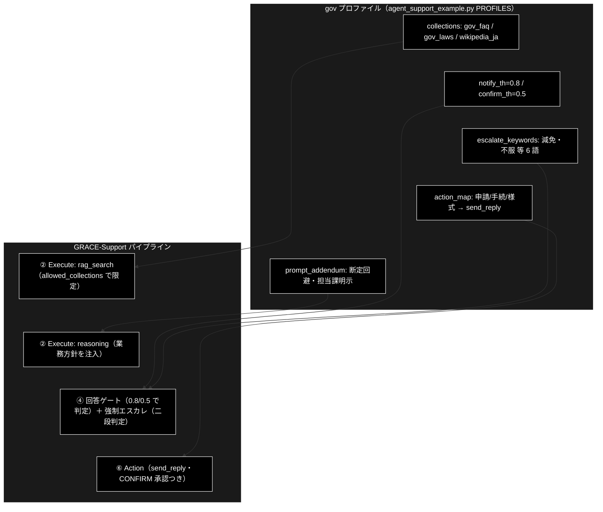

# 業界特化・自治体（gov）ドキュメント

**Version 1.2** | 最終更新: 2026-07-10

GRACE-Support の業界特化（`--vertical gov`）のうち、**自治体プロファイルの特化部分**を説明する。
共通アーキテクチャ（7 つの機構・6 軸の定義）は [`grace/doc/agent_support_verticals.md`](../grace/doc/agent_support_verticals.md)、
テストデータの考え方は [`docs/vertical_test_data.md`](./vertical_test_data.md) を参照。

---

## 目次

1. [概要 — 自治体はどこが「特化」か](#1-概要--自治体はどこが特化か)
2. [プロファイル定義（実コード）](#2-プロファイル定義実コード)
3. [検索スコープ: collections 実検索限定（allowed_collections）](#3-検索スコープ-collections-実検索限定allowed_collections)
4. [二段判定（キーワード誤検知抑止）](#4-二段判定キーワード誤検知抑止)
5. [prompt_addendum の reasoning 注入](#5-prompt_addendum-の-reasoning-注入)
6. [実コレクション命名の確定＋データ検証 TODO(b)](#6-実コレクション命名の確定データ検証-todob)
7. [KPI 評価ハーネス（eval/vertical/・5 カテゴリ）](#7-kpi-評価ハーネスevalvertical5-カテゴリ)
8. [変更履歴](#8-変更履歴)

---

## 1. 概要 — 自治体はどこが「特化」か

自治体プロファイルの性格は一言で「**間違えるくらいなら窓口へ**」。3 業界で唯一しきい値を既定より厳格化し、
法的判断・個別事情に触れる話題は機械に答えさせない。7 つの機構への割り当ては次のとおり。

| # | 機構 | gov の設定 | 意図 |
|---|---|---|---|
| 1 | 検索スコープ（`collections`） | `gov_faq_anthropic` / `gov_laws_anthropic` / `wikipedia_ja`（暫定代替） | 根拠を行政 FAQ・法令・百科事典（制度一般）に限定 |
| 2 | 回答の厳しさ（`notify_th`/`confirm_th`） | **0.8 / 0.5**（既定 0.7 / 0.4 より厳格） | 正確性最優先。確信が弱い回答は出さない |
| 3 | 強制エスカレ語（`escalate_keywords`） | 法的・訴訟・**減免**・個別・例外・**不服** | 法的判断・個別事情の判断を機械にさせない |
| 4 | アクション語彙（`action_map`） | 申請・手続・様式 → **send_reply** | 様式の案内は自動返信。**申請の処理自体は人間** |
| 5 | 本人確認（`require_identity`） | **False** | 「個人情報は尋ねない」方針と一体 |
| 6 | 業務方針（`prompt_addendum`） | 断定回避・該当ページ/担当課の明示・個人情報を尋ねない | 行政窓口としての語り口 |
| 7 | 評価基準（KPI） | 根拠なし回答 = 0 を重視。直近計測 **7/7（decision_accuracy 1.000）** | §7 参照 |

6 軸で言えば「①行政ナレッジのみを知識源とし、②3 業界で最も高い確信を要求し、③法的・個別判断を人間に渡し、
④案内返信だけを実行し、⑤断定せず担当課へ誘導する語り口で、⑥誤案内ゼロで測る」プロファイルである。

適用ポイントの全体像:



> パイプライン全体（①〜⑦と ④-救済／④' 情報なし検知／⑤ Web 再利用の 3 ゲート）と、
> プロファイル項目 → 効く関数の対応（コード読解マップ）は
> [`docs/vertical_comparison.md` §9](./vertical_comparison.md) を参照。

## 2. プロファイル定義（実コード）

`agent_support_example.py` の `PROFILES["gov"]`（`VerticalProfile`）:

```python
"gov": VerticalProfile(
    name="自治体",
    # wikipedia_ja は専用コレクション（gov_faq/gov_laws）登録までの代替
    collections=["gov_faq_anthropic", "gov_laws_anthropic", "wikipedia_ja"],
    escalate_keywords=["法的", "訴訟", "減免", "個別", "例外", "不服"],
    action_map={"申請": "send_reply", "手続": "send_reply", "様式": "send_reply"},
    require_identity=False,
    notify_th=0.8, confirm_th=0.5,   # 正確性最優先：厳しめ
    prompt_addendum="条例・公式案内に基づき、断定を避け、該当ページ・担当課を明示。個人情報は尋ねない。",
),
```

実行例: `python agent_support_example.py --vertical gov "住民票の写しの取り方は？"`

## 3. 検索スコープ: collections 実検索限定（allowed_collections）

`--vertical gov` 指定時、`run_support_agent()` が `config.qdrant.allowed_collections` に
`profile.collections` を設定し、`RAGSearchTool` が**明示指定・フォールバック連鎖を含む全検索候補**へ
許可リストを適用する（`grace/tools.py::_apply_allowed_collections`）。

- **一致判定は部分一致**: `"wikipedia_ja"` は `"wikipedia_ja_5per"` にも一致する
- **未登録コレクションは自動的に無視**: `gov_faq_anthropic` が未登録でも警告のみでデモは動く
- **1 つも一致しない場合は制限を適用しない**（安全側フォールバック・警告ログ）

gov 固有の設計: 専用 2 コレクションに加えて `wikipedia_ja` を**暫定代替**として含む。行政 FAQ の
公開データが乏しいため（§6）、制度・一般知識系の in-scope 質問（例:「選挙権は何歳から？」）に
百科事典の根拠で答えられるようにしている。専用コレクション整備後は外してよい。

## 4. 二段判定（キーワード誤検知抑止）

gov の強制エスカレ語（減免・不服 等）は**FAQ 質問にも普通に現れる**ため、キーワード一致だけで
エスカレすると誤検知する。そこで二段判定を用いる。

- **第 1 段（候補検出）**: `_match_keyword(query, profile.escalate_keywords)` — 部分一致で候補を検出。
  一致しなければ第 2 段（LLM 呼び出し）は走らず、追加コストはゼロ
- **第 2 段（意図分類）**: `create_intent_classifier()` — 軽量モデル（`claude-haiku-4-5-20251001`）で
  問い合わせを `question`（FAQ 質問）/ `request`（操作・手続きの依頼）/ `incident`（障害・被害の報告）に
  1 語分類。同一クエリの分類はメモ化され、エスカレ判定とアクション判定（`action_map` にも同じ二段判定）で共有

**判定ルール**（`_should_force_escalate` / `_decide_action`）は 3 業界共通 — 正は
[`docs/vertical_comparison.md` §4](./vertical_comparison.md) の表を参照
（一致×question=誤検知抑止／一致×request・incident=発動／分類失敗=安全側）。

gov の具体例:

| 問い合わせ | 第 1 段 | 意図 | 結果 |
|---|---|---|---|
| 「固定資産税の**減免**を**個別**に判断してほしい」 | 減免・個別 | request | 強制エスカレ（Web もスキップ） |
| 「住民税の**減免**制度の概要を教えて」 | 減免 | question | 誤検知抑止 → 通常フローで answer |
| 「行政**不服**審査制度とはどんな制度ですか？」 | 不服 | question | 誤検知抑止 → answer |
| 「保育園の**申請**様式がほしい」 | （action_map: 申請） | request | send_reply を起票（CONFIRM 承認後） |

## 5. prompt_addendum の reasoning 注入

`PROFILES["gov"].prompt_addendum` は `config.llm.prompt_addendum` を経由して
`grace/tools.py::ReasoningTool._build_prompt()`（「業務方針」注入口）のシステム指示直後に
**「### 【業務方針（遵守）】」**として注入される。executor 経由（② Execute）と
⑤ Web フォールバック経由の**両方の reasoning に効く**。

gov の方針文とその狙い:

| 方針 | 狙い |
|---|---|
| 条例・公式案内に基づく | 根拠の出所を行政公式に限定（Web の非公式情報で断定しない） |
| 断定を避ける | 個別事情で結論が変わる行政判断を機械が確定させない |
| 該当ページ・担当課を明示 | 「最終確認は窓口で」への安全な誘導 |
| 個人情報は尋ねない | 行政相談の入口で個人情報を収集しない（`require_identity=False` と一体） |

## 6. 実コレクション命名の確定＋データ検証 TODO(b)

**命名（確定・プロファイル設定済み）**: `gov_faq_anthropic`（FAQ）/ `gov_laws_anthropic`（法令）。
命名規約は `*_anthropic`（[`docs/vertical_test_data.md`](./vertical_test_data.md) §5）。

**データ検証 TODO(b) の結論**（2026-07-02 WebSearch 検証・✅ 完了）:

| 候補 | 検証結果 | 扱い |
|---|---|---|
| e-Gov 法令 API v2 | **利用可**。政府標準利用規約 2.0＝出典明示で商用含む二次利用可 | `gov_laws_anthropic` の元データ（推奨） |
| 横浜市オープンデータ等の「FAQ 専用 CSV」 | ポータルは CC BY 4.0 だが **FAQ 形式の標準データは確認できず** | 公式 FAQ ページから `qa_generation` で疑似 FAQ を合成 → `gov_faq_anthropic` |
| JSQuAD / JAQKET（JGLUE） | CC BY-SA 4.0（帰属＋継承） | 事実 QA の器として利用可（補助） |

**投入手順（実装済み・実行はユーザー環境）**: 合成データは
`uv run python -m eval.vertical.register_test_collections --vertical gov --recreate`
（`eval/vertical/data/gov_faq.csv` / `gov_laws.csv` 各 10 件）。実データは

```bash
# e-Gov 法令 API から条単位の text CSV を生成（既定: 行政手続法・行政不服審査法・住民基本台帳法）
uv run python -m eval.vertical.fetch_real_knowledge egov --output OUTPUT/gov_laws_real.csv
# チャンク化 → Q/A 生成＋登録
uv run python -m chunking.csv_text_to_chunks_text_csv --input-file OUTPUT/gov_laws_real.csv --output output_chunked
uv run python qa_qdrant/make_qa_register_qdrant.py \
  --input-file output_chunked/gov_laws_real_chunks.csv --collection gov_laws_anthropic --recreate
```

## 7. KPI 評価ハーネス（eval/vertical/・5 カテゴリ）

**テストケース**: [`eval/vertical/cases/gov.jsonl`](../eval/vertical/cases/gov.jsonl) — 7 ケース・5 カテゴリ。

| カテゴリ | 件数 | 代表質問 | 期待 |
|---|---|---|---|
| in-scope | 2 | 住民票の写しの取り方は？／粗大ごみの出し方は？ | answer（出典つき） |
| out-of-scope | 1 | 来年の税制改正の予測は？ | escalate（④' の将来予測×非確定情報基準） |
| action | 1 | 保育園の申請様式がほしい | answer ＋ send_reply |
| escalate-keyword | 1 | 固定資産税の減免を個別に判断してほしい | escalate（減免・個別 × request） |
| keyword-trap | 2 | 住民税の減免制度の概要を教えて／行政不服審査制度とは？ | answer（誤検知しない） |

**メトリクス**（定義: `eval/vertical/metrics.py`）: decision_accuracy / false_escalate_rate /
forced_escalate_misfire_rate / escalate_recall / citation_rate / ungrounded_answer_rate /
groundedness_neutral_rate / action_accuracy / identity_check_rate / mean_latency_ms。
gov で特に重視するのは **false_escalate_rate = 0**（trap 誤検知なし）と **ungrounded_answer_rate = 0**（根拠なし回答ゼロ）。

**実行**:

```bash
uv run python -m eval.vertical.run --vertical gov --report logs/vertical_gov.json
uv run python -m eval.vertical.run --vertical gov --limit 2      # スモーク
uv run python -m eval.vertical.run --vertical gov --no-web       # 内部 RAG のみ
```

**直近計測**（2026-07-03・vertical_gov3。詳細: [`agent_support_verticals.md` §9.1](../grace/doc/agent_support_verticals.md)）:
**7/7（decision_accuracy 1.000）**・escalate_recall 0.500 → **1.000**（「税制改正の予測」を
force_judge＋将来予測基準で escalate）・keyword-trap 2/2 誤検知なし・mean_latency 41.0 秒/ケース。

## 8. 変更履歴

| バージョン | 変更内容 |
|-----------|---------|
| 1.0 | 初版。gov プロファイルの特化部分（7 機構の割り当て・二段判定の判定ルールと gov 実例・allowed_collections の暫定代替 wikipedia_ja・prompt_addendum の方針と狙い・TODO(b) 検証結論と e-Gov 投入手順・KPI 7 ケースと直近計測 7/7）を整理 |
| 1.1 | §1 適用ポイント図のノード配置を縦並びに変更（`direction TB`＋不可視リンク `~~~` でサブグラフ内を縦一列化。横並びでノード内の文字が小さく読みにくかったため） |
| 1.2 | **P1 改善（docs/vertical_docs_todo.md）**: §1 に comparison §9（①〜⑦フロー図＋コード読解マップ）への参照を追加（P1-1/P1-2）。§4 の判定ルール表を comparison §4 の「共通の正」への参照に置換（P1-4・重複解消）。§5 の行番号アンカー（tools.py:525-528）を関数名参照に変更（drift 対策） |
