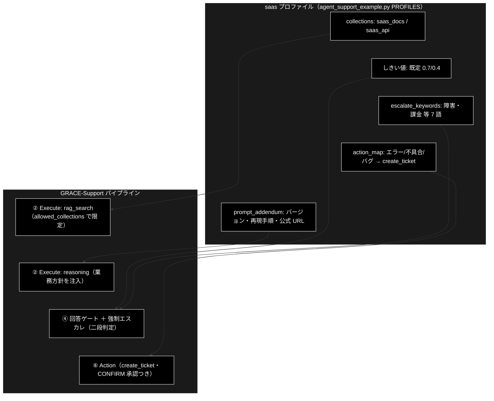

# 業界特化・SaaS ドキュメント

**Version 1.3** | 最終更新: 2026-07-11

GRACE-Support の業界特化（`--vertical saas`）のうち、**SaaS プロファイルの特化部分**を説明する。
共通アーキテクチャ（7 つの機構・6 軸の定義）は [`grace/doc/agent_support_verticals.md`](../grace/doc/agent_support_verticals.md)、
テストデータの考え方は [`docs/vertical_test_data.md`](./vertical_test_data.md) を参照。

---

## 目次

1. [概要 — SaaS はどこが「特化」か](#1-概要--saas-はどこが特化か)
2. [プロファイル定義（実コード）](#2-プロファイル定義実コード)
3. [検索スコープ: collections 実検索限定（allowed_collections）](#3-検索スコープ-collections-実検索限定allowed_collections)
4. [二段判定（キーワード誤検知抑止）](#4-二段判定キーワード誤検知抑止)
5. [prompt_addendum の reasoning 注入](#5-prompt_addendum-の-reasoning-注入)
6. [実コレクション命名の確定＋データ検証 TODO(b)](#6-実コレクション命名の確定データ検証-todob)
7. [KPI 評価ハーネス（eval/vertical/・5 カテゴリ）](#7-kpi-評価ハーネスevalvertical5-カテゴリ)
8. [変更履歴](#8-変更履歴)

---

## 1. 概要 — SaaS はどこが「特化」か

SaaS プロファイルの性格は「**技術 FAQ は自動で捌き、障害・課金は即・人へ**」。エスカレ語彙が
3 業界で最多（7 語）で、障害報告（incident）と技術質問（question）の切り分けが特化の中心になる。
アクションは不具合の**起票（create_ticket）**で、二段判定が「エラーという語を含む FAQ 質問」の
誤起票を抑止する。7 つの機構への割り当ては次のとおり。

| # | 機構 | saas の設定 | 意図 |
|---|---|---|---|
| 1 | 検索スコープ（`collections`） | `saas_docs_anthropic` / `saas_api_anthropic` | 根拠を製品ドキュメント・API 仕様に限定 |
| 2 | 回答の厳しさ（`notify_th`/`confirm_th`） | 既定（0.7 / 0.4） | 技術 FAQ は標準の厳しさで自動化を優先 |
| 3 | 強制エスカレ語（`escalate_keywords`） | 障害・ダウン・落ち・課金・請求・情報漏・セキュリティ | 障害・金銭・セキュリティは機械に答えさせない |
| 4 | アクション語彙（`action_map`） | エラー・不具合・バグ → **create_ticket** | 不具合報告はチケット化して開発へ回す |
| 5 | 本人確認（`require_identity`） | False | 技術問い合わせに本人確認は不要 |
| 6 | 業務方針（`prompt_addendum`） | 製品バージョン明示・再現手順・公式ドキュメント URL | 技術サポートの回答様式 |
| 7 | 評価基準（KPI） | 8 ケース。直近 0.875（7/8。唯一の不一致は #12 で対策済み） | §7 参照 |

6 軸で言えば「①製品ドキュメントのみを知識源とし、②標準の確信度で答え、③障害・課金・セキュリティを
人間に渡し、④不具合を起票し、⑤バージョンと再現手順を添える語り口で、⑥誤起票ゼロと障害の即エスカレで測る」。

適用ポイントの全体像:



> パイプライン全体（①〜⑦と ④-救済／④' 情報なし検知／⑤ Web 再利用の 3 ゲート）と、
> プロファイル項目 → 効く関数の対応（コード読解マップ）は
> [`docs/vertical_comparison.md` §9](./vertical_comparison.md) を参照。

## 2. プロファイル定義（実コード）

`agent_support_example.py` の `PROFILES["saas"]`（`VerticalProfile`）:

```python
"saas": VerticalProfile(
    name="SaaS",
    collections=["saas_docs_anthropic", "saas_api_anthropic"],
    escalate_keywords=["障害", "ダウン", "落ち", "課金", "請求", "情報漏", "セキュリティ"],
    action_map={"エラー": "create_ticket", "不具合": "create_ticket", "バグ": "create_ticket"},
    require_identity=False,
    prompt_addendum="製品バージョンを明示し、再現手順と公式ドキュメント URL を添える。",
),
```

しきい値（`notify_th`/`confirm_th`）は未指定＝`None` のため **config 既定（0.7 / 0.4）**が使われる。
実行例: `python agent_support_example.py --vertical saas "API のレート制限は？"`

## 3. 検索スコープ: collections 実検索限定（allowed_collections）

`--vertical saas` 指定時、`config.qdrant.allowed_collections = ["saas_docs_anthropic", "saas_api_anthropic"]`
が設定され、`RAGSearchTool` が明示指定・フォールバック連鎖を含む全検索候補へ許可リストを適用する
（`grace/tools.py::_apply_allowed_collections`。部分一致・未登録は自動無視・全滅時は制限を適用しない安全側フォールバック）。

saas 固有の設計: gov と異なり**暫定代替（wikipedia_ja 等）を含まない**。製品仕様の質問に百科事典で
答えても正しくならないため、専用コレクション未登録の段階では「社内根拠ゼロ → Web/escalate」に
倒れることを許容している（out-of-scope 検証の「穴」としても機能）。

## 4. 二段判定（キーワード誤検知抑止）

saas は**エスカレ語と FAQ 語彙の衝突が最も激しい**業界である（「課金プランの違い」「障害時の SLA」は
FAQ 質問だが、課金・障害はエスカレ語）。二段判定がこの誤検知を抑止する。

- **第 1 段（候補検出）**: `_match_keyword(query, ...)` — 部分一致。不一致なら LLM は呼ばれない
- **第 2 段（意図分類）**: 軽量モデル（`claude-haiku-4-5-20251001`）で `question` / `request` / `incident` に
  1 語分類（メモ化・エスカレ判定と action_map 判定で共有）

**判定ルール**（`_should_force_escalate` / `_decide_action`）は 3 業界共通 — 正は
[`docs/vertical_comparison.md` §4](./vertical_comparison.md) の表を参照
（一致×question=誤検知抑止／一致×request・incident=発動／分類失敗=安全側）。

saas の具体例:

| 問い合わせ | 第 1 段 | 意図 | 結果 |
|---|---|---|---|
| 「サービスが**落ち**ています」 | 落ち | incident | 強制エスカレ（Web もスキップ） |
| 「**課金**が二重になっています」 | 課金 | incident | 強制エスカレ |
| 「**課金**プランの違いを教えて」 | 課金 | question | 誤検知抑止 → answer |
| 「**障害**発生時の SLA について教えて」 | 障害 | question | 誤検知抑止 → answer |
| 「500 **エラー**が出る**不具合**を報告したい」 | （action_map: エラー・不具合） | request/incident | create_ticket を起票 |

## 5. prompt_addendum の reasoning 注入

`PROFILES["saas"].prompt_addendum` は `config.llm.prompt_addendum` を経由して
`grace/tools.py::ReasoningTool._build_prompt()`（「業務方針」注入口）のシステム指示直後に
**「### 【業務方針（遵守）】」**として注入される（executor 経由・⑤ Web フォールバック経由の両方に有効）。

saas の方針文とその狙い:

| 方針 | 狙い |
|---|---|
| 製品バージョンを明示 | 「どの版の仕様か」を曖昧にしない（技術回答の再現性） |
| 再現手順を添える | 不具合系の回答をそのままチケット・検証に使える形にする |
| 公式ドキュメント URL を添える | ユーザーが一次情報へ到達できるようにする |

## 6. 実コレクション命名の確定＋データ検証 TODO(b)

**命名（確定・プロファイル設定済み）**: `saas_docs_anthropic`（製品ドキュメント）/
`saas_api_anthropic`（API 仕様）。命名規約は `*_anthropic`。

**データ検証 TODO(b) の結論**（2026-07-02 検証・✅ 完了）: SaaS の「製品 FAQ」は各社固有で公開標準
データが無い。現実解は **OSS 製品の公式ドキュメント（Markdown・Apache/MIT）**をチャンク化して
製品ドキュメントの代替にすること（代替: Stack Exchange 系＝英語中心・CC BY-SA）。

**投入手順（実装済み・実行はユーザー環境）**: 合成データは
`uv run python -m eval.vertical.register_test_collections --vertical saas --recreate`
（`eval/vertical/data/saas_docs.csv` / `saas_api.csv` 各 10 件。課金プラン・レート制限・Webhook 等）。実データは

```bash
# OSS 公式ドキュメント（既定: FastAPI 日本語版・MIT・タグ固定 URL）をセクション単位の text CSV へ
# --url で自社製品に近い任意の raw Markdown に差し替え可能
uv run python -m eval.vertical.fetch_real_knowledge oss-docs --output OUTPUT/saas_docs_real.csv
uv run python -m chunking.csv_text_to_chunks_text_csv --input-file OUTPUT/saas_docs_real.csv --output output_chunked
uv run python qa_qdrant/make_qa_register_qdrant.py \
  --input-file output_chunked/saas_docs_real_chunks.csv --collection saas_docs_anthropic --recreate
```

## 7. KPI 評価ハーネス（eval/vertical/・5 カテゴリ）

**テストケース**: [`eval/vertical/cases/saas.jsonl`](../eval/vertical/cases/saas.jsonl) — 8 ケース・5 カテゴリ。

| カテゴリ | 件数 | 代表質問 | 期待 |
|---|---|---|---|
| in-scope | 2 | API のレート制限は？／Webhook の設定方法は？ | answer（出典つき） |
| out-of-scope | 1 | 御社の来期の売上見込みは？ | escalate |
| action | 1 | 500 エラーが出る不具合を報告したい | answer ＋ create_ticket |
| escalate-keyword | 2 | サービスが落ちています／課金が二重になっています | escalate（incident × 落ち・課金） |
| keyword-trap | 2 | 課金プランの違いを教えて／障害発生時の SLA について教えて | answer（誤検知しない） |

**メトリクス**（定義: `eval/vertical/metrics.py`）: decision_accuracy / false_escalate_rate /
forced_escalate_misfire_rate / escalate_recall / citation_rate / ungrounded_answer_rate /
groundedness_neutral_rate / action_accuracy / identity_check_rate / mean_latency_ms。
saas で特に重視するのは **escalate_recall = 1.0**（障害・課金の取りこぼしゼロ）と
**forced_escalate_misfire_rate = 0**（trap 誤検知ゼロ）。

**実行**:

```bash
uv run python -m eval.vertical.run --vertical saas --report logs/vertical_saas.json
uv run python -m eval.vertical.run --vertical saas --show-agent-output   # ゲート発火の確認
```

**直近計測**（2026-07-11・#11〜#14 実装後。詳細: [`agent_support_verticals.md` §9.1](../grace/doc/agent_support_verticals.md)）:
**1.000（8/8）**。前回（2026-07-03・vertical_saas4）唯一の不一致だった action「500 エラー報告」は、
**#12（リトライ設定化＋fallback_backend）実装後の再計測で期待どおり通過**（RAG ヒット → 意味関連性 NO →
動的 Web 検索（SerpAPI 正常応答）→ answer＋create_ticket・intent=incident）。
escalate_recall 1.000・forced_escalate_misfire_rate 0.000・citation_rate 1.000・
ungrounded_answer_rate 0.000（#11 の計測是正が効き、判定不能ぶんは groundedness_neutral_rate 0.600 に分離）・
mean_latency 42.4 秒/ケース。saas が最重視する 2 指標（escalate_recall=1.0・misfire=0）も引き続き達成。

## 8. 変更履歴

| バージョン | 変更内容 |
|-----------|---------|
| 1.0 | 初版。saas プロファイルの特化部分（7 機構の割り当て・二段判定の判定ルールと saas 実例＝課金/障害 trap・専用コレクション限定と「暫定代替なし」の設計・prompt_addendum の技術回答様式・TODO(b) 結論＝OSS docs 現実解と投入手順・KPI 8 ケースと直近計測 7/8＋#12 対策の再計測観点）を整理 |
| 1.1 | §1 適用ポイント図のノード配置を縦並びに変更（`direction TB`＋不可視リンク `~~~` でサブグラフ内を縦一列化。横並びでノード内の文字が小さく読みにくかったため） |
| 1.2 | **P1 改善（docs/vertical_docs_todo.md）**: §1 に comparison §9（①〜⑦フロー図＋コード読解マップ）への参照を追加（P1-1/P1-2）。§4 の判定ルール表を comparison §4 の「共通の正」への参照に置換（P1-4・重複解消）。§5 の行番号アンカー（tools.py:525-528）を関数名参照に変更（drift 対策） |
| 1.3 | **#12 実装後の再計測結果を反映（2026-07-11）**: §7 直近計測を **8/8（1.000）** に更新。前回不一致の「500 エラー報告」が動的 Web 検索経由で answer＋create_ticket を達成し #12 の効果を確認。#11 の計測是正（ungrounded_answer_rate 0.000／groundedness_neutral_rate 0.600）と mean_latency 42.4 秒/ケースも記録 |
