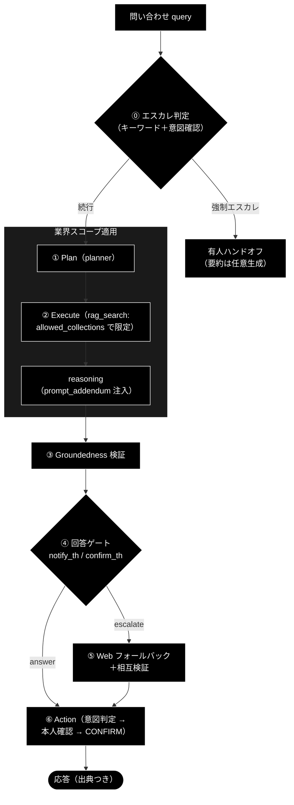

# 業界特化（VerticalProfile）仕様レビュー・改善提案

**Version 1.2** | 最終更新: 2026-07-02

> ✅ **実装反映（v1.2）**: §3 の残タスク 2 件も実装完了 — P2-1 `allowed_collections`
> （`grace/config.py` QdrantConfig ＋ `RAGSearchTool._apply_allowed_collections`。未登録のみなら
> 制限なしで従来動作）と P2-2 `prompt_addendum`（`config.llm.prompt_addendum` →
> `ReasoningTool._build_prompt` のシステム指示直後）。PROFILES には実コレクション名
> （`gov_faq_anthropic` / `gov_laws_anthropic` / `saas_docs_anthropic` / `saas_api_anthropic` /
> `ec_policy_anthropic` / `ec_faq_anthropic`、gov 暫定代替 `wikipedia_ja`）を割り当て、
> 不整合 D3 も解消。テスト: `tests/grace/test_vertical_scope.py`。
>
> ✅ **実装反映（v1.1）**: §4-A の誤検知対策（二段判定・P5-1）と §6 の KPI 評価スクリプト（P3）は
> **実装済み**。二段判定は `agent_support_example.py`（`_should_force_escalate` / `_decide_action` /
> `create_intent_classifier`）、KPI 評価は `eval/vertical/`（`run.py` / `metrics.py` /
> `cases/{gov,saas,ec}.jsonl`）、単体テストは `tests/test_agent_support_vertical.py` /
> `tests/eval/test_vertical_metrics.py`。
> 実装上の設計判断（レビュー案からの調整）: 強制エスカレの抑止対象は **question（FAQ質問）のみ**とし、
> エスカレ語＋request（例: gov「減免を個別に判断してほしい」）は業界設計（「個別事情は必ず有人」）に
> 合わせて強制エスカレを維持した（レビュー原案の「incident のみエスカレ」より安全側）。

本書は、GRACE-Support 業界特化（自治体 / SaaS / EC）のここまでの成果物
（[`grace/doc/agent_support_verticals.md`](../grace/doc/agent_support_verticals.md) v0.4、
[`docs/vertical_test_data.md`](./vertical_test_data.md) v1.0、
[`agent_support_example.py`](../agent_support_example.py)）を**実コードと突き合わせてレビュー**し、
仕様の改善案・再検討事項・検証結果をまとめたものである。

---

## 目次

- [0. 要約（結論）](#0-要約結論)
- [1. レビューの対象と方法](#1-レビューの対象と方法)
- [2. 検証結果①: ドキュメントと実装の不整合](#2-検証結果-ドキュメントと実装の不整合)
- [3. 検証結果②: 「残タスク」は既存フックでほぼ実現可能](#3-検証結果-残タスクは既存フックでほぼ実現可能)
- [4. 検証結果③: 現行仕様の設計上の懸念点](#4-検証結果-現行仕様の設計上の懸念点)
- [5. 改善提案（優先度つき）](#5-改善提案優先度つき)
- [6. KPI 評価スクリプトの設計案](#6-kpi-評価スクリプトの設計案)
- [7. テストデータ準備ガイドへの改善提案](#7-テストデータ準備ガイドへの改善提案)
- [8. 推奨ロードマップ](#8-推奨ロードマップ)
- [9. 変更履歴](#9-変更履歴)

---

## 0. 要約（結論）

コードを実際に追った結果、次の 3 点が本レビューの主要な結論である。

1. **「将来対応（要コアフック）」とされた残タスク 2 件は、既存フックでほぼ実現できる。**
   - `prompt_addendum` の注入: `ReasoningTool.execute()` は既に `context` 引数を持ち
     （`grace/tools.py:391-396`）、プロンプトに合成される。Web フォールバック経路は
     **アプリ側の 1 行変更で今日から注入可能**。executor 経由の内部 RAG 経路も
     小規模なコア改修（config 経由）で対応できる。
   - `collections` の実検索限定: `PlanStep.collection`（`grace/planner.py:286-289`）、
     `RAGSearchTool.execute(collection=...)`（`grace/tools.py:93-99`）、
     `config.qdrant.restrict_to_collection`（`grace/config.py:159`）が既に存在する。
     不足しているのは「複数コレクションの許可リスト」1 点だけで、これも小規模改修で済む。
2. **最大の品質リスクは「キーワード部分一致」の誤検知である。**
   `escalate_keywords` / `action_map` は `keyword in query` の部分一致であり、
   「課金プランの違いを教えて」（SaaS・in-scope の FAQ 質問）が「課金」で強制エスカレ、
   「解約方法を教えて」（情報質問）が「解約」でチケット起票される。
   **話題（topic）と深刻度・意図（severity/intent）を区別する仕様に改善すべき**（§4-A、§5-P5）。
3. **KPI 評価は既存の `eval/` ハーネスを再利用して短期間で構築できる。**
   `run_support_agent()` は `SupportResult`（decision / citations / groundedness /
   action 等）を構造化して返すため、期待ラベル付きテスト質問（4＋1 カテゴリ）を
   JSONL で用意すれば分岐一致率・誤エスカレ率・出典付与率を自動計測できる（§6）。

---

## 1. レビューの対象と方法

| 対象 | 内容 |
|---|---|
| 設計書 | `grace/doc/agent_support_verticals.md` v0.4（プロファイル定義・適用ポイント・残タスク） |
| テストデータガイド | `docs/vertical_test_data.md` v1.0（データ選定 5 条件・業界別候補・テスト質問セット） |
| 実装 | `agent_support_example.py`（`VerticalProfile` / `PROFILES` / `run_support_agent`） |
| コア | `grace/tools.py`（RAGSearchTool・ReasoningTool・WebSearchTool）、`grace/executor.py`（`_prepare_tool_kwargs`）、`grace/planner.py`（`PlanStep.collection`）、`grace/config.py`（しきい値・Qdrant 設定） |
| 評価基盤 | `eval/`（`build_dataset.py` / `run_eval.py` / `metrics.py`・S0/S1 ハーネス） |

方法は CLAUDE.md の作業原則どおり「**コードを実際に読んでから判断**」。
設計書の記述（実装済み / 表示のみ / 将来対応）を 1 項目ずつ実コードの該当行と突合した。

---

## 2. 検証結果①: ドキュメントと実装の不整合

実装済み配線（`escalate_keywords`・しきい値・`action_map`・`require_identity`）は
設計書どおり動作することをコードで確認した。一方、次の不整合が見つかった。

| # | 不整合 | 場所 | 対処 |
|---|---|---|---|
| D1 | §7 冒頭に「`--vertical` フラグは §6 の**設計段階（未実装）**のため」という旧文言が残存。ヘッダの「実装済み（PR #106）」注記・§7.2 と矛盾 | `agent_support_verticals.md` §7（および §7.1 の「業界チューニングは未適用」） | 文言を実装済み前提に修正（本レビューで修正済み → 同書 v0.5） |
| D2 | 設計 §6 の dataclass 案には `sample_queries: list[str]` / `kpi: list[str]` があるが、実装の `VerticalProfile` には**両フィールドが存在しない** | `agent_support_example.py:78-88` | KPI 評価（§6）の前提になるため、**期待ラベル付きで**フィールド追加（§5-P1-3） |
| D3 | `--vertical gov` 実行時に表示される「対象コレクション(想定): 条例・要綱, 手続き案内, 窓口FAQ」は**実在しない論理名**。実際の検索は `config.qdrant.search_priority` の既定（`wikipedia_ja` 等）で走るため、表示と実挙動が乖離 | `agent_support_example.py:95, 319` | 実コレクション名の割り当て（§7）まで「(想定・未接続)」と明示するか、実在コレクション名に差し替え |
| D4 | 設計 §3 自治体の KPI「誤案内 = 0」等は定義（分母・判定方法）が未規定で、このままでは計測不能 | `agent_support_verticals.md` §3-§5 | §6 のメトリクス定義で操作的に定義する |

---

## 3. 検証結果②: 「残タスク」は既存フックでほぼ実現可能

設計書 §8 は残タスク 1・2 を「要コアフック（将来対応）」としているが、
コアを読むと**必要なフックの大半は既に存在する**。再見積もりの根拠を示す。

### 3.1 `prompt_addendum` のプロンプト注入

- `ReasoningTool.execute(query, context, sources)` は `context`（自由テキスト）を受け取り、
  `_build_prompt()` でプロンプトへ合成する（`grace/tools.py:391-489`）。
- executor も reasoning ステップの kwargs に `context` を組み立てて渡している
  （`grace/executor.py:1147-1189`）。

| 経路 | 対応方法 | 規模 |
|---|---|---|
| **Web フォールバック**（アプリが直接 `tool_registry.execute("reasoning", ...)` を呼ぶ・`agent_support_example.py:373`） | `context=profile.prompt_addendum` を引数に追加するだけ | **アプリ側 1 行・即日** |
| **内部 RAG**（executor 経由） | executor は `context` を上書き構築するため、(a) `config.llm.prompt_addendum: str = ""` を追加し `ReasoningTool._build_prompt()` のシステム指示部で連結、または (b) `_prepare_tool_kwargs()` で config の addendum を `context` 先頭に連結 | **コア小改修（数行＋テスト）** |

推奨は (a)。プロファイル適用は `run_support_agent()` 冒頭で
`config.llm.prompt_addendum = profile.prompt_addendum` を設定するだけになり、
ReAct 経路・リプラン経路にも自動で効く。

### 3.2 `collections` の実検索限定

既存フックの状況:

- `PlanStep.collection` があり、planner は実行メモリの優先コレクションを設定できる
  （`grace/planner.py:232-289`）。executor は rag_search に `collection` を渡す
  （`grace/executor.py:1140-1141`）。
- `RAGSearchTool.execute()` は `collection` 指定を受けるが、**結果が無い場合は
  Qdrant 上の全コレクションへ自動フォールバックする**（`grace/tools.py:133-155`）。
  つまり単に `plan.steps[0].collection` を書き換えるだけでは、フォールバックで
  業界外コレクションへ**漏れる**。
- `config.qdrant.restrict_to_collection=True` なら単一コレクション固定になるが、
  業界プロファイルは複数コレクション（例: gov = FAQ＋条例）を想定している。

**不足しているのは「許可リスト型の限定」1 点のみ。** 提案:

```text
RAGSearchTool.execute(..., allowed_collections: Optional[list[str]] = None)
  → search_candidates を allowed_collections との積集合に制限
config.qdrant.allowed_collections: list[str] = []   # 空 = 制限なし（現行互換）
```

`run_support_agent()` 冒頭で `config.qdrant.allowed_collections = profile.collections`
（実在コレクション名に更新後）を設定すれば、planner の優先コレクション選択・
フォールバック連鎖・ReAct のすべてで業界スコープが守られる。
**規模はコア数十行＋単体テスト**であり、「将来対応」に据え置く理由はない。

### 3.3 改善後の処理フロー（提案）

強制エスカレの前倒し（§4-B）とあわせた、改善後の処理順序を示す。



---

## 4. 検証結果③: 現行仕様の設計上の懸念点

### (A) キーワード部分一致の誤検知 — **最重要**

`escalate_keywords` / `action_map` はいずれも `keyword in query` の**部分一致**である
（`agent_support_example.py:182-184, 350`）。具体的な誤検知例:

| プロファイル | クエリ（本来 in-scope の FAQ 質問） | 一致語 | 現行の挙動 | 期待 |
|---|---|---|---|---|
| saas | 「課金プランの違いを教えて」 | 課金 | 強制エスカレ（Web もスキップ） | 出典つき回答 |
| ec | 「返金ポリシーを教えて」 | 返金 | 強制エスカレ | 出典つき回答 |
| gov | 「住民税の減免制度の概要を教えて」 | 減免 | 強制エスカレ | 出典つき回答（制度説明） |
| 共通 | 「解約方法を教えて」（手順の質問） | 解約 | `create_ticket` 起票 | 回答のみ（起票不要） |

根本原因は、**「話題（topic）」と「深刻度・意図（severity / intent）」の混同**である。
「返金」は話題としては in-scope だが、「返金されない・二重請求」なら深刻度が高い。
「解約」も「したい（依頼）」と「方法を知りたい（質問）」で必要なアクションが異なる。
改善案は §5-P5-1（二段判定）を参照。なお強制エスカレは deflection（自己解決率）KPI を
直接押し下げるため、誤検知率は §6 のメトリクスで常時計測すべきである。

### (B) 強制エスカレ判定の位置 — LLM コストの浪費

エスカレ語の判定は ①Plan → ②Execute（RAG＋reasoning）→ ③Groundedness 検証の
**後**にある（`agent_support_example.py:350`）。クエリ文字列だけで決まる判定なので、
先頭（⓪）へ前倒しすれば、強制エスカレ時に **LLM 呼び出し 3〜4 回分**
（計画・推論・claim 分解検証）を丸ごと節約できる。
有人担当者への引き継ぎ要約が必要なら、エスカレ確定後に軽量モデル
（`claude-haiku-4-5-20251001`）で 1 回だけ生成する方が安い。

### (C) 矛盾判定にゲートしきい値 `confirm_th` を流用

内部×Web の一致度判定が `agreement < confirm_th` になっている
（`agent_support_example.py:384`）。`confirm_th` は「回答ゲートの下限」であり、
「2 つの回答が意味的に矛盾しているか」の基準とは別物である。
gov プロファイルが `confirm_th` を 0.4→0.5 に上げると、**副作用として矛盾検出も
過敏になる**（意図しない結合）。独立した `contradiction_th`（例: 0.5 固定または
プロファイル項目）へ分離すべき。

### (D) Web フォールバック採択時の出典・根拠の過大表示

Web 回答を採択した場合も `citations = internal_citations + web_citations` と連結し、
`groundedness = max(内部, Web)` を報告する（`agent_support_example.py:393-394`）。
最終回答（Web 由来）を支持していない内部出典が【出典】に並ぶため、
「出典付与率 ≈ 100%」の KPI が**見かけ上よく出てしまう**。
採択した側の出典を主とし、他方は「参考」として区別表示する。groundedness も
採択回答に対する値を報告する。

### (E) `require_identity` が実質未実装

現状は「本デモでは確認済みとして続行」と**表示するだけ**で、確認に失敗する経路がない
（`agent_support_example.py:207-208`）。EC の KPI「誤操作 = 0（本人確認必須）」を
守る機構としては不十分。既存の `ask_user` ツール（`grace/tools.py:575-610`）と
intervention ハンドラを使い、「注文 ID 等の提示 → 検証不能なら `escalate_to_human`」
という**失敗しうる本人確認ステップ**に置き換える（§5-P5-2）。

### (F) プロファイルのハードコード

`PROFILES` は `agent_support_example.py:92-119` に埋め込まれており、業界の追加・
しきい値調整のたびにコード変更が要る。`config/verticals.yml`（または `config.yml`
のセクション）へ外部化し、pydantic で検証して読み込む形が、既存の
`GraceConfig`（YAML＋env 上書き）の流儀とも一致する。

### (G) 単体テストの不在

`tests/` に `agent_support_example` / `VerticalProfile` のテストが**1 件もない**。
`_answer_gate()`・`_decide_action()`・`_perform_action()`・エスカレ語判定は
純関数または軽量関数で、**API キー・Qdrant なしでテスト可能**である。
特に (A) の誤検知例は、まず失敗するテストとして固定してから直すのが安全。

---

## 5. 改善提案（優先度つき）

### P1: 即時（コア変更なし・アプリ／ドキュメントのみ）

| # | 提案 | 内容 |
|---|---|---|
| P1-1 | ドキュメント不整合の解消 | §2 の D1（実施済み）・D3（「(想定・未接続)」明示） |
| P1-2 | Web 経路への `prompt_addendum` 注入 | `tool_registry.execute("reasoning", query=query, sources=web_output, context=profile.prompt_addendum)`（§3.1） |
| P1-3 | `VerticalProfile` に評価用フィールド追加 | `sample_queries: List[EvalCase]`（期待ラベル付き・§6 スキーマ）と `kpi: List[str]` を追加し、設計 §6 と一致させる |
| P1-4 | 強制エスカレの前倒し | エスカレ語判定を ①Plan の前へ移動（§4-B）。引き継ぎ要約は haiku で任意生成 |
| P1-5 | 純関数の単体テスト追加 | `_answer_gate` / `_decide_action` / エスカレ語判定（誤検知例を含む）を `tests/` に追加 |

### P2: 小規模コア改修（数十行規模）

| # | 提案 | 内容 |
|---|---|---|
| P2-1 | `allowed_collections`（許可リスト型の検索限定）✅ **実装済み** | `RAGSearchTool.execute()` と `config.qdrant` に追加（§3.2）。フォールバック漏れを塞ぐ。実装では一致ゼロ（未登録）時は制限を適用せず従来動作（デモ・評価の継続性優先） |
| P2-2 | `config.llm.prompt_addendum` ✅ **実装済み** | `ReasoningTool._build_prompt()` のシステム指示部で連結（§3.1）。executor / ReAct 経路にも効く |
| P2-3 | `contradiction_th` の分離 | 矛盾判定を `confirm_th` から独立（§4-C） |
| P2-4 | 出典・groundedness の採択側報告 | Web 採択時の表示を採択側基準に（§4-D） |

### P3: KPI 評価スクリプト（§6 に詳細設計）✅ **実装済み**（`eval/vertical/`）

### P4: テストデータ整備（§7 に詳細）

### P5: 判定の堅牢化（中期）

| # | 提案 | 内容 |
|---|---|---|
| P5-1 | **二段判定**（キーワード＋LLM 意図分類）✅ **実装済み** | 第 1 段: 現行キーワードを「候補検出」に格下げ。第 2 段: 候補ヒット時のみ `claude-haiku-4-5-20251001` で意図分類（`question / request / incident`）。実装では `question` のみ強制エスカレ・起票を抑止し、`request`/`incident`・分類失敗は安全側（従来挙動）に倒す。追加コストはヒット時の haiku 1 呼び出しに限定される |
| P5-2 | 本人確認フローの実装 | `ask_user` ＋ intervention で「識別情報の提示 → 検証 → 失敗なら escalate」（§4-E）。EC の「誤操作 = 0」を機構で担保 |
| P5-3 | プロファイルの YAML 外部化 | `config/verticals.yml` ＋ pydantic 検証（§4-F）。業界追加をノーコード化 |
| P5-4 | エスカレ判定の回答側適用 | クエリだけでなく生成回答にも禁止パターン（断定・法的判断）を検査する回答後ゲートを追加（gov の「断定回避」を機構化） |

---

## 6. KPI 評価スクリプトの設計案

**方針: 既存 `eval/` ハーネス（S0/S1）を再利用し、`eval/vertical/` として増設する。**
`run_support_agent()` が `SupportResult`（answer / citations / groundedness / decision /
used_web / action / vertical）を返すため、評価ランナーは同関数を直接呼べばよい。

### 6.1 テストケース・スキーマ（JSONL）

`docs/vertical_test_data.md` §4 の 4 カテゴリに、§4-A の誤検知を計測する
**第 5 カテゴリ `keyword-trap`** を追加する。

```json
{"vertical": "gov", "category": "in-scope",
 "query": "住民票の写しの取り方は？",
 "expected_decision": "answer", "expected_action": null, "expect_citations": true}
{"vertical": "gov", "category": "keyword-trap",
 "query": "住民税の減免制度の概要を教えて",
 "expected_decision": "answer", "expected_action": null, "expect_citations": true}
{"vertical": "ec", "category": "action",
 "query": "返品したい",
 "expected_decision": "answer", "expected_action": "create_ticket",
 "expect_identity_check": true}
{"vertical": "saas", "category": "escalate-keyword",
 "query": "サービスが落ちています",
 "expected_decision": "escalate", "expected_action": "escalate_to_human"}
```

### 6.2 メトリクス定義（設計書 KPI の操作的定義）

| メトリクス | 定義 | 対応する設計書 KPI |
|---|---|---|
| decision 一致率 | `decision == expected_decision` の割合（カテゴリ別に集計） | 一次解決率・deflection の代理 |
| **誤エスカレ率** | `keyword-trap`＋`in-scope` のうち強制エスカレ／escalate になった割合 | deflection 低下要因（§4-A） |
| エスカレ再現率 | `escalate-keyword`＋`out-of-scope` のうち escalate になった割合 | 「迷ったら有人」遵守 |
| 出典付与率 | `decision=answer` のうち `citations >= 1` の割合 | gov「出典付与率 ≈ 100%」 |
| 根拠なし回答率 | `decision=answer` かつ `groundedness < confirm_th` の割合 | gov「根拠なし回答 = 0」 |
| アクション適合率 | `action.action_type == expected_action` の割合 | SaaS「チケット適正振り分け率」 |
| 本人確認遵守率 | `expect_identity_check` のケースで確認ステップが起動した割合 | EC「誤操作 = 0」 |
| 平均レイテンシ／コスト | 既存 `eval/run_eval.py` と同じ計測を流用 | 一次応答時間 |

### 6.3 実装メモ

- `run_support_agent()` は現状 `print` 主体のため、評価時のログ抑制用に
  `quiet: bool = False`（または logger 移行）を追加すると集計が扱いやすい。
- LLM ジャッジ（正答性）は既存 `eval/run_eval.py` の accuracy 判定を流用可能。
  ただし業界評価の第一目標は**分岐の正しさ**（decision / action）であり、
  ジャッジ不要で決定的に計測できる指標を主 KPI に置く。
- 実行例（想定）: `python -m eval.vertical.run --vertical gov --cases eval/vertical/gov.jsonl --report logs/vertical_gov.json`

---

## 7. テストデータ準備ガイドへの改善提案

[`docs/vertical_test_data.md`](./vertical_test_data.md) の方針（コレクションは公開データ・
テスト入力は合成、カバレッジに穴を作る）は妥当。以下を追補提案する。

1. **実コレクション名の命名規約を先に確定する**（D3 の解消と P2-1 の前提）。
   既存規約 `*_anthropic` に合わせ、例: `gov_faq_anthropic` / `gov_laws_anthropic` /
   `saas_docs_anthropic` / `ec_policy_anthropic`。確定後、`PROFILES[*].collections` を
   論理名（条例・要綱 等）から実名に置き換える。
2. **「穴」を意図的に設計する**: 取得した公開データを登録分と保留分に分割し、
   保留分から out-of-scope 質問を作る。「コーパスに似ているが答えは無い」質問群になり、
   escalate 分岐の検証精度が「明らかに畑違いの質問」より高くなる。
3. **keyword-trap 質問を §4 のテスト質問セットに追加する**（§6.1 の第 5 カテゴリ）。
   各業界 2〜3 問（例: gov「減免制度の概要」、saas「課金プランの違い」、ec「返金ポリシー」）。
4. **TODO(b)（データ実在・ライセンス検証）は P2-1 と並行で実施**。
   自治体 FAQ オープンデータ（CSV・CC 系）が第一候補である点は変わらないが、
   §3 の候補（`amazon_reviews_multi` 等）は配布状況の変動があるため、
   確定した取得手順・ライセンス表記を同書 §3 に追記して版を上げる。

---

## 8. 推奨ロードマップ

| 順 | 作業 | 依存 | 規模感 |
|---|---|---|---|
| 1 | P1 一式（doc 修正・Web 経路 addendum・sample_queries 追加・エスカレ前倒し・単体テスト） | なし | 小 |
| 2 | P2-1 `allowed_collections` ＋ P2-2 `prompt_addendum`（コア） | なし | 小〜中 |
| 3 | P4 テストデータ（命名確定 → gov 1 コレクション登録 → TODO(b) 検証） | 2（コレクション名） | 中 |
| 4 | P3 KPI 評価ランナー（`eval/vertical/`・5 カテゴリ JSONL） | 1, 3 | 中 |
| 5 | P5-1 二段判定 → P5-2 本人確認 → P5-3 YAML 外部化 → P5-4 回答後ゲート | 4（効果を KPI で確認しながら） | 中 |

評価（4）を堅牢化（5）より先に置くのが重要である。誤エスカレ率・分岐一致率の
ベースラインを先に取ることで、二段判定などの改善が「本当に効いたか」を数値で言える
（既存 `eval/` S0 と同じ思想）。

---

## 9. 変更履歴

| バージョン | 変更内容 |
|-----------|---------|
| 1.2 | P2-1（`allowed_collections` 実検索限定）・P2-2（`prompt_addendum` 注入）の実装完了を反映。実コレクション名の割り当て（D3 解消）と TODO(b) データ検証完了（`vertical_test_data.md` v1.3）を追記 |
| 1.1 | P5-1（二段判定・誤検知抑止）と P3（KPI 評価スクリプト `eval/vertical/`）の実装完了を反映。ヘッダに実装状況注記（抑止対象を question のみとした設計判断を含む）を追加 |
| 1.0 | 初版作成。成果物（設計書 v0.4・テストデータガイド v1.0・実装）と grace コアの突合レビュー。主要結論 3 点（残タスク 2 件は既存フックでほぼ実現可能／キーワード部分一致の誤検知が最大リスク／KPI 評価は eval/ 再利用）、不整合 D1〜D4、懸念点 A〜G、改善提案 P1〜P5、KPI 評価設計（5 カテゴリ・メトリクス定義）、テストデータガイド追補、推奨ロードマップを記載 |
