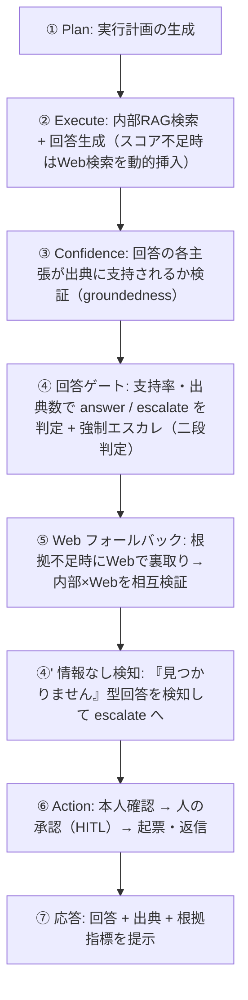
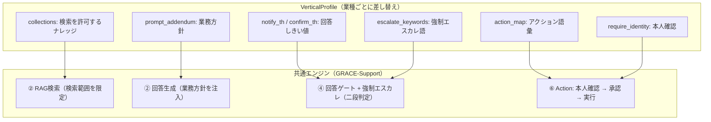

## 1. はじめに

日本語 RAG 自律型 AI エージェント（**GRACE**・自作）を土台にした、**カスタマーサポート／社内ナレッジ・コパイロットの業界特化版**をスクラッチで作りました。対象は **Gov（自治体）／SaaS／EC** の 3 業種です。

設計思想は 1 行で言えます。

> **「共通エンジンは 1 つ、差し替わるのはプロファイルだけ」**

`--vertical {gov|saas|ec}` で業界プロファイル（`VerticalProfile`）を適用し、次の **6 軸**を業種別に切り替えます。

- **検索スコープ**（`allowed_collections`）: 回答の根拠にしてよいナレッジを業界のコレクションに限定
- **回答の厳しさ**（しきい値）: gov は「間違えるくらいなら窓口へ」＝ 3 業界で唯一 `0.8/0.5` に厳格化
- **強制エスカレ語 × 二段判定**: キーワード候補検出（第 1 段）＋軽量 LLM 意図分類（第 2 段）で、「減免制度の概要を教えて」（FAQ）は回答し、「減免を個別に判断してほしい」（依頼）は人へ渡す — 誤エスカレ・誤起票を抑止
- **アクション**: 不具合・返品等の依頼を HITL（CONFIRM 承認）経由で起票（既定は安全なドライラン。Webhook 実連携対応）
- **本人確認**: EC のみ `require_identity=True`（注文操作は本人確認 → 承認 → 実行の順・未確認なら有人へ）
- **KPI 自動計測**: `eval/vertical/run.py` で分岐一致率・誤エスカレ率・出典付与率・本人確認遵守率等を計測

回答には**必ず出典**を付け、根拠不足なら Web フォールバックで裏取りして内部 × Web を相互検証、それでも不足なら「わかりません」と誠実に答えて**有人対応へエスカレーション**します。

:::message
**30 秒でわかる要点**
- 共通エンジン（GRACE-Support）は 1 つ。業種差は `VerticalProfile` の **6 項目**だけ
- 4 業種目の追加コスト＝「プロファイル 1 つ＋ナレッジ登録」
- 直近 KPI（合成テスト）: **gov 7/7・EC 9/9・SaaS 7/8**（残 1 件は原因特定済み・対策後の再計測中）
- 全ソース公開（Claude API 版／ローカル LLM 版）
:::

この記事で分かることは次の 3 つです。

1. **業界特化の設計と実装** — 共通エンジンは 1 つのまま、業種ごとの差分を「プロファイル」として注入する方法（実コード込み）
2. **2 つの判定ロジック** — 「返金ポリシーを教えて」（FAQ）と「返金してほしい」（依頼）を見分ける二段判定と、「誠実な『見つかりません』」を人に渡す情報なし検知
3. **KPI 駆動の改善記録** — 分岐一致率 0.857〜0.889 から 1.000 に到達するまでに、何が失敗し、どう直したか

対象読者は、RAG チャットボットを業務に導入しようとしているエンジニア、および「PoC は動いたが誤回答が怖くて本番に出せない」段階のチームです。

全ソースを公開しています。

- Claude API 版（本記事の実装）: https://github.com/nakashima2toshio/anthropic_grace_agent_v2
- ローカル LLM 版（Ollama・オンプレ向け）: https://github.com/nakashima2toshio/ollama_grace_agent_v2

**業界特化ドキュメント一覧**（本記事の詳細版・リポジトリ内）:

| # | ドキュメント | 説明 |
|---|---|---|
| 1 | [docs/agent_support_example.md](https://github.com/nakashima2toshio/anthropic_grace_agent_v2/blob/master/docs/agent_support_example.md) | GRACE-Support 本体の IPO 仕様 — 全体アーキテクチャ・①Plan〜⑦応答のデータフロー・クラス/関数詳細・CLI/プログラム使用例 |
| 2 | [docs/vertical_comparison.md](https://github.com/nakashima2toshio/anthropic_grace_agent_v2/blob/master/docs/vertical_comparison.md) | **3 業界の横並び比較** — 性格・7 機構・6 軸・二段判定の衝突語彙・検索スコープ設計・データ戦略・KPI の 8 観点対比＋全体対比図 |
| 3 | [docs/vertical_gov.md](https://github.com/nakashima2toshio/anthropic_grace_agent_v2/blob/master/docs/vertical_gov.md) | **Gov・自治体プロファイル** — 唯一の厳格しきい値（0.8/0.5）・減免/不服 trap の誤検知抑止・e-Gov 法令 API 投入手順・KPI 7/7 |
| 4 | [docs/vertical_saas.md](https://github.com/nakashima2toshio/anthropic_grace_agent_v2/blob/master/docs/vertical_saas.md) | **SaaS プロファイル** — エスカレ語 7 語（最多）・課金/SLA trap・不具合の起票・OSS docs 投入・KPI 7/8 |
| 5 | [docs/vertical_ec.md](https://github.com/nakashima2toshio/anthropic_grace_agent_v2/blob/master/docs/vertical_ec.md) | **EC プロファイル** — 唯一の `require_identity=True`（本人確認フロー）・返品/返金/解約 trap・KPI 9/9 |

---

## 2. なぜ「業界特化」が必要か

汎用の RAG ボットを業務サポートに置くと、2 種類の失敗が起きます。

**失敗 1: 答えてはいけない質問に答えてしまう。**
「固定資産税の減免を個別に判断してほしい」という相談に、ボットが一般論で答えてしまう。行政の個別判断・EC の決済トラブル・SaaS の障害報告は、そもそも機械が答えてよい話題ではありません。

**失敗 2: 答えてよい質問を人に回してしまう。**
逆に、危険な単語をキーワードで弾く素朴な対策を入れると、「住民税の**減免**制度の概要を教えて」というただの FAQ 質問まで有人対応に回り、自動化の意味がなくなります。

つまり「答えていいこと／人に渡すこと」の境界線は業種ごとに違い、しかも**単語では引けない**。この境界線を業種別に定義して実装したものが、本プロジェクトの「業界特化」です。

---

## 3. アーキテクチャ — GRACE-Support のパイプライン

土台となるエージェント（GRACE-Support）は、次の 7 段＋1 ゲートのパイプラインです。



要点は 3 つです。

- **回答には必ず出典**を付け、回答の各主張が出典に支持されるか（groundedness）を LLM で検証します
- 根拠が不足すれば Web で裏取りし、それでも不足なら「わかりません」と答えて**有人対応へエスカレーション**します
- 副作用のある操作（起票・返信）は**人の承認（HITL）を通してから**実行します。既定は安全なドライランです

技術スタックは、LLM が Anthropic Claude（判定系は軽量な `claude-haiku-4-5-20251001`）、Embedding が Gemini（`gemini-embedding-001`）、ベクトル DB が Qdrant です。パイプライン本体の詳細は `docs/agent_support_example.md` に委ね、本記事は「業界特化」の設計と実装に集中します。

---

## 4. 業界特化の定義 — 共通エンジン 1 つ、差し替えるのはプロファイルだけ

このエンジンは gov／SaaS／EC で**完全に共通**です。業種の違いは、すべて次の `VerticalProfile`（dataclass）の差分として注入されます。

```python
@dataclass
class VerticalProfile:
    name: str                        # プロファイル表示名
    collections: List[str]           # 検索を許可するナレッジ（Qdrantコレクション）
    escalate_keywords: List[str]     # 強制エスカレ候補語
    action_map: Dict[str, str]       # 意図キーワード → アクション種別
    require_identity: bool = False   # アクション前の本人確認を必須化するか
    notify_th: Optional[float] = None    # 回答しきい値（未指定なら既定 0.7）
    confirm_th: Optional[float] = None   # 未指定なら既定 0.4
    prompt_addendum: str = ""        # 回答生成プロンプトへ注入する業務方針
```

CLI では `--vertical {gov|saas|ec}` を付けるだけで切り替わります。言い換えると、業界特化の実体は次の **6 軸**を業種別に定義したものです。

> **①何を知識源とし、②どこまで自信があれば答え、③何を人間に渡し、④何を実行し、⑤どう語り、⑥何で測るか**

この 6 軸は、実装上は **7 つの機構**に対応します。「プロファイルのどの項目が、パイプラインのどこで効くか」を表にします。

| # | 機構 | 何が業種ごとに変わるか | 実装位置 |
|---|---|---|---|
| 1 | 検索スコープ（`collections`） | 回答の根拠にしてよいナレッジの範囲。フォールバック検索も業種外へ漏れない | `RAGSearchTool._apply_allowed_collections` |
| 2 | 回答の厳しさ（しきい値） | どこまで確信があれば答えてよいか | `_answer_gate()` |
| 3 | 強制エスカレ基準（エスカレ語×意図分類） | 機械に答えさせてはいけない話題の定義 | `_should_force_escalate()` |
| 4 | アクション語彙（`action_map`） | 「対応」と見なす意図と、その処理先 | `_decide_action()` |
| 5 | 本人確認（`require_identity`） | 副作用操作の前に本人確認を要するか | `_perform_action()` |
| 6 | 業務方針（`prompt_addendum`） | 回答の語り口・禁則。プロンプトのシステム指示直後に注入 | `ReasoningTool._build_prompt()` |
| 7 | 評価基準（KPI・テスト質問） | 何をもって良いサポートとするか | `eval/vertical/` |

プロファイルの各項目が、パイプラインのどこに効くかを図にすると次のようになります。



### 設計理由（トレードオフ）

「業種ごとに別アプリを作る」選択肢もありましたが、採りませんでした。回答エンジン・出典検証・HITL という**難しい共通部分を 1 回だけ作り、業種追加を設定の追加に落とす**ためです。実際、4 業種目を足す作業はプロファイルを 1 つ書くことと、ナレッジを登録することだけです。

代償もあります。プロファイルは「数値 2 つと日本語 1 文と語彙リスト」なので、**特化の深さは投入されたデータの質に依存します**。この点は第 10 章で正直に評価します。

---

## 5. 実装 — 3 業種の差分はこの 3 ブロックだけ

ここが本記事の中心です。「共通エンジン 1 つ、差分はプロファイルだけ」を、実コードで示します。

### 5.1 3 業種のプロファイル定義（実コード）

`agent_support_example.py` の `PROFILES` は、業種ごとに `VerticalProfile` を 1 つ持つだけです。**下の 3 ブロックが、業界特化の実体のほぼすべて**です。

```python
# gov: 「間違えるくらいなら窓口へ」。3業界で唯一しきい値を厳格化
"gov": VerticalProfile(
    name="自治体",
    # wikipedia_ja は専用コレクション（gov_faq/gov_laws）登録までの暫定代替
    collections=["gov_faq_anthropic", "gov_laws_anthropic", "wikipedia_ja"],
    escalate_keywords=["法的", "訴訟", "減免", "個別", "例外", "不服"],
    action_map={"申請": "send_reply", "手続": "send_reply", "様式": "send_reply"},
    require_identity=False,
    notify_th=0.8, confirm_th=0.5,   # 正確性最優先：既定 0.7/0.4 より厳しく
    prompt_addendum="条例・公式案内に基づき、断定を避け、該当ページ・担当課を明示。個人情報は尋ねない。",
),

# saas: 「技術FAQは自動・障害/課金は即・人へ」。エスカレ語が最多（7語）
"saas": VerticalProfile(
    name="SaaS",
    collections=["saas_docs_anthropic", "saas_api_anthropic"],  # 暫定代替なし
    escalate_keywords=["障害", "ダウン", "落ち", "課金", "請求", "情報漏", "セキュリティ"],
    action_map={"エラー": "create_ticket", "不具合": "create_ticket", "バグ": "create_ticket"},
    require_identity=False,
    prompt_addendum="製品バージョンを明示し、再現手順と公式ドキュメント URL を添える。",
),

# ec: 「手続きは自動化・注文情報には本人確認」。唯一の require_identity=True
"ec": VerticalProfile(
    name="EC",
    collections=["ec_policy_anthropic", "ec_faq_anthropic"],    # 暫定代替なし
    escalate_keywords=["決済", "返金", "破損", "クレーム", "不良品"],
    action_map={"返品": "create_ticket", "交換": "create_ticket",
                "キャンセル": "create_ticket", "解約": "create_ticket"},
    require_identity=True,            # 注文情報の操作は本人確認必須（3業界で唯一）
    prompt_addendum="注文情報の照会・変更は本人確認必須。返品・交換は規定の版に基づいて回答。",
),
```

思想がそのまま設定値に現れているのが分かります。gov は `notify_th=0.8`（確信が弱い回答を出すくらいなら窓口へ）、EC は `require_identity=True`（守るべきは注文情報の安全）。**守るべきものが業種で違うから、効く機構も違う**わけです。

一言での対比:

| | gov（自治体） | SaaS | EC |
|---|---|---|---|
| **性格** | 間違えるくらいなら窓口へ | 技術 FAQ は自動、障害・課金は即・人へ | 手続きは自動化、注文情報には本人確認 |
| **最も恐れる失敗** | 根拠のない行政回答 | 障害・課金トラブルの取りこぼし | 本人確認なしの注文操作 |
| **3 業界で唯一の特徴** | しきい値を厳格化（0.8/0.5） | エスカレ語が最多（7 語） | `require_identity=True` |

### 5.2 検索スコープの限定 — `_apply_allowed_collections`

`--vertical` 指定時、`run_support_agent()` が `config.qdrant.allowed_collections = profile.collections` を設定し、`RAGSearchTool` が**明示指定・フォールバック連鎖を含む全検索候補**へ許可リストを適用します（`grace/tools.py::_apply_allowed_collections`）。挙動は 3 つの安全弁を持ちます。

- **部分一致**: `"wikipedia_ja"` は `"wikipedia_ja_5per"` にも一致する
- **未登録コレクションは自動的に無視**: `gov_faq_anthropic` が未登録でも警告のみでデモは動く
- **1 つも一致しない場合は制限を適用しない**（全滅時は安全側フォールバック・警告ログ）

業種で設計判断が変わるのは「**暫定代替を持つか**」です。

| | gov | saas | ec |
|---|---|---|---|
| 暫定代替 | **あり**（`wikipedia_ja`） | なし | なし |
| 理由 | 制度・一般知識は百科事典でも正しく答えられる | 製品仕様は百科事典では正しくならない | 返品規定・送料は「自社の規定」であり一般知識で答えてはいけない |

EC の「返品規定を他社ポリシーや Web の一般論で答えてしまう」誤りは、スコープ限定で**構造的に**防げます。これは業務要件がそのままアーキテクチャ制約になる好例です。

### 5.3 業務方針の注入 — `prompt_addendum`

`prompt_addendum` は `config.llm.prompt_addendum` を経由して、`ReasoningTool._build_prompt()` のシステム指示直後に **「### 【業務方針（遵守）】」**として注入されます。② Execute の reasoning と ⑤ Web フォールバックの reasoning の**両方に効く**のがポイントで、Web 経由でも業種の語り口・禁則が崩れません。

たとえば gov の「断定を避ける／個人情報を尋ねない」は、`require_identity=False`（個人情報を収集しない方針）と一体で設計されています。プロファイルの各項目は独立ではなく、業種の思想に沿って**連動**しています。

---

## 6. 判定ロジック① 二段判定 — 「返金ポリシーを教えて」と「返金してほしい」を見分ける

第 2 章の「失敗 2」に戻ります。エスカレ語やアクション語は、**FAQ 質問にも普通に現れます**。

- gov: 「減免**制度の概要を教えて**」（FAQ）と「減免を**個別に判断してほしい**」（依頼）
- saas: 「**課金**プランの違いを教えて」（FAQ）と「**課金**が二重になっています」（トラブル報告）
- ec: 「**返品**規定を教えて」（FAQ）と「**返品**したい」（依頼）

キーワード一致だけで判定すると、FAQ 質問のたびに誤エスカレ・誤起票が発生します。そこで判定を 2 段に分けました。

- **第 1 段（候補検出）** `_match_keyword()`: キーワードの部分一致。一致しなければここで終わり、**LLM は呼ばれません**（追加コストゼロ）
- **第 2 段（意図分類）** `create_intent_classifier()`: 一致したときだけ、軽量 LLM（`claude-haiku-4-5-20251001`）で問い合わせを `question`（FAQ 質問）/ `request`（実行依頼）/ `incident`（障害・被害報告）に 1 語分類（同一クエリはメモ化し、エスカレ判定と `action_map` 判定で共有）

判定ルール（`_should_force_escalate` / `_decide_action`）:

| 第 1 段 | 第 2 段（意図） | 結果 |
|---|---|---|
| 不一致 | （呼ばれない） | 通常フロー |
| 一致 | `question` | **誤検知抑止** — エスカレしない／起票しない |
| 一致 | `request` / `incident` | 強制エスカレ／起票 |
| 一致 | `None`（分類失敗） | **安全側** — 従来どおりエスカレ／起票 |

設計の勘所は 2 つです。第一に、**分類に失敗したら安全側（人へ）に倒す**こと。LLM 判定は確率的なので、失敗時のデフォルトを安全側に固定しておけば、最悪でも「人に回りすぎる」だけで済みます。第二に、**コスト設計**。第 2 段が走るのはキーワード一致時だけなので、大半の問い合わせでは判定コストはゼロ、一致時も Haiku 1 呼び出しで済みます。

### 業種で違うのは「何と何が衝突するか」

判定ルール自体は 3 業界共通で、**違うのは衝突する語彙の性質**です。ここが技術的に一番面白い部分です。

| | gov | saas | ec |
|---|---|---|---|
| **衝突の性質** | 制度名にエスカレ語が含まれる（減免制度・不服審査**制度**） | FAQ 語彙とエスカレ語が同じ（課金・障害は FAQ の主題そのもの） | FAQ 語彙とアクション語が同じ（返品・解約は FAQ の主題そのもの） |
| **抑止する誤動作** | 誤・強制エスカレ | 誤・強制エスカレ | 誤・強制エスカレ ＋ **誤起票** |

3 業種の実例をまとめると次のようになります。

| 問い合わせ | 業種 | 意図 | 結果 |
|---|---|---|---|
| 「減免を個別に判断してほしい」 | gov | request | 強制エスカレ（Web 検索もスキップ） |
| 「減免制度の概要を教えて」 | gov | question | 回答（誤検知抑止） |
| 「課金が二重になっています」 | saas | incident | 強制エスカレ |
| 「課金プランの違いを教えて」 | saas | question | 回答 |
| 「返品したい」 | ec | request | 本人確認 → 起票 |
| 「返品規定を教えて」 | ec | question | 回答のみ（起票しない） |

---

## 7. 判定ロジック② 情報なし検知（④'）— 「誠実な見つかりません」を人に渡す

もう 1 つの難所は、二段判定の逆側で起きました。**エージェントが誠実に「見つかりませんでした」と答えるほど、システムはそれを「回答成功」と誤認する**問題です。

たとえば EC で「この商品の入荷予定日はいつですか？」と聞かれたとき、エージェントは Web の一般情報から「入荷予定日は確認できませんでした。商品ページでご確認ください」という丁寧な回答を作ります。この回答は出典もあり支持率も付くため、回答ゲートを answer で通過してしまう。しかし業務としては、これは有人対応に渡すべきケースです。

この問題への対策は、3 回の作り直しを経ています。

**対策 1: 定型句検出＋実質回答判定。** 「見つかりません」「確認できません」等の定型句を候補検出し、一致したときだけ軽量 LLM で「この回答は質問に実質的に答えているか（`answered` / `no_info`）」を判定するゲート（④'）を追加。二段判定と同じ「候補検出 → LLM 判定」の再利用です。

**対策 2: 判定が厳しすぎた（失敗と是正）。** ④' を入れると逆の誤検知が起きました。「弊社固有の規定は見当たりませんでしたが、一般には〜」という**断り書きつきの実質回答**まで `no_info` と判定され、答えられる質問が人に回ってしまったのです。判定基準を具体化し、few-shot の判定例をプロンプトに追加して是正しました。一時期 KPI が悪化してから回復しており、「**安全装置は入れれば終わりではなく、それ自体の誤検知も測って直す**」という教訓になりました。

**対策 3: 出典が Web のみなら判定を必須化（`force_judge`）。** それでも取りこぼしが残りました。定型句を含まない実質回答風の文面（例: 税制改正の「見通し」を検討段階の情報で紹介する回答）です。そこで「**出典が Web のみ＝社内根拠ゼロ**の回答は、定型句がなくても ④' 判定を必ず実施する」を追加しました。

このとき判定基準として言語化したのが次の 2 つで、これが最終的に効きました。

- 「**質問された事柄そのもの**」と「**それをどこで確認できるかの案内**」を区別する。案内だけの回答は、どれほど丁寧でも `no_info`
- 将来の予測を問う質問に、確定情報ではなく要望・検討段階の情報の紹介で答えている場合も `no_info`

一方で、一般知識の質問に公的情報を根拠として定義・特徴を説明する回答（例: 「行政不服審査制度とはどんな制度ですか？」）は `answered` として保護する例も併記し、誤検知の再発を防いでいます。

---

## 8. 評価 — KPI ハーネスと「意図的な穴」

「安全に振り分けられます」という主張は、測らなければ言えません。期待ラベル付きのテスト質問（gov 7 / saas 8 / ec 9 ケース）を流し、KPI を自動計測する評価ハーネスを同梱しています。

テスト質問は 5 カテゴリで、各分岐を 1 つずつ検証します。

| カテゴリ | 検証内容 | 期待 |
|---|---|---|
| in-scope | ナレッジ内の FAQ に答えられるか | answer |
| out-of-scope | ナレッジ外の質問を人に渡せるか | escalate |
| action | 依頼を起票などに繋げられるか | answer＋起票 |
| escalate-keyword | 障害・決済等で即時エスカレするか | escalate |
| **keyword-trap** | エスカレ語・アクション語を含む**質問**で誤検知しないか | answer（起票なし） |

計測メトリクスは 10 種（`eval/vertical/metrics.py`）で、業種ごとに「最重視の指標」が異なります。

| メトリクス | 意味 | 特に重視する業種 |
|---|---|---|
| `decision_accuracy` | answer/escalate の分岐一致率 | 全業種 |
| `false_escalate_rate` | FAQ を誤って人へ回した率 | **gov** |
| `forced_escalate_misfire_rate` | trap 誤検知率 | saas |
| `escalate_recall` | 渡すべきものを渡せた率 | **saas** |
| `citation_rate` / `ungrounded_answer_rate` | 出典付与率／根拠なし回答率 | **gov** |
| `action_accuracy` | 起票要否の正しさ | ec |
| `identity_check_rate` | 本人確認遵守率 | **ec** |
| `mean_latency_ms` | 平均レイテンシ | 全業種 |

### 意図的な「穴」の設計

評価用ナレッジ（合成 Q&A）を作るとき、1 つ工夫をしました。out-of-scope 質問（入荷予定日・来期売上見込み・税制改正予測）に対応するデータを、**あえて登録しない**のです。全部をカバーすると「わからないときに人に渡せるか」という分岐が永久に検証できなくなるためです。この「穴」が将来のデータ追加で埋まってしまわないよう、CI のテストがガードしています。

### 計測履歴 — 0.857〜0.889 から 1.000 へ

分岐一致率（`decision_accuracy`）の推移です（すべて合成テストケースでの値）。

| 時点 | ec | saas | gov | 主な変化 |
|---|---|---|---|---|
| ベースライン | 0.889 | 0.875 | 0.857 | 専用ナレッジ未登録。keyword-trap の判定が実行ごとに揺れる |
| ナレッジ登録後 | 0.889 | 0.875 | 0.857 | 数値は同じだが質が変化: keyword-trap 6/6 が根拠つきで安定、誤エスカレ率は 3 業種とも 0 に |
| ④' 精密化＋force_judge 後 | **1.000**（9/9） | 0.875（7/8） | **1.000**（7/7） | out-of-scope の取りこぼし（escalate_recall）が ec 0.667→1.000・gov 0.500→1.000 に回復 |

:::message
数値はすべて合成テストケースでの計測値です。評価ハーネスごと公開しているので、同条件で追試できます。
:::

**SaaS の残り 1 件（7/8）**も原因を特定済みです。「500 エラーが出る不具合を報告したい」で Web 検索がタイムアウトし、検索 0 件 → 情報なし回答 → ④' がエスカレ、という連鎖でした（期待は回答＋起票）。Web 検索側にリトライの設定化とフォールバックバックエンドを実装済みで、**再計測で 8/8 到達を確認する段階**です。

このプロセスを通じて実感したのは、**KPI 計測は失敗パターンの発見装置**だということです。「out-of-scope × 動的 Web 検索」という共通パターンも、「④' の判定が厳しすぎる」という安全装置自体の誤検知も、数値の低下として先に現れ、ログを追うことで原因に到達できました。

---

## 9. 運用の現実 — コストとレイテンシ

PoC を検討する際に必要になる実測値も記録しています。

- **1 ケース（1 問い合わせの評価実行）≈ 9 円**。内訳は LLM 呼び出し約 7〜10 回（回答生成・ステップごとの確信度評価・出典検証・意図分類・情報なし判定など）
- 最大費目はステップごとの確信度評価（約 34%）だったため、この処理を軽量モデル（Haiku）へ切り替え、**約 −23%/ケース**に。判定品質への影響は計測上ありませんでした
- レイテンシは 1 ケース 65〜75 秒 → **38〜41 秒**に短縮（同じ Haiku 化の効果）
- 反復検証のコストを抑えるオプション: `--limit N`（先頭 N 件のスモーク）・`--no-web`（Web フォールバック無効）・`--cases`（失敗ケースだけの再実行）

---

## 10. 正直な現在地と今後

うまくいった数値だけを並べると実態を見誤るので、現在地を正直に書きます。

**厚い部分（実質的な差別化）**: エスカレ基準・アクション・本人確認。同じ「返品したい」でも、EC では「本人確認 → 人の承認 → 起票」、自治体なら「有人窓口へ」と、**業務設計の違いをコードが実際に分岐しています**。本人確認は台帳照合つきで、確認できなければ実行せず人に引き継ぎます（`--no-dry-run` では `SUPPORT_IDENTITY_FILE` の顧客台帳 CSV と `order_id`/`email` を照合、実行は `SUPPORT_ACTION_WEBHOOK_URL` 設定時に Webhook 連携）。

**薄い部分（まだ枠のみ）**: ナレッジは評価用の合成データ（各業種 20 件）の段階です。実運用ナレッジの取得スクリプト（gov = e-Gov 法令 API、SaaS = OSS 公式ドキュメント）は整備済みですが、実データでの計測はこれからです。しきい値と業務方針文も「特化」というより業種別チューニングの置き場であり、業界用語辞書や制度改正への追随は未実装です。

今後は、実運用データの投入と再計測、そして 4 業種目の追加（プロファイル 1 つとナレッジ登録で済むかの検証）を進めます。

---

## 11. 動かし方（クイックスタート）

```bash
# 1. 環境変数（.env）
#    ANTHROPIC_API_KEY=...   # LLM（Claude）
#    GOOGLE_API_KEY=...      # Embedding（Gemini）

# 2. Qdrant 起動
docker-compose -f docker-compose/docker-compose.yml up -d

# 3. 評価用ナレッジを一括登録（6 コレクション）
uv run python -m eval.vertical.register_test_collections --recreate

# 4. 実行例（業種ごとに --vertical を変えるだけ）
python agent_support_example.py --vertical gov "住民票の写しの取り方は？"    # FAQ → 出典つき回答
python agent_support_example.py --vertical ec  "返品したい"                  # 本人確認 → 承認 → 起票（ドライラン）
python agent_support_example.py --vertical saas -v "サービスが落ちています"   # 障害 → 即エスカレ

# 5. KPI 計測（レポートを JSON 出力）
uv run python -m eval.vertical.run --vertical ec --report logs/vertical_ec.json
```

実データを入れる場合は、業種別ドキュメント（`docs/vertical_*.md`）の「投入手順」に、e-Gov 法令 API / OSS docs / 自社 CSV からの登録コマンドを記載しています。

---

## 12. リンク集

- **Claude API 版（本記事の実装）**: https://github.com/nakashima2toshio/anthropic_grace_agent_v2
- **ローカル LLM 版（Ollama・オンプレ向け）**: https://github.com/nakashima2toshio/ollama_grace_agent_v2
- 詳細ドキュメント（リポジトリ内）
  - [docs/vertical_comparison.md](https://github.com/nakashima2toshio/anthropic_grace_agent_v2/blob/master/docs/vertical_comparison.md) — 3 業種の横並び比較（8 観点）
  - [docs/vertical_gov.md](https://github.com/nakashima2toshio/anthropic_grace_agent_v2/blob/master/docs/vertical_gov.md) / [vertical_saas.md](https://github.com/nakashima2toshio/anthropic_grace_agent_v2/blob/master/docs/vertical_saas.md) / [vertical_ec.md](https://github.com/nakashima2toshio/anthropic_grace_agent_v2/blob/master/docs/vertical_ec.md) — 業種別の特化部分
  - [docs/agent_support_example.md](https://github.com/nakashima2toshio/anthropic_grace_agent_v2/blob/master/docs/agent_support_example.md) — 本体の仕様（IPO 形式）
  - [grace/doc/agent_support_verticals.md](https://github.com/nakashima2toshio/anthropic_grace_agent_v2/blob/master/grace/doc/agent_support_verticals.md) — 業界特化の設計書（改善履歴・KPI 計測履歴つき）

日本語 RAG・社内ナレッジ検索・自律エージェントの PoC からオンプレ本番化まで、お手伝いしています。「クラウドに出せないデータで試したい」「PoC で止まっている」方、ご相談は GitHub または X の DM へどうぞ。
