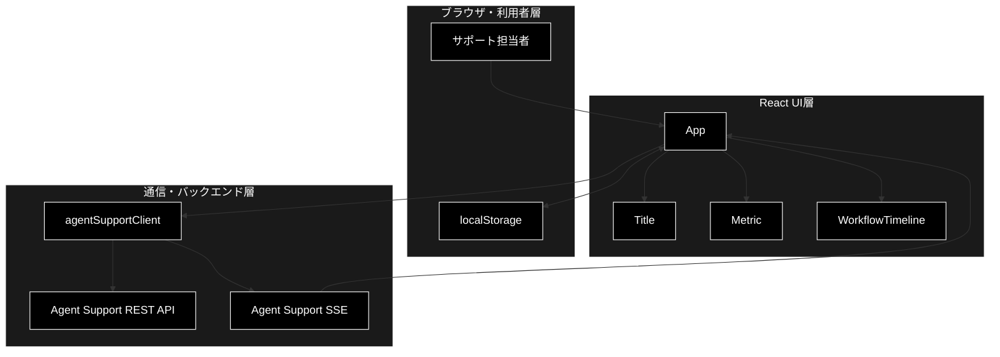
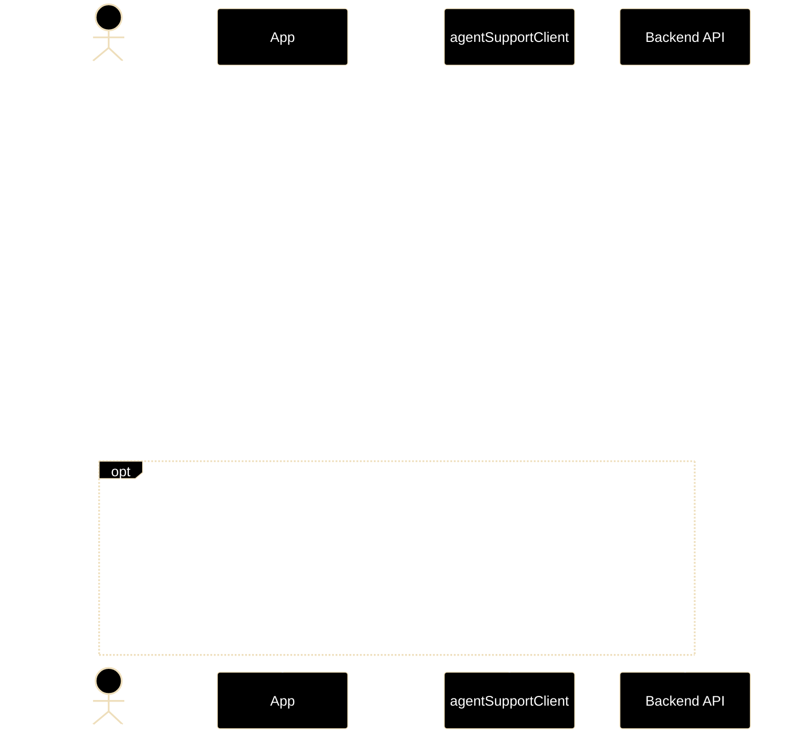
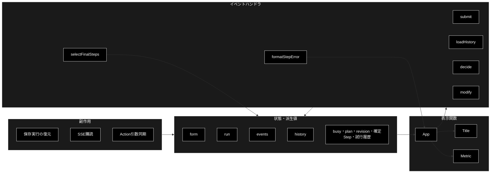
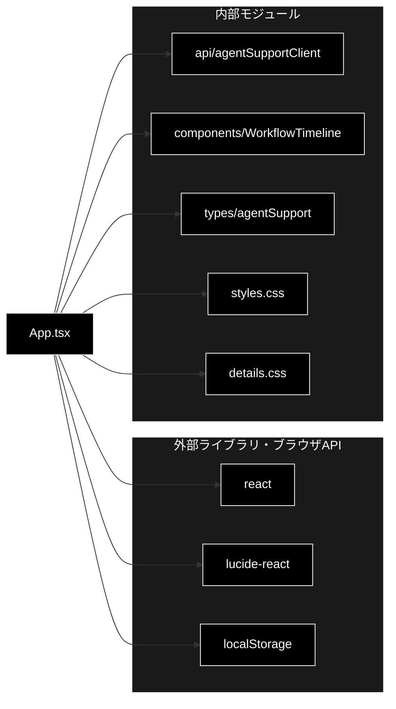

# App.tsx - GRACE Support メイン画面 ドキュメント

**Version 1.1** | 最終更新: 2026-07-17

---

## 目次

1. [概要](#概要)
2. [アーキテクチャ構成図](#1-アーキテクチャ構成図)
3. [モジュール構成図](#2-モジュール構成図)
4. [クラス・関数一覧表](#3-クラス関数一覧表)
5. [クラス・関数 IPO詳細](#4-クラス関数-ipo詳細)
6. [設定・定数](#5-設定定数)
7. [使用例](#6-使用例)
8. [エクスポート](#7-エクスポート)
9. [変更履歴](#8-変更履歴)
10. [付録: 依存関係図](#付録-依存関係図)

---

## 概要

`App.tsx` は、GRACE Support の問い合わせ入力、非同期実行の監視、検証結果の表示、実行履歴の再表示、および Human-in-the-Loop（HITL）承認を一画面にまとめる React モジュールです。バックエンドとの通信は `agentSupportClient` に委譲し、Server-Sent Events（SSE）で実行イベントを受信します。

### 主な責務

- 問い合わせ、必須の業界プロファイル、実行オプションを入力する
- エージェント実行を作成し、SSEイベントと最新状態を同期する
- 最新revisionのPlan、確定Step、試行履歴、Groundedness、回答ゲート、Web検証、Actionを表示する
- 自動回答と有人エスカレーションを分離し、検証不能な回答本文を表示しない
- HITLの承認、却下、Action引数修正を受け付ける
- 実行IDをブラウザに保存し、画面再読み込み後に実行を復元する
- 過去の実行を取得し、選択した実行を再表示する

### 各責務対応のモジュール

| # | 責務 | 対応モジュール | 説明 |
|---|------|--------------|------|
| 1 | 問い合わせ条件の入力 | `App.tsx` | 制御されたフォームとEC向け本人確認入力を描画 |
| 2 | 実行作成と状態同期 | `App.tsx`, `api/agentSupportClient.ts` | REST APIとSSE購読を組み合わせて同期 |
| 3 | 進捗と結果の表示 | `App.tsx`, `components/WorkflowTimeline.tsx` | 最新計画、確定Step、試行履歴、検証指標を描画 |
| 4 | 安全な回答・エスカレーション表示 | `App.tsx` | decisionを分岐し、エスカレーション時は理由だけを表示 |
| 5 | HITL判断 | `App.tsx`, `api/agentSupportClient.ts` | approve/reject/modifyを確認APIへ送信 |
| 6 | 実行復元 | `App.tsx` | `localStorage` の実行IDを利用 |
| 7 | 実行履歴の再表示 | `App.tsx`, `api/agentSupportClient.ts` | 履歴取得と選択時の状態切替を実行 |

### 主要機能一覧

| 機能 | 説明 |
|------|------|
| `App()` | メイン画面全体と状態管理を提供する既定エクスポートコンポーネント |
| `selectFinalSteps()` | `step_completed` をstep IDごとの確定結果へ集約 |
| `formatStepError()` | Stepの構造化エラーコードを日本語ラベルへ変換 |
| `submit()` | フォーム入力から新規実行を作成 |
| `loadHistory()` | 実行履歴を取得 |
| `decide()` | 承認または却下を送信 |
| `modify()` | 編集したAction引数をJSONとして検証し、修正判断を送信 |
| `Title()` | 番号、見出し、補足文を表示 |
| `Metric()` | 結果指標のラベルと値を表示 |

---

## 1. アーキテクチャ構成図

### 1.1 システム全体構成



### 1.2 データフロー

1. 利用者が問い合わせと必須の業界プロファイル、Web検証・Action・Dry runの設定を入力します。
2. `submit()` が実行を作成し、返された `run_id` を `localStorage` とReact stateへ保存します。
3. 実行IDがある間はSSEを購読し、重複しないイベントを `events` に追加します。
4. イベント受信ごとに最新の `RunRecord` を取得し、最新Plan revisionと確定Stepを再描画します。
5. 確認待ちでは利用者の approve/reject/modify をバックエンドへ送ります。
6. 完了後はGroundednessの判定可否、取得／検証出典数、回答または理由別の有人エスカレーションを表示します。

### 1.3 画面操作シーケンス



---

## 2. モジュール構成図

### 2.1 内部モジュール構成



### 2.2 外部依存関係

| ライブラリ | 用途 |
|-----------|------|
| `react` | state、effect、memo化、フォームイベント、JSX描画 |
| `lucide-react` | 状態、操作、警告、出典を表すSVGアイコン |
| Web `localStorage` | 最後に表示した実行IDの永続化 |

### 2.3 内部依存モジュール

| モジュール | 用途 |
|-----------|------|
| `./api/agentSupportClient` | REST通信、確認送信、SSE購読 |
| `./components/WorkflowTimeline` | 実行段階のタイムライン表示 |
| `./types/agentSupport` | APIデータ型の提供 |
| `./styles.css`, `./details.css` | 画面全体と詳細領域のスタイル |

---

## 3. クラス・関数一覧表

### 3.1 クラス一覧

クラス定義はありません。React関数コンポーネントと、その内部ハンドラで構成されます。

### 3.2 関数一覧（カテゴリ別）

#### Reactコンポーネント

| 関数名 | 概要 |
|-------|------|
| `App()` | 画面、状態、副作用、操作を統括 |
| `Title({ n, title, sub })` | セクション見出しを描画 |
| `Metric({ k, v })` | 指標カードを描画 |

#### `App` 内部ハンドラ

| 関数名 | 概要 |
|-------|------|
| `submit(event)` | 実行作成と実行ID保存 |
| `loadHistory()` | 実行履歴の読込み |
| `decide(decision)` | approve/reject判断の送信 |
| `modify()` | 編集済みAction引数によるmodify判断の送信 |
| `selectFinalSteps(events)` | 確定イベントをstep ID単位に集約して昇順化 |
| `formatStepError(step)` | `error_code` を日本語分類名へ変換して詳細と結合 |

### 3.3 state・派生値・effect一覧

| 種別 | 名前 | 型・依存 | 役割 |
|------|------|----------|------|
| state | `form` | `RunRequest` | 入力フォームの値 |
| state | `run` | `RunRecord \| null` | 現在表示中の実行 |
| state | `history` | `RunRecord[]` | 読み込んだ実行履歴 |
| state | `events` | `RunEvent[]` | SSEで受信した実行イベント |
| state | `error` | `string` | トーストに表示するエラー |
| state | `editedArgs` | `string` | 編集中のAction引数JSON |
| 派生値 | `busy` | `run` | 終端状態以外なら `true` |
| memo | `plan` | `events` | `plan_completed` / `replan_completed` の最後の計画 |
| memo | `planRevision` | `events` | replan回数 + 1 の表示revision |
| memo | `executed` | `events` | `step_completed` をIDごとに集約した確定Step |
| memo | `executionAttempts` | `events` | `executor_state` に含まれる途中の試行履歴 |
| effect | 実行復元 | 初回のみ | 保存済み `run_id` の実行を取得 |
| effect | SSE同期 | `run?.run_id` | 実行IDがある間イベントを購読 |
| effect | Action引数同期 | `run?.pending_confirmation` | 確認対象の引数を整形JSONへ変換 |

---

## 4. クラス・関数 IPO詳細

### 4.1 Reactコンポーネント

#### `App`

**概要**: GRACE Support画面の全状態を保持し、入力、実行監視、検証結果、HITL操作を統括します。

```typescript
export default function App(): JSX.Element
```

| パラメータ | 型 | デフォルト | 説明 |
|------------|----|-----------|------|
| なし | - | - | propsは受け取りません |

| 項目 | 内容 |
|------|------|
| **Input** | 利用者のフォーム操作、SSEイベント、REST API応答、`localStorage` の実行ID |
| **Process** | 1. stateと派生値を構成<br>2. 保存実行とSSEを同期<br>3. Plan revisionと確定Stepをイベントから集約<br>4. ハンドラでAPI操作<br>5. 実行状態とdecisionに応じて入力・進捗・確認・回答／エスカレーションを条件描画 |
| **Output** | `JSX.Element`: GRACE Supportメイン画面 |

**戻り値例**:

```tsx
<main>
  <header>...</header>
  <section className="workspace">...</section>
  <section className="results">...</section>
</main>
```

```tsx
// 使用例
import App from './App'

root.render(<App />)
// 出力: 問い合わせ入力と実行結果を含むメイン画面
```

#### `Title`

**概要**: セクション番号、タイトル、補足文を共通レイアウトで描画します。

```typescript
function Title(props: { n: string; title: string; sub: string }): JSX.Element
```

| パラメータ | 型 | デフォルト | 説明 |
|------------|----|-----------|------|
| `n` | `string` | - | セクション番号 |
| `title` | `string` | - | 見出し |
| `sub` | `string` | - | 補足文 |

| 項目 | 内容 |
|------|------|
| **Input** | `n`, `title`, `sub` |
| **Process** | 値を `.section-title` 内の番号、`h2`、`p` に割り当てる |
| **Output** | `JSX.Element`: セクション見出し |

**戻り値例**:

```tsx
<div className="section-title"><b>01</b><div><h2>問い合わせ</h2><p>内容を指定</p></div></div>
```

```tsx
// 使用例
<Title n="01" title="問い合わせ" sub="内容と業界プロファイルを指定してください" />
// 出力: 番号付きセクション見出し
```

#### `Metric`

**概要**: 検証結果の単一指標をラベルと値の組で描画します。

```typescript
function Metric(props: { k: string; v: string }): JSX.Element
```

| パラメータ | 型 | デフォルト | 説明 |
|------------|----|-----------|------|
| `k` | `string` | - | 指標ラベル |
| `v` | `string` | - | 表示値 |

| 項目 | 内容 |
|------|------|
| **Input** | `k`, `v` |
| **Process** | ラベルを `small`、値を `strong` としてカードへ配置 |
| **Output** | `JSX.Element`: 指標カード |

**戻り値例**:

```tsx
<article><small>Groundedness</small><strong>92%</strong></article>
```

```tsx
// 使用例
<Metric k="Groundedness" v="92%" />
// 出力: Groundedness指標カード
```

### 4.2 イベント集約・表示変換関数

#### `selectFinalSteps`

**概要**: `step_completed` イベントだけを抽出し、同じ `step_id` は後のイベントで上書きして、確定Stepを昇順で返します。イベント直下の `origin` が文字列ならStepへ引き継ぎます。

```typescript
export function selectFinalSteps(events: RunEvent[]): StepData[]
```

| パラメータ | 型 | デフォルト | 説明 |
|------------|----|-----------|------|
| `events` | `RunEvent[]` | - | 実行中に受信したイベント配列 |

| 項目 | 内容 |
|------|------|
| **Input** | `events: RunEvent[]` |
| **Process** | 1. `step_completed` かつ `data.step` があるイベントを抽出<br>2. Stepを複製し、必要なら `origin` を付与<br>3. `Map<number, StepData>` へstep IDをキーに格納<br>4. step ID昇順で返却 |
| **Output** | `StepData[]`: 各step IDにつき最後の確定結果1件 |

**戻り値例**:

```typescript
[
  { step_id: 1, status: 'completed', origin: 'planned', confidence: 0.91 },
  { step_id: 2, status: 'failed', origin: 'replan', error_code: 'timeout' },
]
```

```typescript
// 使用例
const finalSteps = selectFinalSteps(events)
// 出力: step_id順に並んだ重複のない確定Step
```

#### `formatStepError`

**概要**: Stepにエラーがある場合、`error_code` を定義済みの日本語分類名へ変換し、バックエンドの詳細文と結合します。未知コードは「実行エラー」、エラー本文なしは空文字列です。

```typescript
export function formatStepError(step: StepData): string
```

| パラメータ | 型 | デフォルト | 説明 |
|------------|----|-----------|------|
| `step` | `StepData` | - | `error` と任意の `error_code` を持つStep |

| 項目 | 内容 |
|------|------|
| **Input** | `step.error`, `step.error_code` |
| **Process** | 1. `error` がなければ空文字列<br>2. コードを `stepErrorLabels` で日本語化<br>3. 分類名と詳細をコロンで結合 |
| **Output** | `string`: 日本語分類付きエラーメッセージ |

**戻り値例**:

```typescript
'タイムアウト: Qdrant search timed out'
```

```typescript
// 使用例
formatStepError({ step_id: 1, status: 'failed', error_code: 'timeout', error: '30秒を超過' })
// 出力: タイムアウト: 30秒を超過
```

### 4.3 イベントハンドラ

#### `submit`

**概要**: フォーム送信を止めて表示状態を初期化し、新規実行を作成します。

```typescript
async function submit(event: FormEvent): Promise<void>
```

| パラメータ | 型 | デフォルト | 説明 |
|------------|----|-----------|------|
| `event` | `FormEvent` | - | フォーム送信イベント |

| 項目 | 内容 |
|------|------|
| **Input** | `event`, 現在の `form` |
| **Process** | 1. 既定送信を抑止<br>2. エラーとイベントを消去<br>3. `createRun(form)` を実行<br>4. `run_id` を保存して `run` を更新<br>5. 失敗時は例外メッセージを設定 |
| **Output** | `Promise<void>`: state更新のみ |

**戻り値例**:

```typescript
undefined
```

```tsx
// 使用例
<form onSubmit={submit}>...</form>
// 出力: 実行作成後にrun stateが更新される
```

#### `loadHistory`

**概要**: 全実行履歴を取得して履歴stateへ格納します。

```typescript
async function loadHistory(): Promise<void>
```

| パラメータ | 型 | デフォルト | 説明 |
|------------|----|-----------|------|
| なし | - | - | 入力パラメータなし |

| 項目 | 内容 |
|------|------|
| **Input** | なし |
| **Process** | `listRuns()` を呼び、成功時は `history`、失敗時は `error` を更新 |
| **Output** | `Promise<void>`: state更新のみ |

**戻り値例**:

```typescript
undefined
```

```tsx
// 使用例
<button onClick={loadHistory}>実行履歴を表示</button>
// 出力: 履歴リストが表示される
```

#### `decide`

**概要**: 現在の確認待ち実行に対し、承認または却下を送信します。

```typescript
async function decide(decision: 'approve' | 'reject'): Promise<void>
```

| パラメータ | 型 | デフォルト | 説明 |
|------------|----|-----------|------|
| `decision` | `'approve' \| 'reject'` | - | HITL判断 |

| 項目 | 内容 |
|------|------|
| **Input** | `decision`, 現在の `run` |
| **Process** | 1. `run` がなければ終了<br>2. `confirm(run, decision)` を実行<br>3. 応答内の実行を `run` に設定<br>4. 失敗時はエラーを設定 |
| **Output** | `Promise<void>`: state更新のみ |

**戻り値例**:

```typescript
undefined
```

```tsx
// 使用例
<button onClick={() => decide('approve')}>承認して実行</button>
// 出力: 承認結果を反映したrunへ更新
```

#### `modify`

**概要**: テキストエリアのJSONをAction引数として解析し、修正済みActionを確認APIへ送信します。

```typescript
async function modify(): Promise<void>
```

| パラメータ | 型 | デフォルト | 説明 |
|------------|----|-----------|------|
| なし | - | - | `run.pending_confirmation` と `editedArgs` を参照 |

| 項目 | 内容 |
|------|------|
| **Input** | 確認待ちAction、`editedArgs` のJSON文字列 |
| **Process** | 1. 確認待ちでなければ終了<br>2. JSONを `Record<string, unknown>` に解析<br>3. 元Actionを複製し引数を置換<br>4. modify判断を送信<br>5. JSON構文エラーは専用の日本語メッセージへ変換 |
| **Output** | `Promise<void>`: state更新のみ |

**戻り値例**:

```typescript
undefined
```

```tsx
// 使用例
<button onClick={modify}>修正を依頼</button>
// 出力: 編集済みActionを含む確認結果がrunへ反映される
```

### 4.4 副作用（`useEffect`）

#### 保存済み実行の復元effect

**概要**: 初回マウント時に保存済み実行IDを読み、該当実行を復元します。取得失敗時は無効なIDを削除します。

```typescript
useEffect((): void => { /* restore run */ }, [])
```

| パラメータ | 型 | デフォルト | 説明 |
|------------|----|-----------|------|
| 依存配列 | `[]` | - | 初回マウント時のみ実行 |

| 項目 | 内容 |
|------|------|
| **Input** | `localStorage['grace-support-run-id']` |
| **Process** | IDがあれば `getRun()` を実行し、失敗時は保存値を削除 |
| **Output** | `void`: 非同期処理により `run` を更新 |

**戻り値例**:

```typescript
undefined
```

```typescript
// 使用例: Appの初回マウント時にReactが自動実行
// 出力: 保存済み実行が画面へ復元される
```

#### SSE同期effect

**概要**: 実行IDがある間SSEを購読し、イベントをIDで重複排除しながら追加し、実行状態も再取得します。

```typescript
useEffect((): void | (() => void) => { /* subscribe events */ }, [run?.run_id])
```

| パラメータ | 型 | デフォルト | 説明 |
|------------|----|-----------|------|
| `run?.run_id` | `string \| undefined` | - | 購読対象実行 |

| 項目 | 内容 |
|------|------|
| **Input** | 実行ID、SSEイベント |
| **Process** | 1. 実行IDがなければ終了<br>2. `events()` で購読<br>3. イベントIDを重複排除<br>4. イベント・エラー時に最新実行を取得<br>5. cleanupでSSEを閉じる |
| **Output** | `void \| (() => void)`: 未購読または購読解除関数 |

**戻り値例**:

```typescript
() => source.close()
```

```typescript
// 使用例: run_idの変更時にReactが自動実行
// 出力: eventsとrunが継続的に同期される
```

#### Action引数同期effect

**概要**: 確認待ちActionが更新されたとき、その引数を2スペースインデントのJSON文字列へ変換します。

```typescript
useEffect((): void => { /* format action args */ }, [run?.pending_confirmation])
```

| パラメータ | 型 | デフォルト | 説明 |
|------------|----|-----------|------|
| `run?.pending_confirmation` | `PendingConfirmation \| undefined` | - | 現在の確認要求 |

| 項目 | 内容 |
|------|------|
| **Input** | `pending_confirmation.action.args` |
| **Process** | 確認要求があれば `JSON.stringify(args, null, 2)` を実行 |
| **Output** | `void`: `editedArgs` を更新 |

**戻り値例**:

```json
{
  "ticket_id": "T-001"
}
```

```typescript
// 使用例: pending_confirmationの受信時にReactが自動実行
// 出力: Action引数テキストエリアへ整形JSONを設定
```

---

## 5. 設定・定数

### 5.1 `initial`

初期フォーム値です。

```typescript
const initial: RunRequest = {
  query: '',
  vertical: null,
  use_web: true,
  do_action: true,
  dry_run: true,
}
```

| キー | デフォルト値 | 説明 |
|-----|-------------|------|
| `query` | `''` | 問い合わせ本文 |
| `vertical` | `null` | 未選択。`select required` により利用者の選択を必須化 |
| `use_web` | `true` | Web相互検証を有効化 |
| `do_action` | `true` | Action候補生成を有効化 |
| `dry_run` | `true` | Dry runを有効化 |

### 5.2 画面内ローカル型

| 型 | 用途 |
|----|------|
| `PlanData` | `plan_completed` イベント内の計画表示 |
| `StepData` | 確定Stepと試行履歴の表示。`origin`、`error`、`error_code` も保持 |

### 5.3 エラー・エスカレーション表示辞書

| 定数 | キー | 表示方針 |
|------|------|----------|
| `stepErrorLabels` | `timeout`, `tool_error`, `cancelled`, `dependency_error`, `validation_error` | Stepの `error_code` を日本語分類へ変換。未知コードは「実行エラー」 |
| `escalationLabels` | `insufficient_grounding`, `contradiction`, `no_information`, `forced_policy`, `identity_required`, `system_error` | エスカレーション理由を利用者向け日本語文へ変換 |

エスカレーション時は `run.result.answer` を表示しません。`escalation_reason` に対応する安全な説明文だけを表示し、未知理由は「十分な根拠が得られなかったため、自動回答を停止しました。」へフォールバックします。

### 5.4 結果表示規則

| 表示項目 | 条件・内容 |
|----------|-----------|
| PLAN | `plan_completed` と `replan_completed` の最後の計画を `PLAN vN` として表示 |
| EXECUTE | `step_completed` の確定結果だけを通常表示し、`executor_state` は折りたたみ試行履歴へ表示 |
| Groundedness | `groundedness_decided > 0` の場合だけ百分率。それ以外は「判定不能」 |
| 取得／検証出典 | `retrieved_source_count/verified_source_count` を表示。結果前は `0/0` |
| 出典本文 | `citations` を「参照した出典」として表示し、URLを含む場合は外部リンク化 |
| 回答本文 | `decision === 'answer'` の場合だけ表示 |
| 長文 | 回答は `white-space: pre-wrap`、出典リンクは `overflow-wrap: anywhere` を `details.css` で適用 |

### 5.5 終端状態

`completed`、`escalated`、`cancelled`、`failed` を終端状態として扱います。いずれかに達すると `busy` は `false` となり、実行開始ボタンの抑止と中止ボタンの表示を解除し、「新しい問い合わせ」を表示します。SSE購読の継続条件は `busy` ではなく `run_id` です。

---

## 6. 使用例

### 6.1 基本的なワークフロー

```tsx
// 使用例
// 1. 問い合わせを入力し、必須の業界を選択
// 2. 必要な実行オプションを選択
// 3. 「実行を開始」を押す
// 4. タイムライン、最新Plan revision、確定Stepを確認
// 5. 確認要求があればAction引数を確認して承認・却下・修正
// 6. 回答またはエスカレーション理由、判定可否、取得／検証出典を確認
```

### 6.2 実行復元と履歴切替

```typescript
// 使用例
// ブラウザ再読込み時は保存されたrun_idから実行を復元する。
// 「実行履歴を表示」で履歴を取得し、項目を選ぶとrunを切り替える。
// 履歴選択時にはeventsを空にするため、過去イベント詳細は自動再取得されない。
```

> 📝 **注意**: 実装上、SSE購読の `events` は実行中に受け取ったイベントだけを保持します。履歴から終端済み実行を選択した場合、`RunRecord` の結果は表示されますが、過去のPlan/Executeイベントは再取得しません。

---

## 7. エクスポート

本モジュールは既定コンポーネントに加え、Step集約・表示変換のテスト可能な要素を名前付きエクスポートします。

```typescript
export default App
export type StepData
export { selectFinalSteps, formatStepError }
```

`Title`、`Metric`、内部ハンドラ、`PlanData` はモジュール外へエクスポートされません。

---

## 8. 変更履歴

| バージョン | 変更内容 |
|-----------|---------|
| 1.0 | `App.tsx` の画面、state、effect、ハンドラ、HITL操作を実コードに基づき初版文書化 |
| 1.1 | 確定Step集約、Plan revision、業界必須、判定不能表示、取得／検証出典、エスカレーション本文抑止、構造化Stepエラー日本語化、長文改行を反映 |

---

## 付録: 依存関係図


