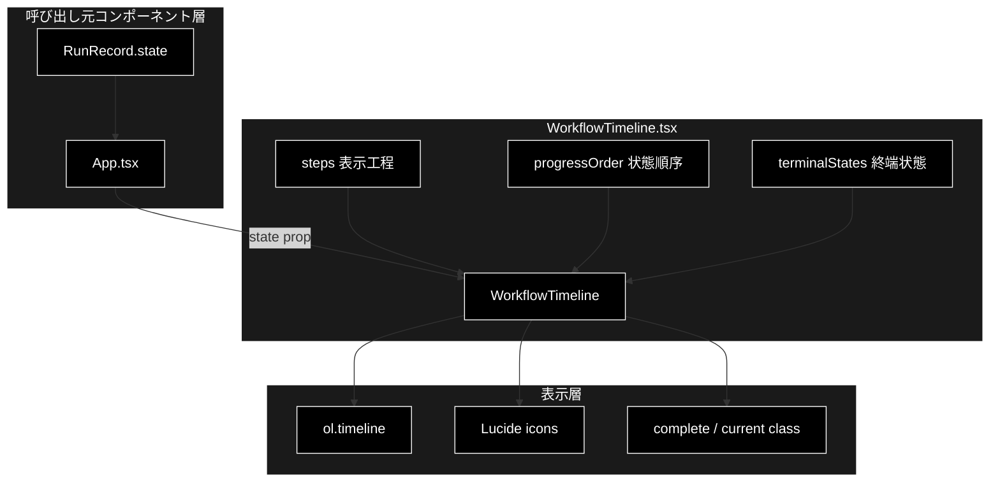
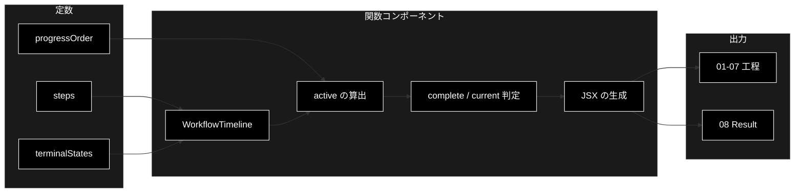
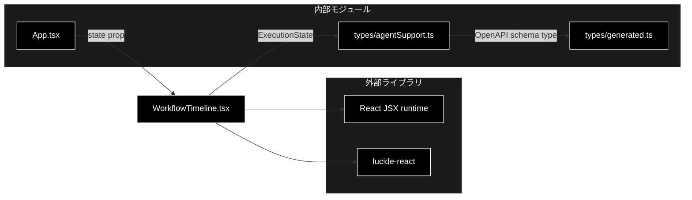

# WorkflowTimeline.tsx - 実行進捗タイムラインコンポーネント ドキュメント

**Version 1.1** | 最終更新: 2026-07-17

---

## 目次

1. [概要](#概要)
2. [アーキテクチャ構成図](#1-アーキテクチャ構成図)
3. [モジュール構成図](#2-モジュール構成図)
4. [クラス・関数一覧表](#3-クラス関数一覧表)
5. [クラス・関数 IPO詳細](#4-クラス関数-ipo詳細)
6. [設定・定数](#5-設定定数)
7. [使用例](#6-使用例)
8. [エクスポート](#7-エクスポート)
9. [変更履歴](#8-変更履歴)
10. [付録: 依存関係図](#付録-依存関係図)

---

## 概要

`WorkflowTimeline.tsx` は、エージェント処理の進捗を8項目の順序付きリストとして表示するReactコンポーネントです。APIから受け取る `ExecutionState` を、完了・実行中・未実行の表示状態とアイコンへ変換します。

### 主な責務

- 表示対象となる7工程とラベルを定義する
- 状態比較に使用する処理順序を定義する
- Resultを完了表示する終端状態を定義する
- 現在の `ExecutionState` から各工程の表示状態を判定する
- 完了・実行中・未実行に対応するアイコンとCSSクラスを付与する
- 最終結果を第8項目として表示する
- スクリーンリーダー向けの進捗ラベルを提供する

### 各責務対応のモジュール

| # | 責務 | 対応モジュール | 説明 |
|---|------|--------------|------|
| 1 | 表示対象となる7工程とラベルを定義する | `WorkflowTimeline.tsx` | `steps` がNo-infoを含む状態と表示ラベルの組を保持 |
| 2 | 状態比較に使用する処理順序を定義する | `WorkflowTimeline.tsx` | `progressOrder` が進捗判定用の状態順序を保持 |
| 3 | Resultを完了表示する終端状態を定義する | `WorkflowTimeline.tsx` | `terminalStates` が4つの終端状態を保持 |
| 4 | 現在の状態から各工程の表示状態を判定する | `WorkflowTimeline.tsx` | `WorkflowTimeline()` 内の `complete` と `current` が判定 |
| 5 | 状態別のアイコンとCSSクラスを付与する | `WorkflowTimeline.tsx` | `Check`、`LoaderCircle`、`Circle` とクラスを条件選択 |
| 6 | 最終結果を第8項目として表示する | `WorkflowTimeline.tsx` | 終端状態名を含む `Result` 項目と `ShieldCheck` を描画 |
| 7 | アクセシブルな進捗ラベルを提供する | `WorkflowTimeline.tsx` | `ol` に `aria-label="処理の進捗"` を設定 |

### 主要機能一覧

| 機能 | 説明 |
|------|------|
| `steps` | タイムラインに表示する7工程の状態キーとラベル |
| `progressOrder` | 工程の完了判定に使用する状態順序 |
| `terminalStates` | Resultを完了表示する終端状態 |
| `WorkflowTimeline()` | `state` を受け取り8項目のタイムラインを返すReact関数コンポーネント |

---

## 1. アーキテクチャ構成図

### 1.1 システム全体構成



### 1.2 データフロー

1. `App.tsx` が実行レコードの `state` を渡す。実行レコードがない場合は `queued` を渡す。
2. `WorkflowTimeline()` が `progressOrder.indexOf(state)` で入力状態の位置を求め、`terminalStates.includes(state)` で終端状態か判定する。
3. `steps` の7工程を順番に走査し、`complete` と `current` を計算する。
4. 判定結果からCSSクラスと `Check`、`LoaderCircle`、`Circle` のいずれかを選ぶ。
5. 7工程の後ろに、`ShieldCheck` を持つ `Result` 項目を追加し、終端時は状態名も表示する。
6. `ol.timeline` を呼び出し元へ返す。

---

## 2. モジュール構成図

### 2.1 内部モジュール構成



### 2.2 外部依存関係

| ライブラリ | バージョン | 用途 |
|-----------|-----------|------|
| `react` | `frontend/package.json` の `latest` | JSXを使う関数コンポーネントの実行基盤 |
| `lucide-react` | `frontend/package.json` の `latest` | `Check`、`Circle`、`LoaderCircle`、`ShieldCheck` アイコン |

### 2.3 内部依存モジュール

| モジュール | 用途 |
|-----------|------|
| `../types/agentSupport` | OpenAPI生成型を基にした `ExecutionState` 型の参照 |

---

## 3. クラス・関数一覧表

### 3.1 クラス一覧

該当なし。このモジュールは関数コンポーネントで構成されています。

### 3.2 関数一覧（カテゴリ別）

#### React関数コンポーネント

| 関数名 | 概要 |
|-------|------|
| `WorkflowTimeline({ state })` | 実行状態を8項目の進捗タイムラインへ変換して表示 |

---

## 4. クラス・関数 IPO詳細

### 4.1 React関数コンポーネント

#### `WorkflowTimeline`

**概要**: 現在の `ExecutionState` を受け取り、各工程の完了・実行中・未実行を表す順序付きリストを返します。

```tsx
export function WorkflowTimeline(
  { state }: { state: ExecutionState }
): JSX.Element
```

| パラメータ | 型 | デフォルト | 説明 |
|------------|----|-----------|------|
| `state` | `ExecutionState` | - | API実行の現在状態。呼び出し側で必ず指定する |

| 項目 | 内容 |
|------|------|
| **Input** | `state: ExecutionState` |
| **Process** | 1. `progressOrder.indexOf(state)` を `active` に格納<br>2. `terminalStates.includes(state)` を `terminal` に格納<br>3. `steps` の各工程について、入力状態が後続位置かつ `active >= 0` なら `complete` を真にする<br>4. 入力状態と工程キーが一致すれば `current` を真にする<br>5. `pending_confirmation` については `action_executing` も `current` 条件に含める<br>6. `complete` を優先してCSSクラスとアイコンを選択<br>7. 第8項目 `Result` を末尾へ追加し、終端時は `Result: {state}` と表示 |
| **Output** | `JSX.Element`: `aria-label="処理の進捗"` を持つ `ol.timeline` |

**戻り値例**:

```tsx
<ol className="timeline" aria-label="処理の進捗">
  <li className="complete">...</li>
  <li className="current">...</li>
  <li className="">...</li>
  {/* ... */}
  <li className=""><span><ShieldCheck /></span><small>08</small>Result</li>
</ol>
```

```tsx
// 使用例
import { WorkflowTimeline } from './components/WorkflowTimeline'

export function StatusPanel() {
  return <WorkflowTimeline state="verifying" />
}
// 出力: PlanとExecuteがcomplete、Groundednessがcurrentのタイムライン
```

### 4.2 状態と表示の対応

`ExecutionState` は `frontend/src/types/generated.ts` のOpenAPI生成型に基づきます。次表は現行コードの判定結果をそのまま示します。

| 入力 `state` | 完了表示 | 実行中表示 | 補足 |
|--------------|----------|------------|------|
| `queued` | なし | なし | 全7工程が未実行、Resultも未完了 |
| `planning` | なし | Plan | `LoaderCircle` を表示 |
| `executing` | Plan | Execute | 以降も同様に順序で判定 |
| `verifying` | Plan、Execute | Groundedness | - |
| `gating` | Plan、Execute、Groundedness | Answer gate | - |
| `web_verifying` | Plan〜Answer gate | Web verify | - |
| `no_info_check` | Plan〜Web verify | No-info | No-infoを第6工程として表示 |
| `pending_confirmation` | Plan〜No-info | Action | - |
| `action_executing` | Plan〜Action | なし | Actionの `current` 条件も真になるが、`complete` 判定が表示上優先される |
| `completed` | Plan〜Action、Result | なし | Resultは `Result: completed` と表示 |
| `escalated` | Result | なし | 工程は未選択、Resultは `Result: escalated` と表示 |
| `cancelled` | Result | なし | 工程は未選択、Resultは `Result: cancelled` と表示 |
| `failed` | Result | なし | 工程は未選択、Resultは `Result: failed` と表示 |

> 📝 **注意**: `escalated`、`cancelled`、`failed` は `terminalStates` に含まれる一方、`progressOrder` には含まれません。そのためResultのみが完了表示になり、個別工程には `complete` / `current` クラスが付きません。

---

## 5. 設定・定数

### 5.1 `steps`

画面に表示する7工程を、状態キーとラベルのタプルで定義します。

```tsx
const steps: [ExecutionState, string][] = [
  ['planning', 'Plan'],
  ['executing', 'Execute'],
  ['verifying', 'Groundedness'],
  ['gating', 'Answer gate'],
  ['web_verifying', 'Web verify'],
  ['no_info_check', 'No-info'],
  ['pending_confirmation', 'Action'],
]
```

| 番号 | 状態キー | 表示ラベル |
|:----:|----------|------------|
| 01 | `planning` | Plan |
| 02 | `executing` | Execute |
| 03 | `verifying` | Groundedness |
| 04 | `gating` | Answer gate |
| 05 | `web_verifying` | Web verify |
| 06 | `no_info_check` | No-info |
| 07 | `pending_confirmation` | Action |

### 5.2 `progressOrder`

`complete` 判定のための比較順序です。`steps.map(step => step[0])` によって7工程を展開し、その前後へ状態を加えます。

```tsx
const progressOrder: ExecutionState[] = [
  'queued', ...steps.map(step => step[0]), 'action_executing', 'completed',
]
```

### 5.3 `terminalStates`

Resultを完了表示にする全終端状態を定義します。

```tsx
const terminalStates: ExecutionState[] = [
  'completed',
  'escalated',
  'cancelled',
  'failed',
]
```

### 5.4 表示判定

| 判定 | 条件 | 表示への影響 |
|------|------|--------------|
| `complete` | `(active > position && active >= 0) || state === 'completed'` | `complete` クラスと `Check` アイコン |
| `current` | `state === key || (key === 'pending_confirmation' && state === 'action_executing')` | `current` クラスと `LoaderCircle` アイコン。ただし `complete` が真なら完了表示が優先 |
| 未実行 | 上記2条件がともに偽 | クラスなしと `Circle` アイコン |
| Result完了 | `terminalStates.includes(state)` | 第8項目に `complete` クラスを付け、`Result: {state}` と表示。アイコンは常に `ShieldCheck` |

---

## 6. 使用例

### 6.1 基本的なワークフロー

```tsx
// 使用例
import { WorkflowTimeline } from './components/WorkflowTimeline'
import type { ExecutionState } from './types/agentSupport'

const state: ExecutionState = 'gating'

export function ExecutionStatus() {
  return <WorkflowTimeline state={state} />
}
// 出力: 01〜03がcomplete、04がcurrent、05〜08が未完了
```

### 6.2 実行レコードとの連携

```tsx
// 使用例
import { WorkflowTimeline } from './components/WorkflowTimeline'
import type { RunRecord } from './types/agentSupport'

export function RunStatus({ run }: { run: RunRecord | null }) {
  return <WorkflowTimeline state={run?.state ?? 'queued'} />
}
// 出力: runが未取得ならqueued、取得済みならrun.stateに対応する表示
```

---

## 7. エクスポート

このモジュールは名前付きエクスポートとして `WorkflowTimeline` のみを公開します。`steps`、`progressOrder`、`terminalStates` はモジュール内部定数であり、外部へは公開されません。

```tsx
export { WorkflowTimeline }
```

---

## 8. 変更履歴

| バージョン | 変更内容 |
|-----------|---------|
| 1.0 | 初版作成。定数、関数コンポーネント、状態と表示の対応、依存関係を文書化 |
| 1.1 | No-info工程、`progressOrder`、全終端状態のResult表示を最新実装に合わせて更新 |

---

## 付録: 依存関係図


