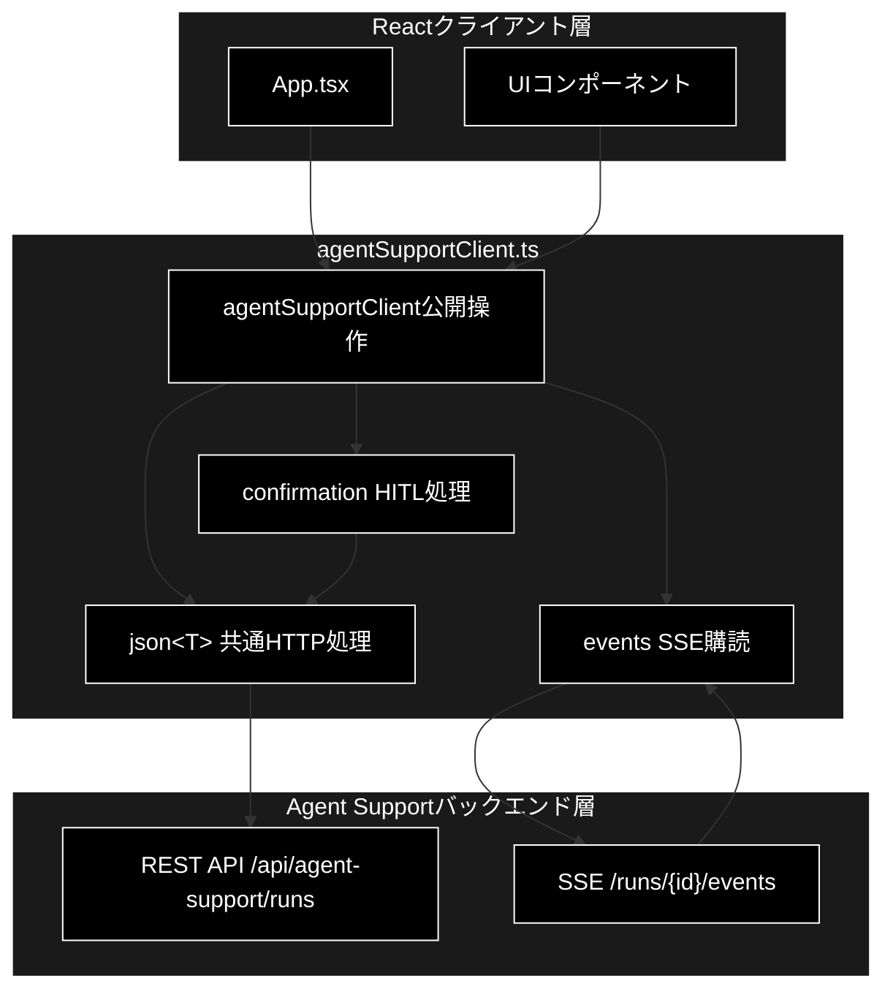
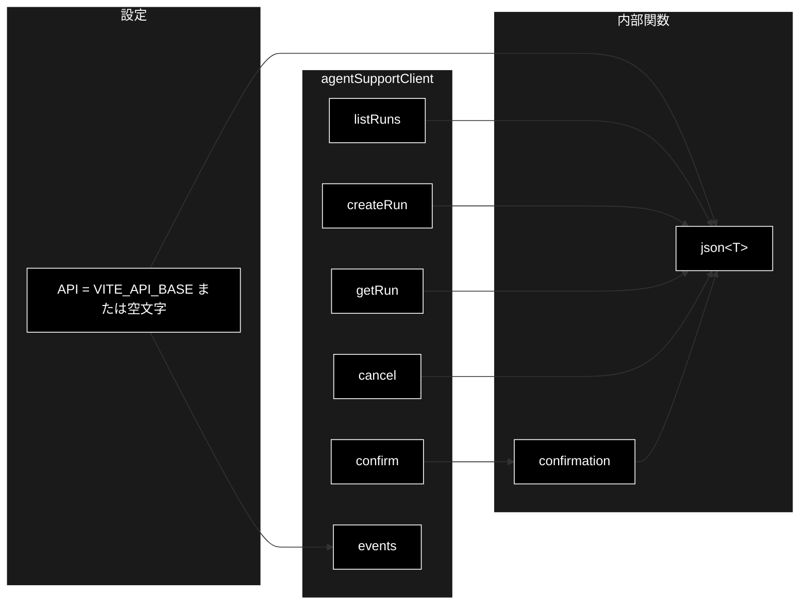
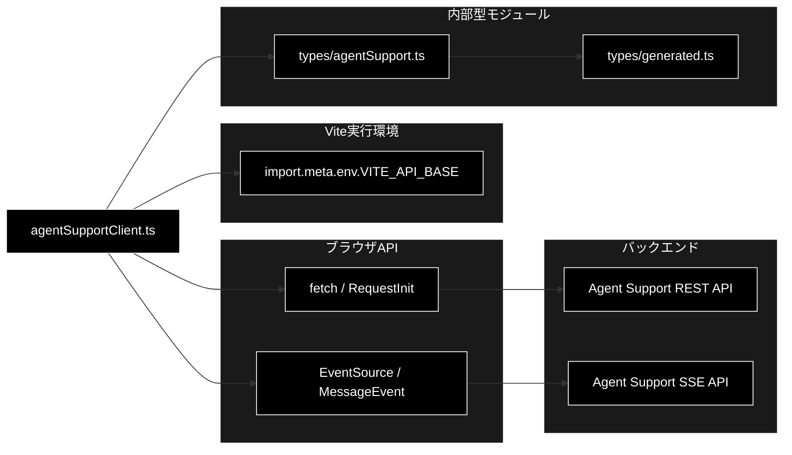

# agentSupportClient.ts - Agent Support APIクライアント ドキュメント

**Version 1.0** | 最終更新: 2026-07-17

---

## 目次

1. [概要](#概要)
2. [アーキテクチャ構成図](#1-アーキテクチャ構成図)
3. [モジュール構成図](#2-モジュール構成図)
4. [クラス・関数一覧表](#3-クラス関数一覧表)
5. [クラス・関数 IPO詳細](#4-クラス関数-ipo詳細)
6. [設定・定数](#5-設定定数)
7. [使用例](#6-使用例)
8. [エクスポート](#7-エクスポート)
9. [SSEイベント一覧](#8-sseイベント一覧)
10. [エラーハンドリング](#9-エラーハンドリング)
11. [変更履歴](#10-変更履歴)
12. [付録: 依存関係図](#付録-依存関係図)

---

## 概要

`frontend/src/api/agentSupportClient.ts` は、Agent SupportバックエンドのREST APIとServer-Sent Events（SSE）をReactフロントエンドから利用するための薄いクライアントモジュールです。実行履歴の取得、実行開始、状態取得、キャンセル、HITL確認応答、および進行イベントの購読を一つのオブジェクトに集約します。

### 主な責務

- APIベースURLと相対パスを結合してHTTP JSONリクエストを送信する
- 非成功HTTPレスポンスを日本語メッセージ付きの`Error`へ変換する
- Agent Supportの実行を作成・取得・一覧表示・キャンセルする
- 保留中アクションへの承認・拒否・修正を送信する
- 実行ライフサイクルのSSEイベントを購読し、購読解除関数を返す

### 各責務対応のモジュール

| # | 責務 | 対応モジュール | 説明 |
|---|------|--------------|------|
| 1 | HTTP JSONリクエストの送信 | `agentSupportClient.ts` | `json<T>()`がURL、ヘッダー、Fetch API呼び出しを共通化 |
| 2 | HTTPエラーの変換 | `agentSupportClient.ts` | `json<T>()`が詳細メッセージまたはステータス付き既定文言を生成 |
| 3 | 実行ライフサイクルのREST操作 | `agentSupportClient.ts` | `agentSupportClient`の各メソッドがエンドポイントを公開 |
| 4 | HITL確認応答 | `agentSupportClient.ts` | `confirmation()`がversionとaction_hashを含む確認要求を送信 |
| 5 | SSEイベント購読 | `agentSupportClient.ts` | `events()`が18イベントを登録し、終了用クロージャを返す |

### 主要機能一覧

| 機能 | 説明 |
|------|------|
| `json<T>()` | JSON API呼び出しとHTTPエラー処理を共通化する内部関数 |
| `confirmation()` | HITLの承認・拒否・修正を送信する内部関数 |
| `agentSupportClient.listRuns()` | 実行履歴一覧を取得 |
| `agentSupportClient.createRun()` | 新しいAgent Support実行を作成 |
| `agentSupportClient.getRun()` | 実行IDで最新状態を取得 |
| `agentSupportClient.cancel()` | 実行のキャンセルを要求 |
| `agentSupportClient.confirm()` | `confirmation()`を公開APIとして提供 |
| `agentSupportClient.events()` | 実行のSSEイベントを購読 |

---

## 1. アーキテクチャ構成図

### 1.1 システム全体構成



### 1.2 データフロー

1. Reactコードが`agentSupportClient`の公開メソッドを呼び出します。
2. REST操作は`json<T>()`を介し、`VITE_API_BASE`とAPIパスを結合して`fetch()`を実行します。
3. HITL確認では、保留中確認情報の`version`と`action_hash`を実行レコードから取り出して送信します。
4. SSE購読では`EventSource`を生成し、イベント名ごとのリスナーでJSONを`RunEvent`としてコールバックへ渡します。
5. 呼び出し元は`events()`の戻り値を実行してSSE接続を明示的に閉じます。

---

## 2. モジュール構成図

### 2.1 内部モジュール構成



### 2.2 外部依存関係

| API | 用途 |
|-----|------|
| Fetch API | REST APIへのJSONリクエスト送信 |
| EventSource API | サーバーからのSSEイベント受信 |
| Vite `import.meta.env` | `VITE_API_BASE`の参照 |

### 2.3 内部依存モジュール

| モジュール | 用途 |
|-----------|------|
| `../types/agentSupport` | `ActionRequest`、`ConfirmationResponse`、`RunEvent`、`RunRecord`、`RunRequest`の型定義 |

---

## 3. クラス・関数一覧表

本モジュールにクラスはありません。

### 3.1 内部関数

| 関数名 | 概要 |
|-------|------|
| `json<T>(path, init?)` | 共通のJSONリクエスト処理 |
| `confirmation(run, decision, action?)` | HITL確認応答の送信 |

### 3.2 `agentSupportClient`メソッド

| メソッド | 概要 |
|---------|------|
| `listRuns()` | 実行履歴一覧を取得 |
| `createRun(request)` | 新規実行を作成 |
| `getRun(id)` | 指定実行を取得 |
| `cancel(id)` | 指定実行をキャンセル |
| `confirm(run, decision, action?)` | 保留中アクションに応答 |
| `events(id, onEvent, onError)` | SSEイベントを購読 |

---

## 4. クラス・関数 IPO詳細

### 4.1 内部関数

#### `json<T>`

**概要**: APIベースURLとパスを結合してJSONリクエストを送り、成功時のJSONを型`T`として返します。

```typescript
async function json<T>(path: string, init?: RequestInit): Promise<T>
```

| パラメータ | 型 | デフォルト | 説明 |
|------------|----|-----------|------|
| `T` | 型パラメータ | - | 成功レスポンスの期待型 |
| `path` | `string` | - | `/api/...`形式の相対APIパス |
| `init` | `RequestInit` | `undefined` | HTTPメソッド、body、追加ヘッダーなど |

| 項目 | 内容 |
|------|------|
| **Input** | `path: string`、`init?: RequestInit` |
| **Process** | 1. `API`と`path`を結合<br>2. `init`を展開し、`Content-Type: application/json`と追加ヘッダーをマージ<br>3. `fetch()`を実行<br>4. 非成功時はレスポンスJSONの読み取りを試行して`Error`を送出<br>5. 成功時は`response.json()`を`Promise<T>`として返却 |
| **Output** | `Promise<T>`: JSONデコードされた成功レスポンス |

**戻り値例**:

```typescript
{
  run_id: 'run-001',
  state: 'completed',
  // RunRecordのその他のフィールド
}
```

```typescript
// 使用例（モジュール内部）
const run = await json<RunRecord>('/api/agent-support/runs/run-001')
console.log(run.run_id)
// 出力: run-001
```

#### `confirmation`

**概要**: 実行レコードの保留中確認情報を使い、承認・拒否・修正の決定をバックエンドへ送信します。

```typescript
function confirmation(
  run: RunRecord,
  decision: 'approve' | 'reject' | 'modify',
  action?: ActionRequest,
): Promise<ConfirmationResponse>
```

| パラメータ | 型 | デフォルト | 説明 |
|------------|----|-----------|------|
| `run` | `RunRecord` | - | `run_id`と`pending_confirmation`を持つ実行レコード |
| `decision` | `'approve' \| 'reject' \| 'modify'` | - | ユーザーの決定 |
| `action` | `ActionRequest` | `undefined` | `modify`時などに送信する修正アクション |

| 項目 | 内容 |
|------|------|
| **Input** | `run: RunRecord`、`decision`、`action?: ActionRequest` |
| **Process** | 1. `run.run_id`から確認APIパスを生成<br>2. `pending_confirmation`から`version`と`action_hash`を取得<br>3. `decision`、バージョン、ハッシュ、任意の`action`をJSON化<br>4. `json<ConfirmationResponse>()`でPOST |
| **Output** | `Promise<ConfirmationResponse>`: 更新後の実行と任意のアクション結果 |

**戻り値例**:

```typescript
{
  run: { run_id: 'run-001', state: 'completed' },
  outcome: { status: 'success' },
}
```

```typescript
// 使用例（公開API経由）
const response = await agentSupportClient.confirm(run, 'approve')
console.log(response.run.state)
```

> ⚠️ **前提条件**: 実装は`run.pending_confirmation!`の非nullアサーションを使用します。確認待ちでない`run`を渡すと、リクエスト送信前に実行時エラーになる可能性があります。

### 4.2 `agentSupportClient` 公開メソッド

#### `listRuns`

**概要**: Agent Supportの実行レコード一覧を取得します。

```typescript
listRuns(): Promise<RunRecord[]>
```

| パラメータ | 型 | デフォルト | 説明 |
|------------|----|-----------|------|
| なし | - | - | 引数なし |

| 項目 | 内容 |
|------|------|
| **Input** | なし |
| **Process** | `GET /api/agent-support/runs`を`json<RunRecord[]>()`で呼び出す |
| **Output** | `Promise<RunRecord[]>`: 実行レコード配列 |

**戻り値例**:

```typescript
[
  { run_id: 'run-001', state: 'completed' },
  { run_id: 'run-002', state: 'awaiting_confirmation' },
]
```

```typescript
// 使用例
const runs = await agentSupportClient.listRuns()
console.log(runs.length)
```

#### `createRun`

**概要**: 指定した`RunRequest`から新しいAgent Support実行を作成します。

```typescript
createRun(request: RunRequest): Promise<RunRecord>
```

| パラメータ | 型 | デフォルト | 説明 |
|------------|----|-----------|------|
| `request` | `RunRequest` | - | OpenAPI生成型に準拠した実行開始要求 |

| 項目 | 内容 |
|------|------|
| **Input** | `request: RunRequest` |
| **Process** | 1. `request`をJSON文字列化<br>2. `POST /api/agent-support/runs`を実行 |
| **Output** | `Promise<RunRecord>`: 作成された実行レコード |

**戻り値例**:

```typescript
{ run_id: 'run-003', state: 'queued' }
```

```typescript
// 使用例
const run = await agentSupportClient.createRun(request)
console.log(run.run_id)
```

#### `getRun`

**概要**: 実行IDを指定して最新の実行レコードを取得します。

```typescript
getRun(id: string): Promise<RunRecord>
```

| パラメータ | 型 | デフォルト | 説明 |
|------------|----|-----------|------|
| `id` | `string` | - | 実行ID |

| 項目 | 内容 |
|------|------|
| **Input** | `id: string` |
| **Process** | `GET /api/agent-support/runs/{id}`を実行 |
| **Output** | `Promise<RunRecord>`: 指定した実行レコード |

**戻り値例**:

```typescript
{ run_id: 'run-001', state: 'executing' }
```

```typescript
// 使用例
const run = await agentSupportClient.getRun('run-001')
console.log(run.state)
```

#### `cancel`

**概要**: 指定実行のキャンセルをバックエンドへ要求します。

```typescript
cancel(id: string): Promise<RunRecord>
```

| パラメータ | 型 | デフォルト | 説明 |
|------------|----|-----------|------|
| `id` | `string` | - | キャンセル対象の実行ID |

| 項目 | 内容 |
|------|------|
| **Input** | `id: string` |
| **Process** | `POST /api/agent-support/runs/{id}/cancel`を実行 |
| **Output** | `Promise<RunRecord>`: キャンセル要求後の実行レコード |

**戻り値例**:

```typescript
{ run_id: 'run-001', state: 'cancelled' }
```

```typescript
// 使用例
const cancelled = await agentSupportClient.cancel('run-001')
console.log(cancelled.state)
// 出力例: cancelled
```

#### `confirm`

**概要**: 内部関数`confirmation()`を同じシグネチャで公開します。

```typescript
confirm(
  run: RunRecord,
  decision: 'approve' | 'reject' | 'modify',
  action?: ActionRequest,
): Promise<ConfirmationResponse>
```

| パラメータ | 型 | デフォルト | 説明 |
|------------|----|-----------|------|
| `run` | `RunRecord` | - | 確認待ちの実行レコード |
| `decision` | `'approve' \| 'reject' \| 'modify'` | - | HITLの決定 |
| `action` | `ActionRequest` | `undefined` | 任意の修正アクション |

| 項目 | 内容 |
|------|------|
| **Input** | `run`、`decision`、`action?` |
| **Process** | `confirmation()`へ引数をそのまま渡す |
| **Output** | `Promise<ConfirmationResponse>` |

**戻り値例**:

```typescript
{ run: { run_id: 'run-001', state: 'executing' } }
```

```typescript
// 使用例
await agentSupportClient.confirm(run, 'reject')
```

#### `events`

**概要**: 指定実行のSSEエンドポイントへ接続し、18種類の名前付きイベントを購読します。

```typescript
events(
  id: string,
  onEvent: (event: RunEvent) => void,
  onError: () => void,
): () => void
```

| パラメータ | 型 | デフォルト | 説明 |
|------------|----|-----------|------|
| `id` | `string` | - | 購読対象の実行ID |
| `onEvent` | `(event: RunEvent) => void` | - | JSONデコード済みイベントの受信処理 |
| `onError` | `() => void` | - | EventSourceの`error`時に呼ばれる処理 |

| 項目 | 内容 |
|------|------|
| **Input** | `id`、`onEvent`、`onError` |
| **Process** | 1. `EventSource`を生成<br>2. 18種類のイベント名にリスナーを登録<br>3. 各`MessageEvent.data`を`JSON.parse()`して`onEvent`へ渡す<br>4. `source.onerror`に`onError`を設定<br>5. `source.close()`を呼ぶクロージャを生成 |
| **Output** | `() => void`: SSE接続を閉じる購読解除関数 |

**戻り値例**:

```typescript
() => source.close()
```

```typescript
// 使用例
const unsubscribe = agentSupportClient.events(
  'run-001',
  event => console.log(event.type, event.state),
  () => console.error('SSE接続エラー'),
)

// Reactのクリーンアップなどで切断
unsubscribe()
```

---

## 5. 設定・定数

### 5.1 `API`

```typescript
const API = import.meta.env.VITE_API_BASE ?? ''
```

| 設定元 | デフォルト値 | 説明 |
|-------|-------------|------|
| `VITE_API_BASE` | `''` | REST APIとSSE URLの先頭に付与するベースURL。未設定時は同一オリジンを使用 |

### 5.2 HTTPヘッダー

`json<T>()`は常に`Content-Type: application/json`を設定します。`init.headers`に同名ヘッダーがあれば後勝ちで上書きされます。

---

## 6. 使用例

### 6.1 実行作成からSSE購読まで

```typescript
// 使用例
import { agentSupportClient } from '../src/api/agentSupportClient'
import type { RunRequest } from '../src/types/agentSupport'

const request: RunRequest = {
  // OpenAPIスキーマに沿った要求フィールドを設定
} as RunRequest

const run = await agentSupportClient.createRun(request)

const closeEvents = agentSupportClient.events(
  run.run_id,
  event => {
    console.log(`[${event.id}] ${event.type}: ${event.state}`)
  },
  () => {
    console.error('イベント接続でエラーが発生しました')
  },
)

// 画面破棄時
closeEvents()
```

### 6.2 HITL承認

```typescript
// 使用例
const latest = await agentSupportClient.getRun('run-001')

if (latest.pending_confirmation) {
  const response = await agentSupportClient.confirm(latest, 'approve')
  console.log(response.run.state)
}
```

---

## 7. エクスポート

本モジュールに`__all__`相当の明示的なエクスポート一覧はありません。ES Moduleの名前付きエクスポートとして次の要素のみを公開します。

```typescript
export const agentSupportClient = {
  listRuns: () => json<RunRecord[]>('/api/agent-support/runs'),
  createRun: (request: RunRequest) => /* POSTしてRunRecordを返す */,
  getRun: (id: string) => /* GETしてRunRecordを返す */,
  cancel: (id: string) => /* POSTしてRunRecordを返す */,
  confirm: confirmation,
  events: (id: string, onEvent, onError) => /* 購読解除関数を返す */,
}
```

`json<T>()`と`confirmation()`はモジュール内部のみで利用されます。

---

## 8. SSEイベント一覧

`events()`は次の18種類を`addEventListener()`で購読します。すべてのイベントペイロードは`JSON.parse()`後、共通の`RunEvent`として`onEvent`へ渡されます。

| # | イベント名 | 意味 |
|---|-----------|------|
| 1 | `plan_started` | 計画生成の開始 |
| 2 | `plan_completed` | 計画生成の完了 |
| 3 | `execution_started` | 計画実行の開始 |
| 4 | `executor_state` | Executorの状態更新 |
| 5 | `tool_event` | ツール実行に関するイベント |
| 6 | `step_completed` | 実行ステップの完了 |
| 7 | `groundedness_completed` | Groundedness評価の完了 |
| 8 | `gate_completed` | 回答ゲート判定の完了 |
| 9 | `web_started` | Web相互検証の開始 |
| 10 | `web_completed` | Web相互検証の完了 |
| 11 | `no_info_completed` | 情報なし検知の完了 |
| 12 | `confirmation_required` | HITL確認が必要な状態への遷移 |
| 13 | `confirmation_resolved` | HITL確認の解決 |
| 14 | `action_started` | 確認済みアクションの開始 |
| 15 | `action_completed` | アクションの完了 |
| 16 | `run_completed` | 実行全体の正常完了 |
| 17 | `run_failed` | 実行全体の失敗 |
| 18 | `run_cancelled` | 実行全体のキャンセル |

### 8.1 `RunEvent`の形

```typescript
interface RunEvent {
  id: number
  type: string
  state: ExecutionState
  data: Record<string, unknown>
  created_at: string
}
```

> 📝 **注意**: イベント名の意味はクライアント側の購読名に基づく説明です。`data`の詳細スキーマはこのモジュールではイベント種別ごとに定義されていません。

---

## 9. エラーハンドリング

| エラー種別 | 実装上の処理 | 呼び出し元での対応 |
|-----------|-------------|-------------------|
| HTTP 4xx / 5xx | `response.ok`がfalseならレスポンスJSONの読み取りを試行し、`body.detail.message`または`APIエラー (status)`で`Error`を送出 | RESTメソッドの`Promise`を`try/catch`または`.catch()`で処理 |
| エラーレスポンスが非JSON | JSON読み取り失敗を空オブジェクトへ変換し、`APIエラー (status)`を使用 | ステータス番号をログ・画面表示に利用 |
| 通信失敗 | `fetch()`の例外を加工せず伝播 | ネットワークエラーとして処理 |
| 成功レスポンスが不正JSON | `response.json()`の例外を加工せず伝播 | API契約不整合として処理 |
| `pending_confirmation`未設定 | 非nullアサーションは実行時検証を行わないため、プロパティ参照時に例外となり得る | `confirm()`前に`run.pending_confirmation`を確認 |
| SSE接続エラー | `EventSource.onerror`が`onError`を呼ぶ。実装は自動的に`close()`しない | 必要なら購読解除関数を呼ぶ。ブラウザのEventSource再接続挙動を考慮 |
| SSEペイロードが不正JSON | イベントリスナー内の`JSON.parse()`例外は捕捉されない | バックエンドのSSE契約を検証し、必要なら上位のエラー監視を行う |
| 未登録イベント種別 | リスナーがないため`onEvent`へ渡されない | 新イベント追加時は`eventTypes`へ明示追加 |

### 9.1 HTTPエラーメッセージの優先順位

```text
body.detail.message が存在する
  → そのメッセージを使用
存在しない、または本文がJSONでない
  → APIエラー (HTTPステータス) を使用
```

---

## 10. 変更履歴

| バージョン | 変更内容 |
|-----------|---------|
| 1.0 | 初版作成。REST操作、HITL確認、SSE 18イベント、エラー処理をIPO形式で文書化 |

---

## 付録: 依存関係図


