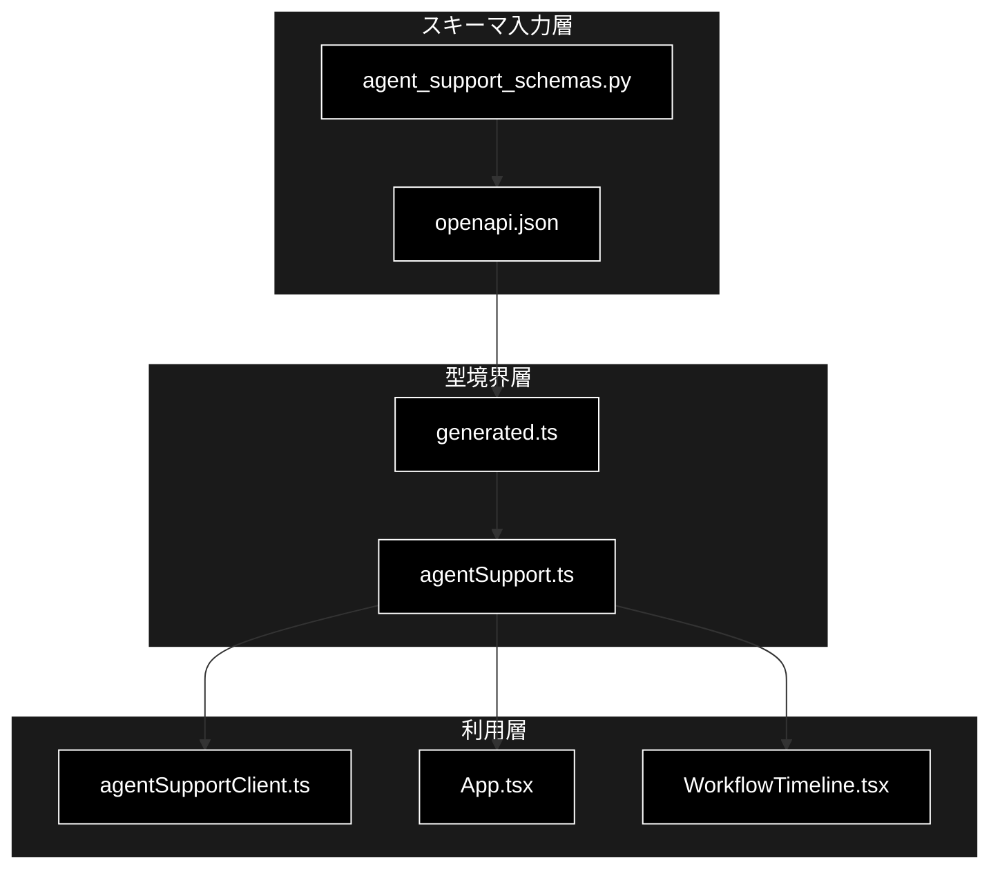
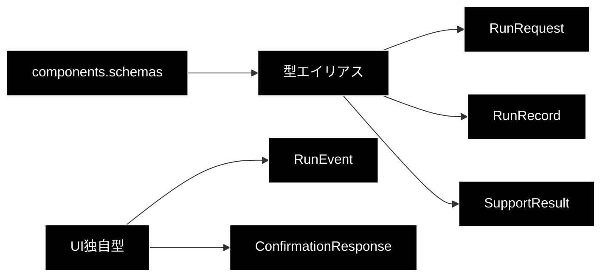

# agentSupport 型定義モジュール

> **対象**: `frontend/src/types/agentSupport.ts` / `frontend/src/types/generated.ts`  
> **バージョン**: 1.1
> **最終更新日**: 2026-07-17

## 目次

1. [概要](#1-概要)
2. [アーキテクチャ構成図](#2-アーキテクチャ構成図)
3. [モジュール構成図](#3-モジュール構成図)
4. [型一覧](#4-型一覧)
5. [型 IPO詳細](#5-型-ipo詳細)
6. [設定・定数](#6-設定定数)
7. [使用例](#7-使用例)
8. [エクスポート](#8-エクスポート)
9. [変更履歴](#9-変更履歴)
10. [付録: 依存関係図](#付録-依存関係図)

## 1. 概要

FastAPI の OpenAPI スキーマから生成した型を、React UI が安全に利用できる形へ公開する型境界です。`services/agent_support_schemas.py` がAPI契約の定義元、`generated.ts` がOpenAPIからの自動生成物、`agentSupport.ts` がUI向け補正とイベント型の定義を担当します。

### 1.1 主な責務

- OpenAPIスキーマの型をReact側へ再公開する
- APIのnullable表現をUIで扱いやすいoptional表現へ補正する
- SSEで受信する`RunEvent`を定義する
- 再計画イベントとステップ実行エラーを汎用イベントデータとして受け渡す
- HITL確認APIの応答型を定義する

### 1.2 各責務対応のモジュール

| 責務 | モジュール |
|---|---|
| OpenAPI型の自動生成 | `src/types/generated.ts` |
| UI向け型の公開・補正 | `src/types/agentSupport.ts` |
| OpenAPI入力 | `openapi.json` |
| APIスキーマの定義元 | `services/agent_support_schemas.py` |
| イベントの購読・利用 | `src/api/agentSupportClient.ts` / `src/App.tsx` |

### 1.3 主要機能一覧

| 型 | 概要 |
|---|---|
| `ExecutionState` | 実行状態の列挙型 |
| `RunRequest` | 新規実行リクエスト |
| `RunRecord` | 実行状態・結果・確認待ちを保持するレコード |
| `SupportResult` | 回答、根拠性、出典件数、再計画回数、エスカレーション、Action結果 |
| `RunEvent` | `replan_completed` やステップ結果を含むSSEイベントのUI表現 |
| `ConfirmationResponse` | HITL判断後の応答 |

## 2. アーキテクチャ構成図



## 3. モジュール構成図



## 4. 型一覧

| 型名 | 定義元 | 概要 |
|---|---|---|
| `ExecutionState` | generated | No-infoと4終端状態を含む13種類の実行状態 |
| `ActionRequest` | generated | Action種別、引数、確認要否 |
| `PendingConfirmation` | generated | Action、ハッシュ、版、期限 |
| `RunRequest` | generated | 問い合わせと実行オプション |
| `SupportResult` | UI補正 | `citations`を必須配列とし、エスカレーション理由・出典件数・再計画回数を含む結果 |
| `RunRecord` | UI補正 | 結果・確認待ちをoptionalとして扱う実行記録 |
| `RunEvent` | UI独自 | SSEイベント |
| `ConfirmationResponse` | UI独自 | 確認後の実行記録と任意のAction結果 |

## 5. 型 IPO詳細

### 5.1 `ExecutionState`

**概要**: バックエンド実行のライフサイクルを表す文字列リテラルUnionです。

```typescript
type ExecutionState =
  | 'queued' | 'planning' | 'executing' | 'verifying' | 'gating'
  | 'web_verifying' | 'no_info_check' | 'pending_confirmation'
  | 'action_executing' | 'completed' | 'escalated' | 'cancelled' | 'failed'
```

| 状態 | 区分 | 説明 |
|---|---|---|
| `queued` | 開始待ち | 実行キュー登録済み |
| `planning` | 処理中 | 初回計画または計画イベント処理中 |
| `executing` | 処理中 | 計画ステップ実行中 |
| `verifying` | 処理中 | Groundedness検証中 |
| `gating` | 処理中 | 回答ゲート判定中 |
| `web_verifying` | 処理中 | Web相互検証中 |
| `no_info_check` | 処理中 | 情報なし判定中 |
| `pending_confirmation` | HITL | Action承認待ち |
| `action_executing` | HITL | 承認済みAction実行中 |
| `completed` | 終端 | 回答またはActionが正常完了 |
| `escalated` | 終端 | 有人対応へエスカレーション |
| `cancelled` | 終端 | ユーザー操作等により中止 |
| `failed` | 終端 | システムエラーで失敗 |

| 項目 | 内容 |
|---|---|
| **Input** | バックエンドの `ExecutionState` 文字列 |
| **Process** | OpenAPI生成型が13個の許可値に制限 |
| **Output** | `ExecutionState`: UIの進捗・終端判定に使用 |

**戻り値例**:

```typescript
const state: ExecutionState = 'no_info_check'
```

```typescript
// 使用例
const terminal: ExecutionState[] = ['completed', 'escalated', 'cancelled', 'failed']
// 出力: APIスキーマの全終端状態
```

### 5.2 `RunRequest`

**概要**: エージェント実行開始時にバックエンドへ送信する入力です。

```typescript
type RunRequest = components['schemas']['RunRequest']
```

| パラメータ | 型 | デフォルト | 説明 |
|---|---|---|---|
| `query` | `string` | - | 問い合わせ本文 |
| `vertical` | `'gov' \| 'saas' \| 'ec' \| null` | optional | 業界プロファイル |
| `use_web` | `boolean` | `true`（API） | Web相互検証 |
| `do_action` | `boolean` | `true`（API） | Action候補生成 |
| `dry_run` | `boolean` | `true`（API） | Actionのドライラン |
| `identity` | `Record<string, string> \| null` | optional | EC等の本人確認情報 |

| 項目 | 内容 |
|---|---|
| **Input** | UIフォーム入力 |
| **Process** | OpenAPI生成型により送信データを静的検証 |
| **Output** | `RunRequest`: 実行作成APIのJSON本文 |

**戻り値例**:

```typescript
const request: RunRequest = { query: '返品方法を教えてください', vertical: 'ec', use_web: true, do_action: true, dry_run: true }
```

```typescript
// 使用例
await agentSupportClient.createRun(request)
// 出力: RunRecord
```

### 5.3 `RunRecord`

**概要**: 1回の実行について、現在状態、入力、結果、確認待ち、エラーを表します。

```typescript
type RunRecord = Omit<ApiRunRecord, 'result' | 'pending_confirmation'> & {
  result?: SupportResult
  pending_confirmation?: PendingConfirmation
}
```

| パラメータ | 型 | デフォルト | 説明 |
|---|---|---|---|
| `run_id` | `string` | - | 実行ID |
| `state` | `ExecutionState` | `queued`（API） | 現在状態 |
| `request` | `RunRequest` | - | 元の入力 |
| `result` | `SupportResult` | optional | 完了結果 |
| `pending_confirmation` | `PendingConfirmation` | optional | HITL確認待ち |

| 項目 | 内容 |
|---|---|
| **Input** | バックエンドの実行レコードJSON |
| **Process** | UIで未確定値をoptionalとして扱う |
| **Output** | `RunRecord`: 表示・再接続・確認判断の基準 |

**戻り値例**:

```typescript
const run: RunRecord = { run_id: 'run-1', state: 'planning', request }
```

```typescript
// 使用例
if (run.pending_confirmation) console.log(run.pending_confirmation.version)
// 出力: 確認要求の版番号
```

### 5.4 `RunEvent`

**概要**: EventSourceから受け取る進捗イベントの共通構造です。

```typescript
interface RunEvent {
  id: number
  type: string
  state: ExecutionState
  data: Record<string, unknown>
  created_at: string
}
```

| パラメータ | 型 | デフォルト | 説明 |
|---|---|---|---|
| `id` | `number` | - | 重複排除に用いるイベントID |
| `type` | `string` | - | イベント種別。`replan_completed`、`executor_state`、`step_completed` 等 |
| `state` | `ExecutionState` | - | 発生時の状態 |
| `data` | `Record<string, unknown>` | - | 種別固有データ |
| `created_at` | `string` | - | 発生日時 |

| 項目 | 内容 |
|---|---|
| **Input** | SSEのJSON文字列 |
| **Process** | APIクライアントがJSONへ変換し、AppがIDで重複排除 |
| **Output** | `RunEvent`: 計画・再計画・実行結果・検証進捗の表示入力 |

**戻り値例**:

```typescript
const event: RunEvent = { id: 1, type: 'plan_completed', state: 'executing', data: { plan: {} }, created_at: '2026-07-17T00:00:00Z' }
```

```typescript
// 使用例
agentSupportClient.events('run-1', event => console.log(event.type), () => undefined)
// 出力: plan_completed など
```

#### `replan_completed` の扱い

`RunEvent.type` 自体は将来のイベント追加を許容するため `string` です。クライアントは `replan_completed` を明示的に購読し、UIは `plan_completed` と `replan_completed` の最後のイベントに含まれる `data.plan` を現行計画として選択します。再計画回数は `SupportResult.replan_count` にも格納されます。

```typescript
const replanEvent: RunEvent = {
  id: 8,
  type: 'replan_completed',
  state: 'executing',
  data: { plan: { steps: [] } },
  created_at: '2026-07-17T00:00:08Z',
}
```

#### Step event内の `error_code`

`executor_state` および `step_completed` の `data.step` は、`RunEvent.data` の汎用型 `Record<string, unknown>` の内側に入ります。バックエンドの `StepResult.error_code` は次の5値または `null` です。これは `agentSupport.ts` の独立したexport型ではなく、UIが `data.step` を `StepData` として解釈して表示します。

| `error_code` | UI表示分類 | 用途 |
|---|---|---|
| `timeout` | タイムアウト | 処理時間超過 |
| `tool_error` | ツール実行エラー | ツール呼び出し失敗 |
| `cancelled` | キャンセル | ステップの中止 |
| `dependency_error` | 依存ステップ未完了 | 依存関係を満たせない |
| `validation_error` | 入力・設定エラー | 入力値や設定の検証失敗 |
| 未設定・未知値 | 実行エラー | UIのフォールバック分類 |

```typescript
const failedStepEvent: RunEvent = {
  id: 9,
  type: 'step_completed',
  state: 'executing',
  data: {
    step: {
      step_id: 2,
      status: 'failed',
      error: 'request timed out',
      error_code: 'timeout',
    },
  },
  created_at: '2026-07-17T00:00:09Z',
}
```

> 📝 **注意**: `error_code` は機械判定・表示分類用、`error` はユーザーへ示す詳細メッセージ用です。未知の `error_code` でもイベント自体は受信でき、UIは「実行エラー」へフォールバックします。

### 5.5 `SupportResult`

**概要**: 回答可否、根拠検証、出典件数、再計画、Web検証、Action結果をまとめた最終結果です。UI型ではAPI上optionalの `citations` を必須の `string[]` に補正します。

```typescript
type SupportResult = Omit<ApiSupportResult, 'citations'> & {
  citations: string[]
}
```

| パラメータ | 型 | デフォルト | 説明 |
|---|---|---|---|
| `decision` | `'answer' \| 'escalate'` | `escalate`（API） | 回答または有人移管の判定 |
| `escalation_reason` | `EscalationReason \| null` | optional | エスカレーション理由 |
| `citations` | `string[]` | `[]` | UIでは必須化された引用一覧 |
| `retrieved_source_count` | `number` | `0` | 検索で取得した出典数 |
| `verified_source_count` | `number` | `0` | 検証を通過した出典数 |
| `replan_count` | `number` | `0` | 実行中に行われた再計画回数 |
| `groundedness` | `number` | `0` | Groundednessスコア |
| `groundedness_decided` | `number` | `0` | Groundednessを判定できた主張数 |
| `action_outcome` | `ActionOutcome \| null` | optional | Action実行結果 |

`escalation_reason` の許可値:

| 値 | 意味 |
|---|---|
| `insufficient_grounding` | 根拠不足 |
| `contradiction` | 情報源間の矛盾 |
| `no_information` | 回答可能な情報なし |
| `forced_policy` | ポリシーによる強制移管 |
| `identity_required` | 本人確認が必要 |
| `system_error` | システムエラー |

| 項目 | 内容 |
|---|---|
| **Input** | バックエンドの `SupportResult` JSON |
| **Process** | OpenAPI型を継承し、`citations` のみUI境界で必須配列へ補正 |
| **Output** | `SupportResult`: 回答、メトリクス、エスカレーション表示の入力 |

**戻り値例**:

```typescript
const result: SupportResult = {
  decision: 'escalate',
  escalation_reason: 'no_information',
  citations: [],
  retrieved_source_count: 0,
  verified_source_count: 0,
  replan_count: 1,
  groundedness: 0,
  groundedness_decided: 0,
  contradiction: false,
  forced_escalate: false,
  identity_checked: false,
  no_info_detected: true,
  overall_confidence: 0,
  used_web: false,
  warning: false,
  web_reused: false,
}
```

```typescript
// 使用例
const sourceSummary = `${result.retrieved_source_count}/${result.verified_source_count}`
// 出力: 0/0
```

### 5.6 `ConfirmationResponse`

**概要**: 承認・却下・修正後の最新実行レコードを表します。

```typescript
interface ConfirmationResponse {
  run: RunRecord
  outcome?: SupportResult['action_outcome']
}
```

| パラメータ | 型 | デフォルト | 説明 |
|---|---|---|---|
| `run` | `RunRecord` | - | 判断反映後の実行 |
| `outcome` | `SupportResult['action_outcome']` | optional | Action実行結果 |

| 項目 | 内容 |
|---|---|
| **Input** | confirmations API応答 |
| **Process** | 実行状態と任意のAction結果を型付け |
| **Output** | `ConfirmationResponse` |

**戻り値例**:

```typescript
const response: ConfirmationResponse = { run: { ...run, state: 'action_executing' } }
```

```typescript
// 使用例
const { run: updated } = await agentSupportClient.confirm(run, 'approve')
// 出力: 判断反映後のRunRecord
```

## 6. 設定・定数

このモジュールに実行時設定・定数はありません。`generated.ts`は`npm run types:generate`で再生成し、直接編集しません。

## 7. 使用例

```typescript
// 使用例
import type { RunRequest, RunRecord } from './types/agentSupport'

const request: RunRequest = {
  query: '契約変更の方法を教えてください',
  vertical: 'saas',
  use_web: true,
  do_action: true,
  dry_run: true,
}
const consume = (run: RunRecord) => console.log(run.state)
```

## 8. エクスポート

`agentSupport.ts`は8型をnamed exportします。`generated.ts`は`paths`、`components`、`operations`等のOpenAPI生成型をexportします。

## 9. 変更履歴

| バージョン | 変更内容 |
|---|---|
| 1.0 | 初版作成 |
| 1.1 | 全ExecutionState、SupportResultのエスカレーション理由・出典件数・再計画回数、再計画イベント、ステップエラー分類を追加 |

## 付録: 依存関係図


