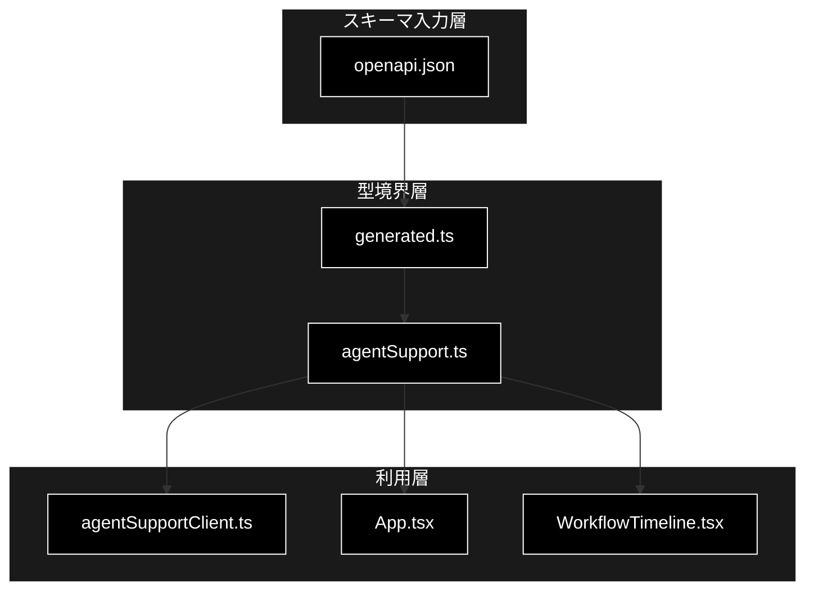
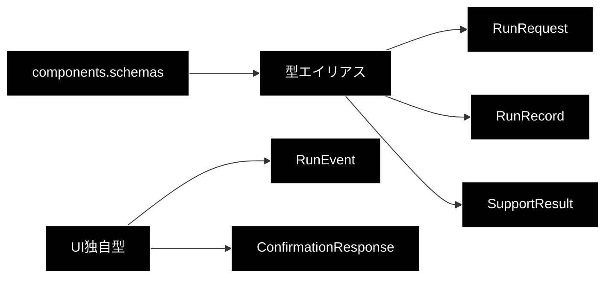

# agentSupport 型定義モジュール

> **対象**: `frontend/src/types/agentSupport.ts` / `frontend/src/types/generated.ts`  
> **バージョン**: 1.0  
> **最終更新日**: 2026-07-17

## 目次

1. [概要](#1-概要)
2. [アーキテクチャ構成図](#2-アーキテクチャ構成図)
3. [モジュール構成図](#3-モジュール構成図)
4. [型一覧](#4-型一覧)
5. [型 IPO詳細](#5-型-ipo詳細)
6. [設定・定数](#6-設定定数)
7. [使用例](#7-使用例)
8. [エクスポート](#8-エクスポート)
9. [変更履歴](#9-変更履歴)
10. [付録: 依存関係図](#付録-依存関係図)

## 1. 概要

FastAPI の OpenAPI スキーマから生成した型を、React UI が安全に利用できる形へ公開する型境界です。`generated.ts` は自動生成物、`agentSupport.ts` はUI向け補正とイベント型の定義を担当します。

### 1.1 主な責務

- OpenAPIスキーマの型をReact側へ再公開する
- APIのnullable表現をUIで扱いやすいoptional表現へ補正する
- SSEで受信する`RunEvent`を定義する
- HITL確認APIの応答型を定義する

### 1.2 各責務対応のモジュール

| 責務 | モジュール |
|---|---|
| OpenAPI型の自動生成 | `src/types/generated.ts` |
| UI向け型の公開・補正 | `src/types/agentSupport.ts` |
| OpenAPI入力 | `openapi.json` |

### 1.3 主要機能一覧

| 型 | 概要 |
|---|---|
| `ExecutionState` | 実行状態の列挙型 |
| `RunRequest` | 新規実行リクエスト |
| `RunRecord` | 実行状態・結果・確認待ちを保持するレコード |
| `SupportResult` | 回答、根拠性、ゲート、Web検証、Action結果 |
| `RunEvent` | SSEイベントのUI表現 |
| `ConfirmationResponse` | HITL判断後の応答 |

## 2. アーキテクチャ構成図



## 3. モジュール構成図



## 4. 型一覧

| 型名 | 定義元 | 概要 |
|---|---|---|
| `ExecutionState` | generated | `queued`から`failed`までの実行状態 |
| `ActionRequest` | generated | Action種別、引数、確認要否 |
| `PendingConfirmation` | generated | Action、ハッシュ、版、期限 |
| `RunRequest` | generated | 問い合わせと実行オプション |
| `SupportResult` | UI補正 | `citations`を必須配列として扱う結果 |
| `RunRecord` | UI補正 | 結果・確認待ちをoptionalとして扱う実行記録 |
| `RunEvent` | UI独自 | SSEイベント |
| `ConfirmationResponse` | UI独自 | 確認後の実行記録と任意のAction結果 |

## 5. 型 IPO詳細

### 5.1 `RunRequest`

**概要**: エージェント実行開始時にバックエンドへ送信する入力です。

```typescript
type RunRequest = components['schemas']['RunRequest']
```

| パラメータ | 型 | デフォルト | 説明 |
|---|---|---|---|
| `query` | `string` | - | 問い合わせ本文 |
| `vertical` | `'gov' \| 'saas' \| 'ec' \| null` | optional | 業界プロファイル |
| `use_web` | `boolean` | `true`（API） | Web相互検証 |
| `do_action` | `boolean` | `true`（API） | Action候補生成 |
| `dry_run` | `boolean` | `true`（API） | Actionのドライラン |
| `identity` | `Record<string, string> \| null` | optional | EC等の本人確認情報 |

| 項目 | 内容 |
|---|---|
| **Input** | UIフォーム入力 |
| **Process** | OpenAPI生成型により送信データを静的検証 |
| **Output** | `RunRequest`: 実行作成APIのJSON本文 |

**戻り値例**:

```typescript
const request: RunRequest = { query: '返品方法を教えてください', vertical: 'ec', use_web: true, do_action: true, dry_run: true }
```

```typescript
// 使用例
await agentSupportClient.createRun(request)
// 出力: RunRecord
```

### 5.2 `RunRecord`

**概要**: 1回の実行について、現在状態、入力、結果、確認待ち、エラーを表します。

```typescript
type RunRecord = Omit<ApiRunRecord, 'result' | 'pending_confirmation'> & {
  result?: SupportResult
  pending_confirmation?: PendingConfirmation
}
```

| パラメータ | 型 | デフォルト | 説明 |
|---|---|---|---|
| `run_id` | `string` | - | 実行ID |
| `state` | `ExecutionState` | `queued`（API） | 現在状態 |
| `request` | `RunRequest` | - | 元の入力 |
| `result` | `SupportResult` | optional | 完了結果 |
| `pending_confirmation` | `PendingConfirmation` | optional | HITL確認待ち |

| 項目 | 内容 |
|---|---|
| **Input** | バックエンドの実行レコードJSON |
| **Process** | UIで未確定値をoptionalとして扱う |
| **Output** | `RunRecord`: 表示・再接続・確認判断の基準 |

**戻り値例**:

```typescript
const run: RunRecord = { run_id: 'run-1', state: 'planning', request }
```

```typescript
// 使用例
if (run.pending_confirmation) console.log(run.pending_confirmation.version)
// 出力: 確認要求の版番号
```

### 5.3 `RunEvent`

**概要**: EventSourceから受け取る進捗イベントの共通構造です。

```typescript
interface RunEvent {
  id: number
  type: string
  state: ExecutionState
  data: Record<string, unknown>
  created_at: string
}
```

| パラメータ | 型 | デフォルト | 説明 |
|---|---|---|---|
| `id` | `number` | - | 重複排除に用いるイベントID |
| `type` | `string` | - | イベント種別 |
| `state` | `ExecutionState` | - | 発生時の状態 |
| `data` | `Record<string, unknown>` | - | 種別固有データ |
| `created_at` | `string` | - | 発生日時 |

| 項目 | 内容 |
|---|---|
| **Input** | SSEのJSON文字列 |
| **Process** | APIクライアントがJSONへ変換し、AppがIDで重複排除 |
| **Output** | `RunEvent`: 計画・実行結果・検証進捗の表示入力 |

**戻り値例**:

```typescript
const event: RunEvent = { id: 1, type: 'plan_completed', state: 'executing', data: { plan: {} }, created_at: '2026-07-17T00:00:00Z' }
```

```typescript
// 使用例
agentSupportClient.events('run-1', event => console.log(event.type), () => undefined)
// 出力: plan_completed など
```

### 5.4 `ConfirmationResponse`

**概要**: 承認・却下・修正後の最新実行レコードを表します。

```typescript
interface ConfirmationResponse {
  run: RunRecord
  outcome?: SupportResult['action_outcome']
}
```

| パラメータ | 型 | デフォルト | 説明 |
|---|---|---|---|
| `run` | `RunRecord` | - | 判断反映後の実行 |
| `outcome` | `SupportResult['action_outcome']` | optional | Action実行結果 |

| 項目 | 内容 |
|---|---|
| **Input** | confirmations API応答 |
| **Process** | 実行状態と任意のAction結果を型付け |
| **Output** | `ConfirmationResponse` |

**戻り値例**:

```typescript
const response: ConfirmationResponse = { run: { ...run, state: 'action_executing' } }
```

```typescript
// 使用例
const { run: updated } = await agentSupportClient.confirm(run, 'approve')
// 出力: 判断反映後のRunRecord
```

## 6. 設定・定数

このモジュールに実行時設定・定数はありません。`generated.ts`は`npm run types:generate`で再生成し、直接編集しません。

## 7. 使用例

```typescript
// 使用例
import type { RunRequest, RunRecord } from './types/agentSupport'

const request: RunRequest = {
  query: '契約変更の方法を教えてください',
  vertical: 'saas',
  use_web: true,
  do_action: true,
  dry_run: true,
}
const consume = (run: RunRecord) => console.log(run.state)
```

## 8. エクスポート

`agentSupport.ts`は8型をnamed exportします。`generated.ts`は`paths`、`components`、`operations`等のOpenAPI生成型をexportします。

## 9. 変更履歴

| バージョン | 変更内容 |
|---|---|
| 1.0 | 初版作成 |

## 付録: 依存関係図


