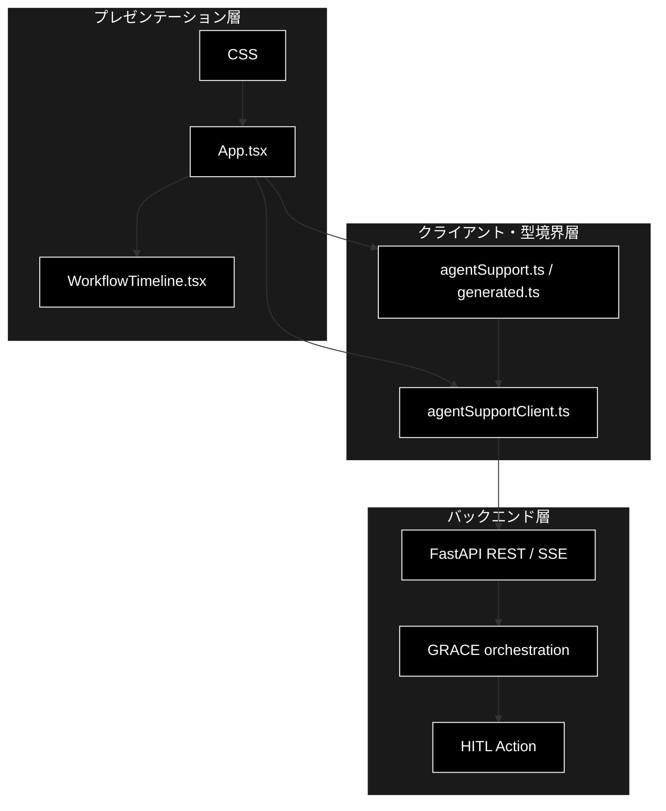
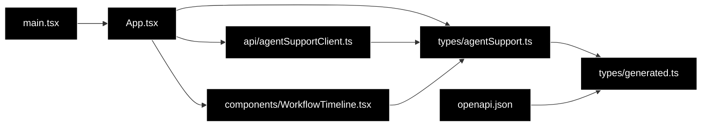
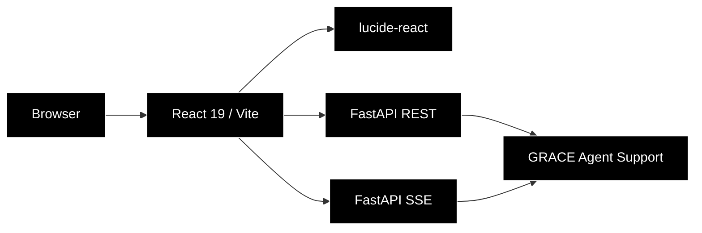

# GRACE Agent Support React Frontend ドキュメント

## このアプリの実行方法

### 前提条件

- Docker / Docker Compose
- Python環境と`uv`
- Node.js / npm
- リポジトリ直下の`.env`または環境変数に`OPENAI_API_KEY`を設定済み
- 検索対象のQdrantコレクションを登録済み（コレクションは本アプリから自動作成しません）

### 1. QdrantとRedisを起動する

リポジトリのルートディレクトリで実行します。

```bash
docker-compose -f docker-compose/docker-compose.yml up -d
```

起動確認:

```bash
docker-compose -f docker-compose/docker-compose.yml ps
```

### 2. FastAPIバックエンドを起動する

同じくリポジトリのルートディレクトリで実行します。

```bash
export AGENT_SUPPORT_STORE=redis
uv run uvicorn api.app:app --reload --port 8000
# ブラウザで： http://localhost:5173/
```
- ポート解放：
```aiignore
lsof -i :8000
kill -9 PID
```

`AGENT_SUPPORT_STORE=redis`を指定すると、Run、イベント、確認待ちActionがRedisへ保存されます。省略した場合はインメモリ保存となり、バックエンド再起動時に実行履歴が失われます。

別のターミナルからバックエンドを確認できます。

```bash
curl http://localhost:8000/health
curl http://localhost:8000/ready
```

- `/health`が`{"status":"ok"}`ならFastAPIは起動済みです。
- `/ready`ではAPIキー、Qdrant、Redisの状態を確認できます。

### 3. Reactフロントエンドを起動する

バックエンドを動かしたまま、別のターミナルで実行します。

```bash
cd frontend
npm ci
npm run dev
```

ブラウザでViteが表示したURL（通常は[http://localhost:5173](http://localhost:5173)）を開きます。開発時の`/api`リクエストはViteにより`http://localhost:8000`へ転送されます。

### 4. 終了する

FastAPIとViteは、それぞれのターミナルで`Ctrl+C`を押して終了します。QdrantとRedisを停止する場合は、リポジトリのルートで次を実行します。

```bash
docker-compose -f docker-compose/docker-compose.yml down
```

> 📝 **注意**: `down -v`はQdrantとRedisの永続ボリュームを削除するため、通常の終了では使用しないでください。

> **対象**: `frontend/`<br>
> **バージョン**: 1.1<br>
> **最終更新日**: 2026-07-17

## 目次

1. [概要](#1-概要)
2. [アーキテクチャ構成図](#2-アーキテクチャ構成図)
3. [モジュール構成図](#3-モジュール構成図)
4. [モジュール一覧](#4-モジュール一覧)
5. [処理 IPO詳細](#5-処理-ipo詳細)
6. [設定・定数](#6-設定定数)
7. [使用例](#7-使用例)
8. [エクスポート](#8-エクスポート)
9. [変更履歴](#9-変更履歴)
10. [付録: 依存関係図](#付録-依存関係図)

## 1. 概要

`agent_support_example.py`相当の自律エージェント処理を、ブラウザから実行・監視・承認するReactフロントエンドです。Plan、Execute、Groundedness、回答ゲート、情報なし検知、Web相互検証、HITL Actionの状態をFastAPIとSSE経由で表示します。業務ロジックとAction実行はバックエンドに置き、フロントエンドは入力、可視化、明示的な人の判断を担当します。

### 1.1 主な責務

- 問い合わせ、業界、Web検証、Action、dry-runの入力
- 実行作成・中止・履歴取得・再表示
- SSEによる進捗イベントの受信と重複排除
- 計画、各実行ステップ、検証指標、回答・エスカレーションの表示
- Actionの承認・却下・JSON引数修正
- 最後に開いた実行の`localStorage`復元

### 1.2 各責務対応のモジュール

| 責務 | モジュール |
|---|---|
| 画面・状態・操作 | [`App.md`](./App.md) |
| REST/SSE通信 | [`agentSupportClient.md`](./agentSupportClient.md) |
| 進捗表示 | [`WorkflowTimeline.md`](./WorkflowTimeline.md) |
| API/UI型境界 | [`agentSupportTypes.md`](./agentSupportTypes.md) |
| エントリーポイント | `src/main.tsx` |
| スタイル | `src/styles.css`, `src/details.css` |

### 1.3 主要機能一覧

| 機能 | 内容 |
|---|---|
| Run作成 | `POST /api/agent-support/runs` |
| 進捗監視 | `EventSource`で実行イベントを購読 |
| 状態同期 | イベント受信時にRunを再取得 |
| HITL | 版番号・Actionハッシュ付きで承認、却下、修正 |
| 再接続 | 保存済みRun IDを初期表示時に取得 |
| 型同期 | OpenAPIからTypeScript型を生成 |

## 2. アーキテクチャ構成図



## 3. モジュール構成図



## 4. モジュール一覧

| モジュール | クラス・関数・公開要素 | 詳細 |
|---|---|---|
| `App.tsx` | `App`, `Title`, `Metric` | [`App.md`](./App.md) |
| `agentSupportClient.ts` | `json`, `confirmation`, `agentSupportClient` | [`agentSupportClient.md`](./agentSupportClient.md) |
| `WorkflowTimeline.tsx` | `WorkflowTimeline`, `steps`, `order` | [`WorkflowTimeline.md`](./WorkflowTimeline.md) |
| `agentSupport.ts` | 実行・結果・イベント・確認応答型 | [`agentSupportTypes.md`](./agentSupportTypes.md) |

## 5. 処理 IPO詳細

### 5.1 エージェント実行ワークフロー

**概要**: UI入力から結果表示または有人エスカレーションまでを非同期に追跡します。各関数の完全なIPOは上記モジュール文書を参照してください。

```typescript
createRun(request: RunRequest): Promise<RunRecord>
events(id: string, onEvent: (event: RunEvent) => void, onError: () => void): () => void
```

| パラメータ | 型 | デフォルト | 説明 |
|---|---|---|---|
| `request` | `RunRequest` | - | 問い合わせと実行オプション |
| `onEvent` | `(RunEvent) => void` | - | 進捗イベント処理 |
| `onError` | `() => void` | - | SSE障害時の再取得処理 |

| 項目 | 内容 |
|---|---|
| **Input** | 問い合わせ、業界、`use_web`、`do_action`、`dry_run`、任意の本人確認情報 |
| **Process** | 1. Run作成<br>2. SSE購読<br>3. Plan → Execute → Groundedness → Gate → No-info/Web検証を表示<br>4. 必要時にHITL判断<br>5. 回答またはエスカレーションを表示 |
| **Output** | `RunRecord`と`RunEvent[]`に基づく画面表示 |

**戻り値例**:

```typescript
{ run_id: 'run-1', state: 'queued', request: { query: '質問', use_web: true, do_action: true, dry_run: true } }
```

```typescript
// 使用例
const run = await agentSupportClient.createRun(request)
const close = agentSupportClient.events(run.run_id, console.log, console.error)
// 出力: 進捗イベントを受信。不要になったら close()
```

### 5.2 HITL確認ワークフロー

**概要**: `pending_confirmation`が存在する場合だけ、現在の版番号とActionハッシュを添えて人の判断を送ります。

```typescript
confirm(run: RunRecord, decision: 'approve' | 'reject' | 'modify', action?: ActionRequest): Promise<ConfirmationResponse>
```

| パラメータ | 型 | デフォルト | 説明 |
|---|---|---|---|
| `run` | `RunRecord` | - | 最新の確認待ち実行 |
| `decision` | `'approve' \| 'reject' \| 'modify'` | - | 人の判断 |
| `action` | `ActionRequest` | optional | 修正後のAction |

| 項目 | 内容 |
|---|---|
| **Input** | 判断、版番号、Actionハッシュ、任意の修正Action |
| **Process** | 1. 確認待ち情報を取得<br>2. JSONをPOST<br>3. 最新Runへ画面状態を更新 |
| **Output** | `ConfirmationResponse` |

**戻り値例**:

```typescript
{ run: { ...run, state: 'action_executing', pending_confirmation: undefined } }
```

```typescript
// 使用例
const response = await agentSupportClient.confirm(run, 'approve')
// 出力: 判断反映後のRunRecord
```

## 6. 設定・定数

| 項目 | 値・コマンド | 用途 |
|---|---|---|
| `VITE_API_BASE` | 未設定時は空文字 | APIのベースURL |
| Vite proxy | `/api` → `http://localhost:8000` | 開発時バックエンド接続 |
| `grace-support-run-id` | localStorageキー | 最後のRun復元 |
| `npm run types:generate` | OpenAPI型生成 | `generated.ts`更新 |

## 7. 使用例

```bash
# 使用例
cd frontend
npm install
npm run dev
# 出力: Vite開発サーバー（/apiはlocalhost:8000へプロキシ）
```

検証コマンド:

```bash
npm run typecheck
npm run lint
npm run test
npm run build
```

## 8. エクスポート

- `App.tsx`: default export `App`
- `WorkflowTimeline.tsx`: named export `WorkflowTimeline`
- `agentSupportClient.ts`: named export `agentSupportClient`
- `agentSupport.ts`: named type exports

## 9. 変更履歴

| バージョン | 変更内容 |
|---|---|
| 1.0 | 初版作成。構成、実行フロー、HITL、設定、モジュール文書索引を追加 |
| 1.1 | 文書先頭に、前提条件、Qdrant/Redis、FastAPI、Reactの起動確認・終了手順を追加 |

## 付録: 依存関係図


